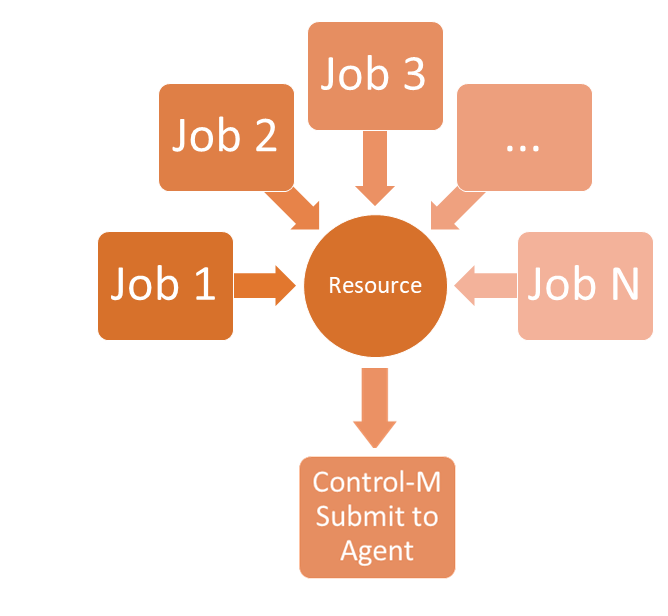

# Control Job Submission With Resources

## Requirement

The DBA development team occasionally needs to run a group of database maintenance jobs.  The sequence of the runs do not matter but they have found that only a few can run simultaneously before there are serious database performance issues.  There are also a few jobs that must never run concurrently since they update similar tables and two or 
more of them executing at the same time can lead to database deadlocks.  Control-M allows the use of the semaphore and mutext resources to control concurrent job execution. The first (semaphore), known to Control-M users as quantitative resources, allows a set number of jobs to run concurrently.  The second (mutex), known to Control-M users as 
control resources, allows the sharing or exclusive lock on a resource such as a database table.

## Implementation

## Table of Contents

1. [json job definitions](./json/README.md)