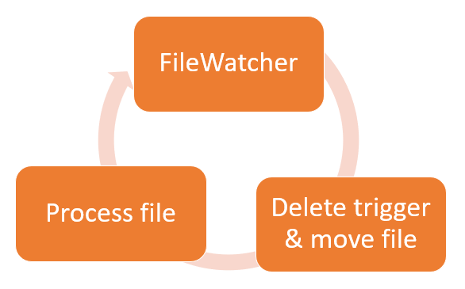

# Process incoming files through cyclic jobs

## Requirement

Our site receives files from external partners on weekdays which need to be processed when they come in. 
The files arrive at random intervals. They are large csv files accompanied by a 0 byte trigger file with the same filename plus the extension ".done". A series of jobs will need to monitor the arrival of trigger files, move the actual files to a staging area and delete the trigger file, then kick of a python script that performs a record count and transform.

## Implementation

The jobs are implemented as 3 cyclic jobs that run one after the other. The first is a FileWatcher type job that monitors the incoming directory for trigger files matching the pattern "*.done".  When a file is found, the filename is passed to the 2nd job which moves the csv file to a staging area and deletes the trigger file. Next the 3rd job is triggered which runs a python script to process that file. When this is done, the 1st FileWatcher becomes active again, and so on.

## Code

Refer to the [ctmjobs](./ctmjobs/) directory for the code and a complete 
walkthrough.
