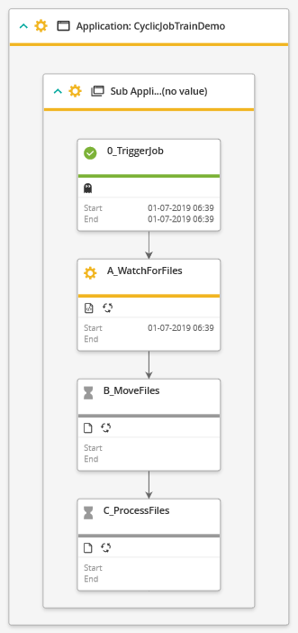

# Control-M jobs' json

Complete source code: [cyclic-job-train.json](./cyclic-job-train.json)

## Code walkthrough

### Defaults

First we define a Defaults section to specify the attributes that will apply to
all jobs, so we do not have to repeat them for each job individually.

```
	"Defaults": {
		"Application": "CyclicJobTrainDemo",
		"SubApplication": "Demo",
		"Host": "workbench",
		"RunAs": "workbench",
		"Job": {
			"When": {
				"WeekDays": ["MON", "TUE", "WED", "THU", "FRI"]
			}
		}
	},
```

The `when` and `rerun` labels determine when the job will run.  It is scheduled
for weekdays and will rerun every 2 minutes. A FileWatcher job only ends when 
it finds a file, or when it exceeds the optional maximum time defined to wait. 
The job will only rerun when it actually finds files, otherwise it will be
waiting for them.

`Host` and `RunAs` define on which host and with which user this job should run.

### Folder

Jobs are grouped in Folders, so we begin with defining the folder name, and the
name of the Control-M/Server it will be scheduled on.

```
    "CyclicJobTrain" :
    {
        "Type" : "SimpleFolder",
		"ControlmServer": "workbench",
```


Next comes the definition for the three jobs that we want to run after one 
another. As explained in the [scenario](../README.md), the jobs will run in 
the order A > B > C > A > B > C > A  etcetera.
The job names are A_WatchForFiles, B_MoveFiles and C_ProcessFiles 
respectively, but I will refer to them as A, B and C hereafter.

### job A

The complete definition is:

```
        "A_WatchForFiles": {
            "Type" : "Job:FileWatcher:Create",
			"Description":"Watches for trigger files named *.done in incoming directory",
			"Rerun" : { "Every": "2",  "Units":  "Minutes" },
			"Path" : "/home/filehub/incoming/*.done",
			"SearchInterval" : "30"
        },
```

The first label defines its name, and then followed by its attributes.
The `Type` is a `FileWatcher:Create`, which means this job will watch for a file
to exist or be created in a specific location.

`Path` defines where to look for the files, and what file name to look for, in 
this case it is looking for the '*.done' trigger files.

`SearchInterval` defines at what interval the job should check for new files, 
in seconds.

### job B

```
        "B_MoveFiles": {
            "Type" : "Job:EmbeddedScript",
            "Script": "#!/bin/bash\\ncd /home/filehub/incoming\\nfor f in *.done\\ndo\\n  mv ${f%.*}.csv ../process/\\n  rm $(basename $f)\\ndone\\n",
			"Description":"Moves csv file to process directory and deletes trigger file",
			"Rerun" : { "Every": "2",  "Units":  "Minutes" },
			"FileName":"movefiles.sh"
        },    
```

Job B is an `EmbeddedScript` type job. This means that a script can be embedded 
into the Control-M job code, which will be uploaded to the target machine by 
Control-M, and then run. 
This allows easy inclusion of small scripts without having to create them as 
separate script files. The `script` parameter defines the actual script. 
Because it is embedded into json, the newline control character must be escaped
as follows : `\\n`.  The actual newline character to use may be platform 
dependent.

### job C

```
        "C_ProcessFiles": {
            "Type" : "Job:Command",
            "Command" : "/home/filehub/process.py",
			"Description":"Process the received csv files from process directory",
			"Rerun" : { "Every": "2",  "Units":  "Minutes" }
        }, 
``` 

Job C is a `Command` type job, which allows easy definition of a job that runs
a single command. In this case it is executing a Python script.

### Job Flow

Next, we need to define in which order these jobs will run. This can be done by
defining a `Flow` sequence. We define the following two flows

```
        "flow1": {
          "Type":"Flow",
          "Sequence":["A_WatchForFiles", "B_MoveFiles", "C_ProcessFiles"]
        },
        "flow2": {
          "Type":"Flow",
          "Sequence":["C_ProcessFiles", "A_WatchForFiles"]
        }
```

The first `flow1` defines the job order A > B > C, while the `flow2` defines 
the additional dependency C > A.  These cannot be defined in a single flow as 
a job may not appear in a flow more than once. 

Now it would appear as though we are finished, but something is still missing.
If we would run these jobs as defined until this point, each job would end up 
waiting for its predecessor to run, so neither job A, B or C would actually 
ever start running. We need a way to tell Control-M at the start of the day, it 
needs to run job A first, without it waiting for job C. 

### Flow sequences are implemented as Events

When deploying jobs, `Flow` sequences as described above are translated into
`Events`. When job A finishes, it adds an event. Job B is waiting for that 
Event so it can then run. The names of these generated events are as follows:

`*flowname*_from_*Foldername*_folder_job_*jobname*_to_*Foldername*_folder_job_*jobname*`

From this we can deduce that to trigger job A, we would need to add an event 
named:

`flow2_from_CyclicJobTrain_folder_job_C_ProcessFiles_to_CyclicJobTrain_folder_job_A_WatchForFiles`


## Additional Dummy job

To add the Event described above at the start of each day, we define a Dummy job:

```
		"0_TriggerJob": {
			"Type": "Job:Dummy",
			"Description":"Dummy job to trigger A_WatchForFiles job at start of day",
			"AddCondition" :
			{
				"Type": "AddEvents",
				"Events": [
					{"Event":"flow2_from_CyclicJobTrain_folder_job_C_ProcessFiles_to_CyclicJobTrain_folder_job_A_WatchForFiles"}
				]
			}
		},
```

A dummy job does not actually run anything but can be used to perform actions
within Control-M like adding an event as in this example. The `AddEvents` 
property is used for this. `Events` then describes the list of events to be
added, in our case just the one event discussed earlier.

That concludes our final job flow. When run in Control-M, the job flow looks
as follows:



Here you can see the dummy job has already run, and triggered job A. This job
is active, waiting for the incoming files to arrive. When a file arrives, it 
will end OK, triggering job B to run, and so on.

### More information

* [Code Reference](https://docs.bmc.com/docs/automation-api/919/code-reference-817914520.html)

