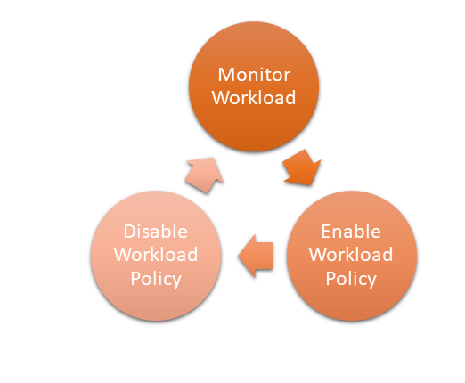

# Control job load on SAP landscape

## Requirement

Customer SAP landscapes can occassionally encounter performance issues due to various activities such as system maintenace, month-end, and other routine processes.
When this happens it can affect the execution of critical jobs or user session response times due to lack of system resources or dialog processes.  One part of the 
solution is to allow SAP administator the ability to adjust the workload coming from Control-M Workload Automation.  The Control-M adminstrator already has policies in 
place but wants to allow the SAP administors to activate or deactivate specific Workload Polices without engaging Control-M administrators each time. Also monitoring 
tools already in place can dyanamically adjust the workload load as needed.

## Prerequisites

* A Control-M userid with the following minimal privileges:
    * Assigned Roles: BrowseGroup
    * Privileges > Control-M Configuration Manager: Full
    * Privileges > Configuration: Update for Workload Policies pre-defined by Control-M Administrator
* Unix system with bash shell and curl

## Implementation
The script will support 3 actions:

### Get
The “get” action will list current Workload Policy definitions details.

### Start
The “start” action will activate specified Workload Policy.

### Stop
The “stop” action will deactivate specified Workload Policy.

## The bash script uses the following Automation API [run service](https://docs.bmc.com/docs/automation-api/919110/run-service-872868748.html) commands:
* [run workloadpolicies::get](https://docs.bmc.com/docs/automation-api/919110/run-service-872868748.html#Runservice-wp_getrunworkloadpolicies::get)
* [run workloadpolicy::activate](https://docs.bmc.com/docs/automation-api/919110/run-service-872868748.html#Runservice-wp_actrunworkloadpolicy::activate)
* [run workloadpolicy::deactivate](https://docs.bmc.com/docs/automation-api/919110/run-service-872868748.html#Runservice-wp_deactrunworkloadpolicy::deactivate)

## Table of Contents
* [Scripts and Documentation](./scripts)
