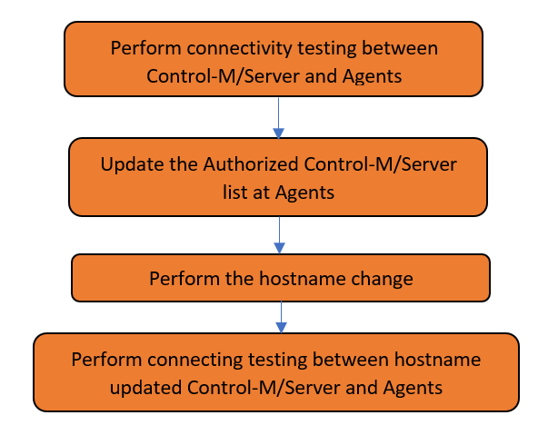

## **Requirement:**

The “Authorized Control-M/Server Hosts” field under ctmagcfg in Control-M/Agent determines which Control-M/Server can connect to this Control-M/Agent, so when the server hostname, which by default Control-M/Server is listening on, has been changed, the new name of Control-M/Server needs to be added into this filed. Control-M Automation API offers the API of “ctm config server:agent:param::set” to automate and orchestrate the process.

**Scenarios:**


We have multiple Control-M Server testing machines, and one of them is called ctmstest1, and there is need to prepare a Control-M server for UAT use. Instead building a new UAT machine, we decide to convert ctmstest1 to serve as UAT. To make the server hostname more sensible, we need to change it to ctmsuat.

After hostname change, the ctmsuat should be able to connect to all the associated Control-M/Agents

Basic Workflow for this scenario is





## **Prerequisites**


- Python 3.3 or higher


## **Implementation**


Step 1 - &quot;Perform connectivity testing between Control-M/Server and Agents&quot;

- To perform this,  the following Automation APIs are invoked in ServerAgentConnectivityTest.py:
```
1-1 : Login Automation API to obtain the user token
r_login = requests.post(endPoint + '/session/login', json=credentialAAPI, verify=False)

1-2 : Check the Agent status
r_responce = requests.get(endPoint + '/config/server/' + search_criteria,
                           headers={'Authorization': 'Bearer ' + token},
                           verify=False)


1-3 : Logout from Automation API by /session/logout
r_logout = requests.post(endPoint + '/session/logout',
                             headers={'Authorization': 'Bearer ' + token},
                             verify=False)

```


Step 2 - &quot;Update the Authorized Control-M/Server list at Agents&quot;
- To perform this,  the following Automation APIs are invoked in UpdateAuthorizedServer.sh:

```
2-1 : Define the Automation API server endpoint 
ctm env add endpoint https://$AAPI_HOST:$AAPI_PORT/automation-api $AAPI_USER $AAPI_PASSWORD && ctm env set endpoint

2-2 : Update the Authorized Control-M/Server list
ctm config server:agent:param::set $CTM_SERVER $AGENT "CTMPERMHOSTS" "$DESIRED_CTM_SERVER"
```

Step 3 - &quot;Perform the hostname change&quot;

Step 4 - &quot;Perform connecting testing between hostname updated Control-M/Server and        Agents&quot;

## Table of Contents

1. [Images](./Images)
2. [Scripts](./Scripts)
