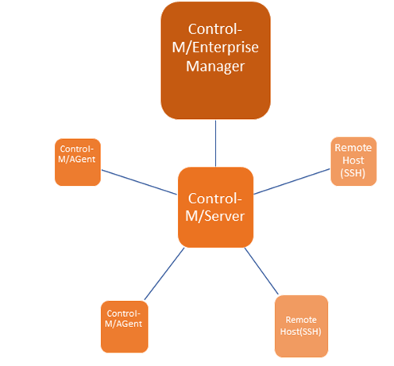

# Add remote ssh host example
This example demonstrates how add a remote host to Control-M/Server using SSH.

### Requirements
Developers want to be able to quickly test programs on various Unix hosts without having to provision a full Control-M/Agent and maintain them.  Using the remote host option, developers are able to submit jobs to agentless machines so they require less maintenance since no Control-M/Agent software is installed.

### Prerequisites
* Control-M/Enterprise Manager 9.0.18.000 or higher
* Control-M Automation API 9.0.05 or higher

### Implementation

This example demonstrates the following  [Automation API config service](https://docs.bmc.com/docs/automation-api/9191/config-service-869536965.html) commands and codes:
* [config server:remotehost::add](https://docs.bmc.com/docs/automation-api/9191/config-service-869536965.html#Configservice-configserver:remotehost::add)
* [config server:remotehost::delete](https://docs.bmc.com/docs/automation-api/9191/config-service-869536965.html#Configservice-configserver:remotehost::delete)
* [config server:remotehost::authorize](https://docs.bmc.com/docs/automation-api/9191/config-service-869536965.html#Configservice-configserver:remotehost::authorize)

### Limitations
* No application plugin support
* Limited shout support 
* For additional information review the Control-M documentation 
http://documents.bmc.com/supportu/9.0.19/help/Main_help/en-US/index.htm#4685.htm

### Table of Contents
1. [ Automation API Code (adding ssh host)](./ssh-host)
