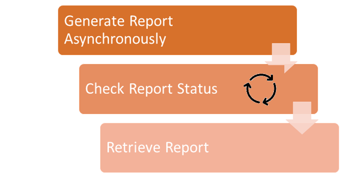
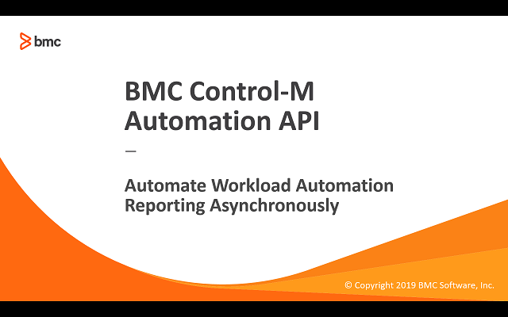

# Automate Workload Automation Reporting Asynchronously

## Requirement

Starting with Control-M/Enterprise Manager 9.0.18 the reporting engine was changed to a web based implementation.  The various teams can generate reports via 
the Control-M Reports client, Automation API 'ctm' utility, and direct REST calls but there are times when the reports take many minutes to complete.  They request the option 
to run the reports without having to wait for them to complete so they don't have to leave it running on their workstations.  Also the sychronous option will soon be deprecated.

## Prerequisites
* Control-M/Enterprise Manager 9.0.19 or higher
* Automation API 9.0.19 or higher
* Report defined in Control-M Reports
* Control-M user with the following minimum privileges:
    * Assigned Roles: BrowseGroup
    * Privileges > Control-M Configuration Manager: Full
    * Privileges > Monitoring and Administration Tools > CLI: Full
* Unix system with bash, curl, and wget

## Implementation

The script uses the following [Automation API Reporting service](https://docs.bmc.com/docs/automation-api/9191/reporting-service-869536969.html) commands:
* [reporting report](https://docs.bmc.com/docs/automation-api/9191/reporting-service-869536969.html#Reportingservice-reportAsyncAsynchronousreportgeneration(reportingreport)) 
* [reporting status::get](https://docs.bmc.com/docs/automation-api/9191/reporting-service-869536969.html#Reportingservice-reportStatusGetGetreportstatus(reportingstatus::get))

## Video

The following video demonstrates the above steps.

Click the above image to watch the video on YouTube.

## Table of Contents

1. [Scripts and Documentation](./scripts)

