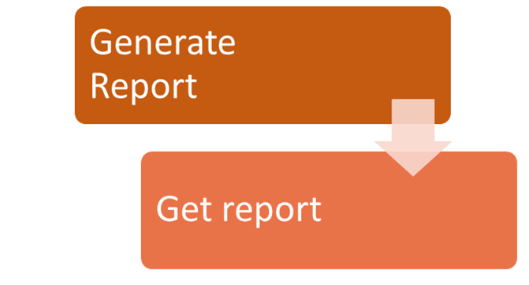
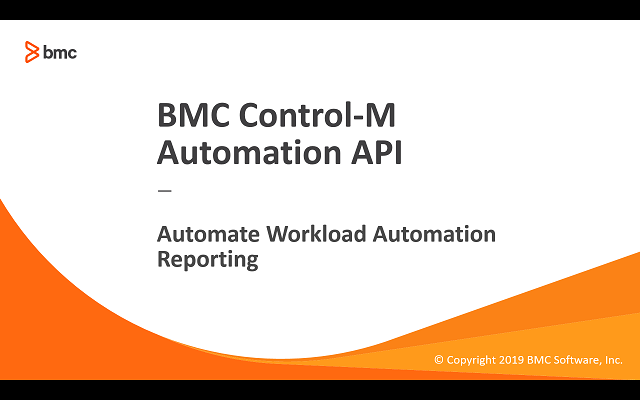

# Automate Workload Automation Reporting

## Requirement
Starting with Control-M/Enterprise Manager 9.0.18 the reporting engine was changed to a web based implementation.  As a result legacy tools such as "emreportcli"
are no longer compatible with Control-M/Enterprise Manager. In their place is a new modern interface based on REST services to interact with the reporting
server.  Control-M Automation API exposes verbs to generate and retrieve reports synchronously and asynchronously.  There are various methods to invoke the REST calls.
The Operations team has requested a simple bash script they could execute on Unix environments to be used by various teams and customers with minimal installation
requirements.

## Prerequisites
* Control-M/Enterprise Manager 9.0.18 or higher
* Automation API 9.0.18 or higher
* Report defined in Control-M Reports
* Control-M user with the following minimum privileges:
    * Assigned Roles: BrowseGroup
    * Privileges > Control-M Configuration Manager: Full
    * Privileges > Monitoring and Administration Tools > CLI: Full
* Unix system with bash, curl, and wget

## Implementation

## Limitations

* To generate a report through the Control-M Automation API, the user running the command must be the same as the Control-M/EM user who created the report in Control-M Reports.

## Video

The following video demonstrates the above steps.

Click the above image to watch the video on YouTube.

## Table of Contents

1. [scripts and documentation](./scripts)

