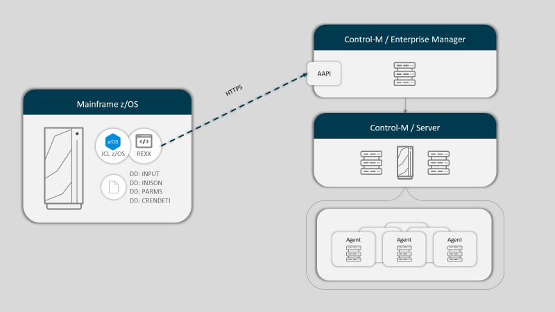
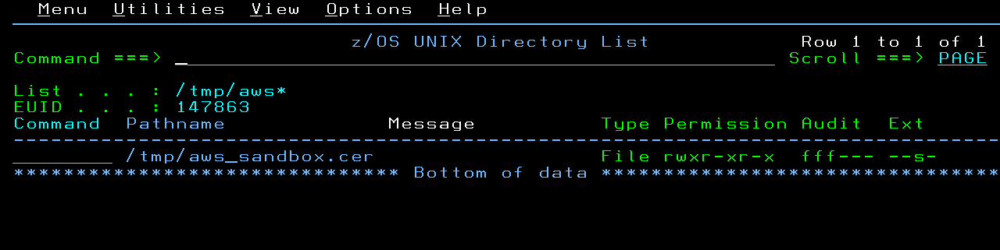
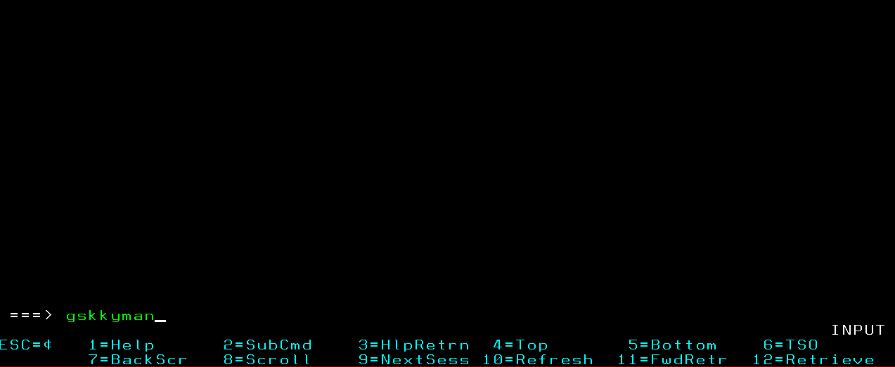
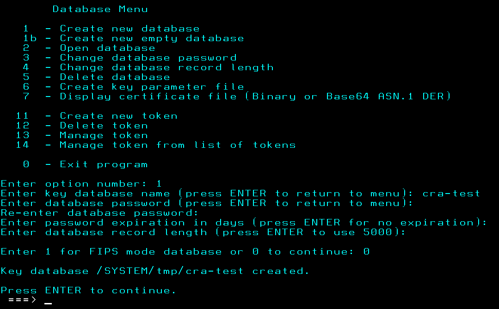
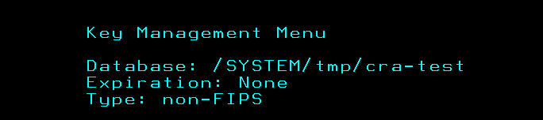
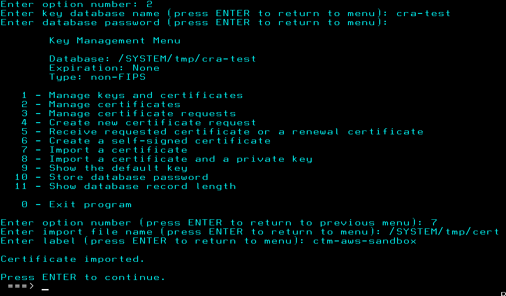
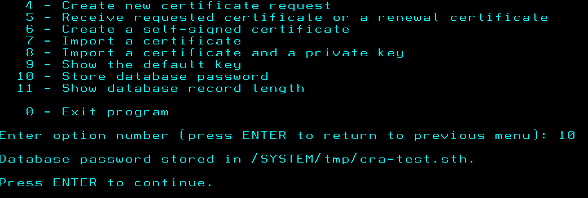

<h1>Call Automation API from Mainframe </h1>

## Description

This example shows how to be able to connect to a Control-M (or Helix Control-M) environment from Mainframe (z/OS) and run Automation API services from JCL.

Several sample programs, JCLs, and procedures have been built to take advantage of the capabilities of the "**z/OS client web enablement toolkit**" (available from z/OS version 2.2).

## Prerequisites

- z/OS V2.2 or higher.
- Unix System Services - if the certificate store is not managed in RACF.
- ICSF - to be able to make use of secure HTTPS connections if necessary.
- Restructured Extended Executor (REXX).
- PolicyAgent - if you want to manage the security of out-of-app layer (AT-TLS) connections.
- z/OS client web enablement toolkit.

## Architecture

The following diagram shows, as an example, the communication architecture between Mainframe and the Control-M Automation API using HTTPS protocol.



For Helix Control-M the architecture is the same: calling from the Mainframe the Automation API endpoint exposed in a tenant.

## Reference Table

The following table shows the files and libraries needed to run the Automation API call.

All of them must be sent to the Mainframe with the formats indicated in the "**Format**" column.

<table class="tg">
<thead>
  <tr>
    <th class="tg-gwlm">Folder</th>
    <th class="tg-gwlm">Member</th>
    <th class="tg-gwlm">Type</th>
    <th class="tg-gwlm">Description</th>
    <th class="tg-gwlm">Format</th>
  </tr>
</thead>
<tbody>
  <tr>
    <td class="tg-0a7q" rowspan="2">JCLLIB</td>
    <td class="tg-0a7q">AAPICOND</td>
    <td class="tg-0a7q" rowspan="2">JCL</td>
    <td class="tg-0a7q">Add / Delete Conditions</td>
    <td class="tg-0a7q" rowspan="2">RECFM=FB   LRECL=80     DSORG=PO</td>
  </tr>
  <tr>
    <td class="tg-0a7q">AAPIORDE</td>
    <td class="tg-0a7q">Order folder / job, monitors the status and captures the output / log</td>
  </tr>
  <tr>
    <td class="tg-0a7q" rowspan="2">REXX</td>
    <td class="tg-0a7q">AAPICOND</td>
    <td class="tg-0a7q" rowspan="2">REXX</td>
    <td class="tg-0a7q">Rexx program to add or delete conditions</td>
    <td class="tg-0a7q" rowspan="2">RECFM=FB   LRECL=80     DSORG=PO</td>
  </tr>
  <tr>
    <td class="tg-0a7q">AAPIORDE</td>
    <td class="tg-0a7q">Rexx program to run folders or jobs, monitor its run status, collect logs and output</td>
  </tr>
  <tr>
    <td class="tg-0a7q" rowspan="2">PROCLIB</td>
    <td class="tg-0a7q">AAPICOND</td>
    <td class="tg-0a7q" rowspan="2">PROC</td>
    <td class="tg-0a7q">Cataloged procedure for encapsulating a call to Rexx</td>
    <td class="tg-0a7q" rowspan="2">RECFM=FB   LRECL=80     DSORG=PO</td>
  </tr>
  <tr>
    <td class="tg-0a7q">AAPIORDE</td>
    <td class="tg-0a7q">Cataloged procedure for encapsulating a call to Rexx</td>
  </tr>
  <tr>
    <td class="tg-0a7q">CREDENTI</td>
    <td class="tg-0a7q" rowspan="2"></td>
    <td class="tg-0a7q" rowspan="2">DATASET</td>
    <td class="tg-0a7q">Credential file</td>
    <td class="tg-0a7q">RECFM=FB   LRECL=200    DSORG=PS</td>
  </tr>
  <tr>
    <td class="tg-0a7q">PARMS</td>
    <td class="tg-0a7q">Parameter file and endpoint connection</td>
    <td class="tg-0a7q">RECFM=FB   LRECL=80     DSORG=PS</td>
  </tr>
  <tr>
    <td class="tg-0a7q" rowspan="4">EXAMPLE</td>
    <td class="tg-0a7q">MFTJOB</td>
    <td class="tg-0a7q">JCL</td>
    <td class="tg-0a7q">Sample to order a predefined MFT job using variables to identify files</td>
    <td class="tg-0a7q" rowspan="2">RECFM=FB   LRECL=80     DSORG=PO</td>
  </tr>
  <tr>
    <td class="tg-0a7q">OSJOB</td>
    <td class="tg-0a7q">JCL</td>
    <td class="tg-0a7q">Sample to order a predefined OS job using variables</td>
  </tr>
  <tr>
    <td class="tg-0a7q">MFTJOB.json</td>
    <td class="tg-0a7q">JSON</td>
    <td class="tg-0a7q">Sample MFT job definition file to be imported in Control-M</td>
    <td class="tg-xwyw" rowspan="2">N/A</td>
  </tr>
  <tr>
    <td class="tg-0a7q">OSJOB.json</td>
    <td class="tg-0a7q">JSON</td>
    <td class="tg-0a7q">Sample OS job definition file to be imported in Control-M</td>
  </tr>
</tbody>
</table>

## Security Configuration

If your Control-M Automation API endpoint uses HTTPS, cryptographic services must be used to secure the connection. This involves uploading certificates to z/OS, selecting the appropriate encryption algorithm, and making use of the required communication protocol (TLS v1.x).

Here are the steps required to perform this management using a database created in the USS (Unix System Services) zone as a keystore, although RACF can also be used.

1. Create a file in the USS zone with the contents of the certificate to be imported.

   

2. Run the **gskkyman** utility in OMVS to be able to create the database that will contain the certificates. The example works on the "**/tmp/**" path, but any valid path can be used.
   It is recommended to follow the policies defined at each site.

   

3. We select option "**1**" and indicate the path and name of the file that will contain the database (in our example, "**/tmp/cra-test**").
   Next, we must enter a password, expiration date of the password (\<ENTER\> so that it does not expire) and indicate the mode of the database, in our case we select "**0**".

   

   

4. The next action is to import the certificate in the database from the file we created in step 1.
   We select option "**7**" and then identify the path, the file (e.g.: "**/tmp/aws_sandbox.cer**") and a label to recognize the certificate. This label will be used in the "**CREDENTI**" file later.

   

5. Finally, we need to generate a stash key. To do so, we will select option "**10**". This will generate the file "**/SYSTEM/tmp/cra-test.sth**".

   

## Configuration Files

### CREDENTI

This file contains security-related information and access credentials.

|     Parameter       |     Description                                                                                                                                                             |
|---------------------|-----------------------------------------------------------------------------------------------------------------------------------------------------------------------------|
|     ``Token``       |     Automation API access token. Generated from the Control-M Web interface Configuration domain. This option is available from version **9.0.21.000**. The *AuthMethod* parameter must be set to **TOKEN**. |
|     ``AuthMethod``  |     Authentication method: **TOKEN** or **USER**.                                                                                                                           |
|     ``username``    |     Existing user name in Control-M. *AuthMethod* parameter must be **USER**.                                                                                               |
|     ``password``    |     User password. *AuthMethod* parameter must be **TOKEN**.                                                                                                                |
|     ``KeyStore``    |     Type of keystore to use: **FILE** or **SAF**.                                                                                                                           |
|     ``FileKeyDB``   |     Path to the database containing the certificates.                                                                                                                       |
|     ``FileKeyPwd``  |     Path to the file with the stash key generated by the **gskkyman** utility.                                                                                              |
|     ``CertLabel``   |     Certificate label within keystore.                                                                                                                                      |
|     ``ValidCipher`` |     Encryption algorithm to be used identified in 4-byte codes. See [**Cipher suite definitions**](https://www.ibm.com/docs/en/zos/2.5.0?topic=programming-cipher-suite-definitions) section of the "**z/OS Cryptographic Services (System SSL Programming)**" manual. |
|     ``SafKeyRing``  |     SAF ring containing certificate.                                                                                                                                        |
|     ``sslTraceFile``|     Path to create the SSL trace file. The result must be converted using the **gsktrace** utility to be read.                                                              |

### PARMS

This file contains information about the connection to the Control-M Automation API endpoint and certain configuration parameters.

|     Parameter        |     Description                                                                                                                                                                                                                 |
|----------------------|---------------------------------------------------------------------------------------------------------------------------------------------------------------------------------------------------------------------------------|
|     ``Verb``         |     Activates debug. The information is generated in the file identified in the HWTHDD DD and must have a **RECFM=U** format. Possible values are **Y** or **N**.                                                               |
|     ``Track``        |     Wait until the remote job is complete and return the return code. The process will end up either ok in error depending on the status of the remote job execution. Possible values are **Y** or **N**.                       |
|     ``Getsysout``    |     Capture the Log and Output of the remote job. Possible values are **Y** or **N**.                                                                                                                                           |
|     ``Pooling_limit``|     Number of times to check the remote job status. Possible values are a **\<number\>** or **NOLIMIT** (to keep monitoring the remote job until its status is either **Ended OK** or **Ended Not OK**).                          |
|     ``Pooling_secs`` |     Timeout between checks of the remote job status. It must be a numeric value indicating the number of **seconds**.                                                                                                           |
|     ``Cert_Check``   |     Verify server identity. See [Server identity - IBM Documentation](https://www.ibm.com/docs/en/zos/2.5.0?topic=enabler-server-identity). Possible values are **Y** or **N**.                                                 |
|     ``CTMUri``       |     URL for the Control-M Automation API. E.g.: *https://controlm_prod.com*                                                                                                                                                     |
|     ``CTMPort``      |     Port for the Control-M Automation API.                                                                                                                                                                                      |
|     ``RequestPath``  |     Path of the Control-M Automation API service to run. This parameter is optional as it is already defined in the program code, but it will be replaced if it is modified in this file.                                 |

## Description of JCLs

### AAPICOND

The purpose of this JCL is to add or delete conditions (events) in Control-M using the Automation API.

In installations where a Control-M for z/OS already exists, this mechanism is not really required as there are official utilities for this purpose such as **IOACND** or **CTMAPI**.

To encapsulate the call to the Rexx **AAPICOND** program,a cataloged procedure with the same name is located in the library **&HLQ..PROCLIB**.

Details for the required parameters:

|     Parameter           |     Description                                                                                                                                                                                   |
|-------------------------|---------------------------------------------------------------------------------------------------------------------------------------------------------------------------------------------------|
|     ``HLQ``             |     High Level Qualifier where the CREDENTI, PARMS, PROCLIB, REXX, etc. files are located.                                                                                                        |
|     ``ENV``             |     Pointer to identify the libraries or files of the corresponding Control-M environment.                                                                                                        |
|     ``DD: INTPUT``      |     Identifies the condition to add or delete. View documentation in JCL.<br> Example for Add: *ADD CONDITION-NAME-1 ODAT SERVERNAME*<br> Example for Delete: *DEL CONDITION-NAME-1 ODAT SERVERNAME*  |
|     ``DD: CRENDETI``    |     Credential file. Embedded in **AAPICOND** procedure.                                                                                                                                          |
|     ``DD: PARMS``       |     Connections file. Embedded in **AAPICOND**  procedure.                                                                                                                                         |

> [!NOTE]
> <sup>Automation API services used:<br>
> [Session Service \> Session \> Login](https://documents.bmc.com/supportu/API/Monthly/en-US/Documentation/API_Services_SessionService.htm#sessionlogin) :point_up: **(Only for Control-M on-prem and *AuthMethod=USER*)** <br>
> [Run Service \> Event \> Add](https://documents.bmc.com/supportu/API/Monthly/en-US/Documentation/API_Services_RunService.htm#run34)<br>
> [Run Service \> Event \> Delete](https://documents.bmc.com/supportu/API/Monthly/en-US/Documentation/API_Services_RunService.htm#run35)</sup>

### AAPIORDE

The purpose of this JCL is to order jobs or folders defined in Control-M, monitor their status, and capture logs.
If monitoring is enabled, the JCL will remain on hold until the remote job completes its execution.
The JCL completion return code will be the same as the one from the remote job.

To order a job or folder it is necessary to identify the required parameters using a configuration file in JSON format.
Refer to the Automation API [Run Service \> Order](https://documents.bmc.com/supportu/API/Monthly/en-US/Documentation/API_Services_RunService.htm#run5) documentation for more details.

To encapsulate the call to the Rexx **AAPIORDE** program, a cataloged procedure with the same name located in the library **&HLQ..PROCLIB**.

Details for the required parameters:

|     Parameter           |     Description                                                                                 |
|-------------------------|-------------------------------------------------------------------------------------------------|
|     ``HLQ``             |     High Level Qualifier where the CREDENTI, PARMS, PROCLIB, REXX, etc. files are located.      |
|     ``ENV``             |     Pointer to identify the libraries or files of the corresponding Control-M environment.      |
|     ``SERVER``          |     Name of the Control-M/Server where the folder/job to be ordered is defined.                 |
|     ``FOLDER``          |     Name of the folder where the job/s to be ordered is/are defined.                            |
|     ``JOBNAME``         |     Name of the job to be ordered.                                                              |
|     ``ODATE``           |     Order date.                                                                                 |
|     ``DD: INJSON``      |     Configuration file in JSON format with execution parameters.                                |
|     ``DD: CRENDETI``    |     Credential file. Embedded in **AAPIORDE** procedure.                                        |
|     ``DD: PARMS``       |     Connections file. Embedded in **AAPIORDE** procedure.                                       |

> [!TIP]
> <sup>You can add more variables to the JCL and then reference them in the INJSON DD. They will be used in the "Active Job File". See the [MFTJOB](./EXAMPLES/MFTJOB) and [OSJOB](./EXAMPLES/OSJOB) examples.</sup>

> [!NOTE]
> <sup>Automation API services used:<br>
> [Session Service \> Session \> Login](https://documents.bmc.com/supportu/API/Monthly/en-US/Documentation/API_Services_SessionService.htm#sessionlogin) :point_up: **(Only for Control-M on-prem and *AuthMethod=USER*)** <br>
> [Run Service \> Order](https://documents.bmc.com/supportu/API/Monthly/en-US/Documentation/API_Services_RunService.htm#run5)<br>
> [Run Service \> Status](https://documents.bmc.com/supportu/API/Monthly/en-US/Documentation/API_Services_RunService.htm#run51)<br>
> [Run Service \> Output \> Get](https://documents.bmc.com/supportu/API/Monthly/en-US/Documentation/API_Services_RunService.htm#run18)<br>
> [Run Service \> Log \> Get](https://documents.bmc.com/supportu/API/Monthly/en-US/Documentation/API_Services_RunService.htm#run3)</sup>


  - Sample **INJSON** file:
  ```json
  {                           
    "ctm": "&SERVER",         
    "folder": "&FOLDER",      
    "jobs": "&JOBNAME",       
    "createDuplicate": true,  
    "hold": false,            
    "ignoreCriteria": true,   
    "independentFlow": true,  
    "orderDate": "&ODATE",    
    "waitForOrderDate": false,
    "variables": [            
     {"ARG": "TEST"}        
    ]                         
  }                           
  ```

## Troubleshooting

This section describes how to activate the different traces that are available.
Depending on the error or problem detected, we may activate one or the other.

### Security error, certificates, connection encryption, etc

If the problem is related to certificates, connection security or encryption, then we can activate the **sslTraceFile** parameter located in the **CREDENTI** credential file.
Activation is done by adding the path and file where we want to generate the trace.
This file must be USS (zFS) and will be created automatically.

Once the process has been executed with the active trace, the information will be generated in the path identified.
The file is not human readable so we must execute the **gsktrace utility** in OMVS to transform it as follows:

```
gsktrace source_file > destination_file
```
> [!TIP]
> <sup> gsktrace /tmp/ssltrace.bin > /tmp/ssltrace.txt  </sup>

### Automation API service execution failed

If the problem is related to an incorrect composition of the REST headers, using a wrong service, etc, then we can use the **Verbose** parameter located in the **PARMS** file.

When activating the parameter **(Verbose=y)** it is necessary to create a file with **RECFM=U** format and add it in the HWTHDD DD of the procedure or add it to the JCL.

#### Example:

Modify the parameter **Verbose=y** in the **PARMS** file, add the DD name HWTHDD in the step and a previous delete as shown below: 

- Sample **AAPICOND** JCL:

```jcl
//*--------------------------------------------------
//*   DELETE VERBOSE (HWTHDD)
//*--------------------------------------------------
//DELETE01 EXEC PGM=IEFBR14
//DD DD DSN=&HLQ..HWTHDD,DISP=(MOD,DELETE,DELETE),
// SPACE=(TRK,(1,1))
//*==================================================
//*   CALL AUTOMATION API
//*==================================================
//CALLAAPI EXEC AAPICOND,HLQ=&HLQ
//CREDENTI DD DISP=SHR,DSN=&HLQ..CREDENTI.&ENV
//PARMS    DD DISP=SHR,DSN=&HLQ..PARMS.&ENV
//*--------------------------------------------------
//*   WRITE VERBOSE (HWTHDD)
//*--------------------------------------------------
//HWTHDD DD DSN=&HLQ..HWTHDD,DISP=(NEW,CATLG,DELETE),
// UNIT=SYSDA,RECFM=U,SPACE=(TRK,(1,1))
//*--------------------------------------------------
//INPUT    DD *
ADD CONDITION-NAME-1 ODAT SERVERNAME
ADD CONDITION-NAME-2 ODAT SERVERNAME
DEL CONDITION-NAME-3 ODAT SERVERNAME
DEL CONDITION-NAME-4 ODAT SERVERNAME
/*
```

- Sample **AAPIORDE** JCL:

```jcl
//*--------------------------------------------------
//*   DELETE VERBOSE (HWTHDD)
//*--------------------------------------------------
//DELETE01 EXEC PGM=IEFBR14
//DD DD DSN=&HLQ..HWTHDD,DISP=(MOD,DELETE,DELETE),
// SPACE=(TRK,(1,1))
//*==================================================
//*   CALL AUTOMATION API
//*==================================================
//CALLAAPI EXEC AAPIORDE,HLQ=&HLQ,
//         SERVER='XXXXX',
//         FOLDER='XXXXXXX',
//         JOBNAME='XXXXXXXXX',
//         ODATE='YYYYMMDD'
//CREDENTI DD DISP=SHR,DSN=&HLQ..CREDENTI.&ENV
//PARMS DD DISP=SHR,DSN=&HLQ..PARMS.&ENV
//*--------------------------------------------------
//*   WRITE VERBOSE (HWTHDD)
//*--------------------------------------------------
//HWTHDD DD DSN=&HLQ..HWTHDD,DISP=(NEW,CATLG,DELETE),
// UNIT=SYSDA,RECFM=U,SPACE=(TRK,(1,1))
//*--------------------------------------------------
//INJSON DD *,SYMBOLS=JCLONLY
{                                 
   "ctm": "&SERVER",               
   "folder": "&FOLDER",            
   "jobs": "&JOBNAME",             
   "createDuplicate": true,        
   "hold": false,                  
   "ignoreCriteria": true,         
   "independentFlow": true,        
   "orderDate": "&ODATE",          
   "waitForOrderDate": false,      
   "variables": [                  
      {"ARG": "TEST"}              
   ]                               
 }                                 
/*       
```

## Useful Links

|     Description                                                       |     Link                                                                                                                                                   |
|-----------------------------------------------------------------------|------------------------------------------------------------------------------------------------------------------------------------------------------------|
|     ``HTTP services in z/OS``                                         |     [zOS-Client-Web-Enablement-Toolkit - IBM Documentation](https://www.ibm.com/docs/en/zos/2.5.0?topic=languages-zos-client-web-enablement-toolkit)       |
|     ``IBM encryption algorithms documentation``                       |     [Cipher suite definitions - IBM encryption algorithms Documentation](https://www.ibm.com/docs/en/zos/2.5.0?topic=programming-cipher-suite-definitions) |
|     ``Github repository used to aid in the coding of Rexx programs``  |     [zOS-Client-Web-Enablement-Toolkit](https://github.com/IBM/zOS-Client-Web-Enablement-Toolkit/tree/main)                                                |
|     ``Automation API documentation``                                  |     [Control-M Automation API (bmc.com)](https://documents.bmc.com/supportu/API/Monthly/en-US/Documentation/API_Intro.htm)                                 |

## Versions

| Date | Updated by | Changes |
| - | - | - |
| 2024-01-12 | Carlos Ruiz | First release |