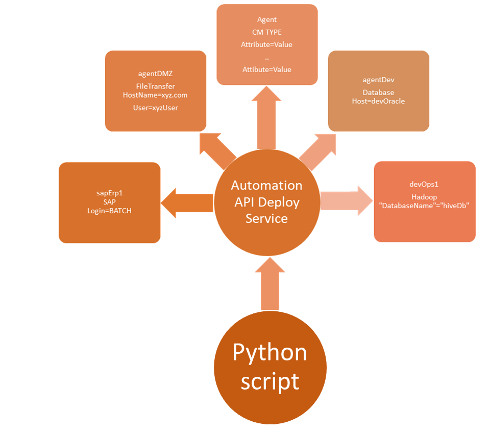

# Search connection profiles on agents for specific attributes

Company XYZ has a very dynamic network infrastructure where things change constantly.  Various hosts used for file transfers, SAP, Hadoop, web servers, and others get decommissioned or migrated frequently.  As a consequence, host names, file paths, logins, and other attributes may be changed in the process.  For the Control-M Administrator it is often a daunting task to figure out which agent and Control-M module will be affected.  The Control-M administrator wants a way to search specific attributes on connection profiles that changed and report on them, so he or she can update them.  

## Prerequisites
* Control-M/Enterprise Manager 9.0.19 or higher
* Automation API 9.0.19.110 or higher
* Control-M user with the following minimum privileges:
    * Assigned Roles: BrowseGroup
    * Privileges > Control-M Configuration Manager: Full
    * Privileges > Configuration: Browse
    * Privileges > Security: Browse
* Unix or Windows system with Python 2.7+ or 3.6+
* httplib2 for Python
* urlparse for Python2 or urllib.parse for Python3 (*required for urlparse*)

## Platforms Tested
* CentOS 7.3 with Python 2.7.5 and 3.6.8
* Windows with Python 3.7.4
* Cygwin 64 bit for Windows with Python 2.7.16 and 3.6.9
* Solaris 10 with Python 2.7.11
## Implementation

The Python script uses the following Automation API [deploy service](https://docs.bmc.com/docs/automation-api/919110/deploy-service-872868746.html) commands and codes:
* [Connection Profiles](https://docs.bmc.com/docs/automation-api/919110/connection-profiles-872868730.html)
* [deploy connectionprofiles::get](https://docs.bmc.com/docs/automation-api/919110/deploy-service-872868746.html#Deployservice-deployconnectionprofiles::get)

## Video

The following video demonstrates the above steps.

Click the above image to watch the video on YouTube.

## Table of Contents

1. [Python Scripts & Documentation](./scripts)