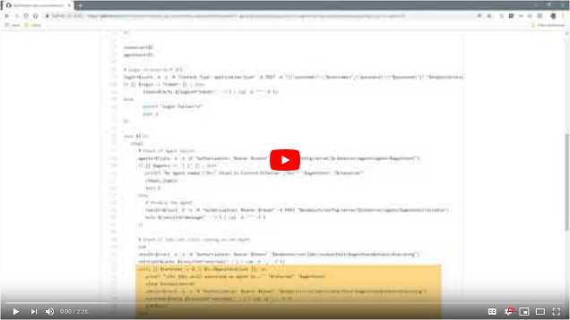

# Stop scheduling jobs to a host during maintenance

## Requirement

During system maintenance outages on weekends, for example when the sysadmins 
need to apply operating system patches, a Control-M admin needs to be on the
call to stop jobs from being scheduled to that agent before maintenance can 
start and enable scheduling again afterwards. 
The Control-M admins want to create a script that the sysadmins can run to do 
this task, so they don’t have to be actively involved during system maintenance 
on weekends. 
The System Admin group has requested that a Shell script and Windows PowerShell
script are created so that both their Linux and Windows teams will have a script 
they can work with.

## Prerequisites

A Control-M userid has been created named “sysadmin” with the following attributes:
* Assigned Roles: BrowseGroup
* Privileges > Control-M Configuration Manager: Full
* Privileges > Configuration: Update

## Implementation
The scripts will support two actions:

### Stop
The “stop” action will check for a maximum of 5 minutes if jobs are still 
running on the host.  If none are found, a message is printed saying that jobs 
are not longer running on the host. The Agent will then be disabled so no 
new jobs will be started on the host.
If after 5 minutes jobs are still found to be running, a message is printed 
stating to contact the Control-M administrators to check on those jobs and take 
action.

### Start
The “start” action will enable the Agent so jobs can resume scheduling on 
the host.

The [scripts](./scripts) directory contains the final code, and an explanation 
on how they work.

## Video

The following video demonstrates the above steps.

Click the above image to watch the video on YouTube.
