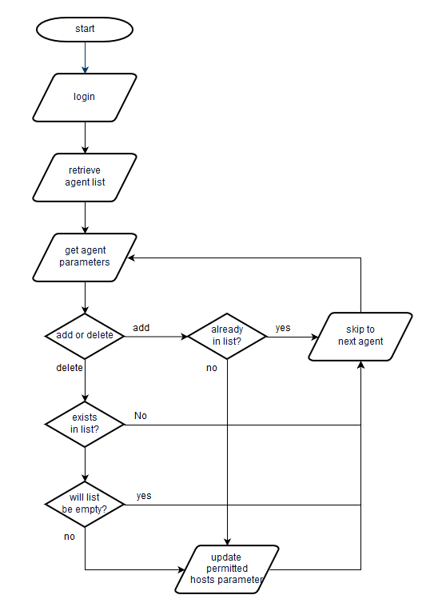

# update-ctmpermhosts-in-agents.py

## Usage

```
usage: update-ctmpermhosts-in-agents.py [-h] (-a | -d) -u USERNAME
                                        [-pf PWFILE] [-i] -s SERVER -n NEWHOST

Updates Authorized Control-M/Servers list in multiple Agents

optional arguments:
  -h, --help            show this help message and exit
  -a, --add             Add a host to the list
  -d, --delete          Delete a host from the list
  -u USERNAME, --username USERNAME
                        Username to login to Control-M/Enterprise Manager
  -pf PWFILE, --pwfile PWFILE
                        The file that contains the password to login to
                        Control-M/Enterprise Manager
  -i, --insecure        Disable SSL Certificate Verification
  -s SERVER, --server SERVER
                        Name of current Control-M/Server the Agents are
                        connected to
  -n NEWHOST, --newhost NEWHOST
                        Host name to be added to the Authorized
                        Control-M/Servers list
```

* --add or --delete must be specified indicating the desired action.
* --newhost specifies the hostname to be added or removed.
* --username and --pwfile specify the login credentials to be used to connect to
  the Automation API.
* --server specifies the Control-M/Server to which the Agents are currently
  connected.

## Program Flow



