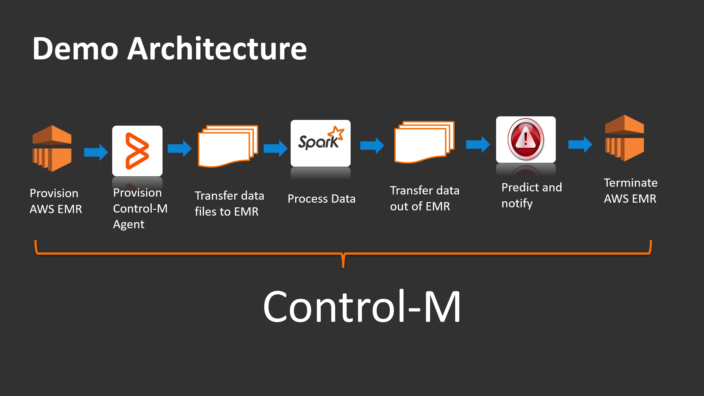

# **Preventive Maintenance with AWS and Control-M**

This repo contains an example of an IOT/ML predictive maintenance application running on AWS and orchestrated by Control-M.

Control-M is a business application workfow orchestration solution that simplifies the creation, integration and automation of data pipelines across on-premises and cloud technologies.

## Details
A truck manufacturer set out to improve the utilization of trucks for customers subscribing to its "Connected Vehicle" program. By collecting and analyzing the data from on-board sensors, it was expected the overall "dwell" time (unproductive time a vehicles spends waiting for service) would be decreased. The eventual reduction was about 40% which resulted into significant cost savings, increased productivity and surging levels of satisfaction resulting in repeat business and customer loyalty.
 
### **Architecture**
This is a view of the application components:

 - **EMR** - the AWS Hadoop offering is dynamically launched based upin demand
 - **Control-M Agent** - orchestration worker deployed onto the EMR cluster during instantiation
 - **Transfer files** - input IOT data is pushed to the EMR cluster after the cluster has initialized
 - **Spark** - Scala Machine Learning algorithms run in Spark
 - **Transfer results** - any data that should persist is pulled out of the EMR cluster 
 - **Predict** - AWS SNS is used to notify all interested parties
 - **Terminate EMR** - decommission cluster to manage costs

### Data
IOT data from vehicle-mounted sensors are collected by a Telematics provider and dropped into an S3 bucket periodically. Control-M watches the S3 bucket for data arrival. That event triggers the workflow you see in the architecture above.
### EMR Cluster 
The EMR service launches a Hadoop cluster pre-configured with the selected components/versions selected during the instantiation request. A bootstrap mechanism is provided to add custom components. This facility is used to deploy a Control-M agent to manage workflow operations that run on the EMR cluster.
### Other Processing
Data movement is performed by Control-M and its Managed File Transfer facility. 
The ML portion including creation and training of models is [available in this repo](https://github.com/werowe/preventiveMaintenanceLogitReg).
Notification to the vehicle driver and any other interested parties is performed via text messages using AWS SNS.