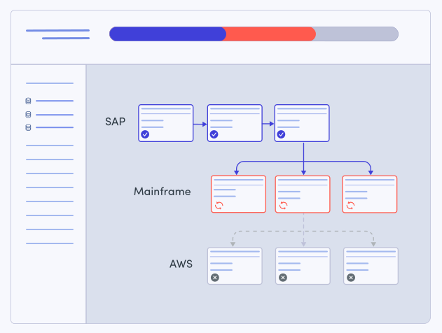
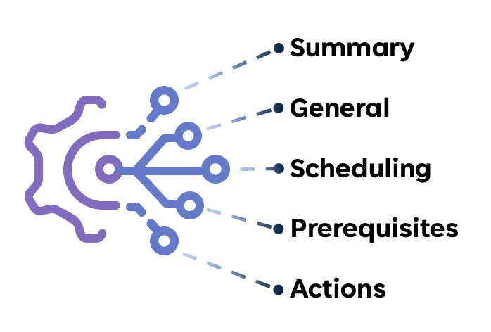
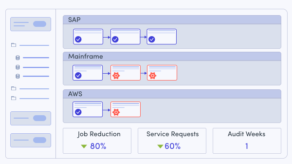

# Control-M Workload Pre-Flight Check

## The Pilot Preflight Inspections: Essential Checks for Safe Flight

Before a pilot ever pushes the throttle forward, they walk the aircraft and work through a checklist: control surfaces, fuel, instruments, hydraulics. Not because they distrust the plane — because a [preflight inspection](https://www.aviationtrainingexperts.com/article/preflight-inspections-essential-checks) turns an in-flight emergency into a five-minute fix on the tarmac. The whole point is to find the problem **before** commitment, when the cost of finding it is a delay, not a disaster.

A Control-M workflow deserves the same discipline. Once a folder is ordered, its jobs are "in the air" — agents need to answer, file transfers need to land, dependencies need to fire on schedule. Finding out an agent is down or a connection profile is broken *after* the job has already started is the equivalent of discovering a fuel problem at 10,000 feet.

## Why this matters to a Control-M operator

Take [financial close](https://www.bmc.com/it-solutions/finance-automation/financial-close.html) as a concrete example: a tightly-scheduled, multi-system chain of jobs — pulling ledger extracts, transferring files between ERP, banking, and reporting systems, triggering downstream reconciliation — that runs on a hard deadline (end of month, end of quarter) with finance, audit, and compliance all waiting on the output.

If an Cloud Storage or SFTP connection profile has stale credentials, or the agent behind a host group has been decommissioned, the close process doesn't fail quietly — it fails in the middle of the night, mid-chain, with jobs already dependent on its output. Recovery means paging someone, manually re-running steps, and possibly missing the close deadline entirely. The failure was almost always discoverable hours or days earlier — the connection profile could have been tested any time before the run.

This tool is the preflight check for that scenario: it walks every job in a folder, resolves and tests the agent behind it, and for file transfer jobs, tests the connection profiles (and optionally the network path to SFTP endpoints) — all without ordering, running, or touching anything. It turns "we'll find out at go-time" into "we already know, and we know it hours before the scheduled window."

## The anatomy of a Control-M job

The reason a preflight check can be automated at all — across a folder full of mixed job types — is that every Control-M job, regardless of type, is built from the same five panels:

- **Summary** — name, description, application/sub-application
- **General** — job type, Run As, and the **Host/Host Group** the job executes on
- **Scheduling** — when and how often it runs
- **Prerequisites** — conditions, events waited for, resource requirements
- **Actions** — on-success/on-failure handling, alerts

Because that shape never changes, the Automation API always exposes `Host` in the same place in the deployed-job payload no matter the job type. That's what makes "resolve Host Group → test agent" (API calls #1-3 below) a check you can run unconditionally against every job in a folder — the check doesn't need to know or care what the job actually does. Only the job-type-specific piece changes: a File Transfer job hangs a `ConnectionProfileSrc`/`ConnectionProfileDest` off this same standard shape; a different job type hangs something else off it.

## What gets checked

- **Agent reachability** — every job's Host (a Host Group) is resolved to a member agent, and that agent is tested for availability.
- **Connection profile validity** — for File Transfer jobs, both the source and destination connection profiles are tested against the resolved agent, using Control-M's own connection-profile test.
- **SFTP network path** — when a connection profile is SFTP, its live host/port is resolved and pinged/port-tested from the machine running the check, as an extra early signal (see the caveat below).
- **Nothing else runs** — this is entirely read-only and test-only against the Automation API; no job is ordered, held, or modified.

> **Caveat:** the SFTP network test proves reachability *from the machine running the check*, not from the Control-M agent itself — the agent's network path may differ. Treat it as an early warning signal, not proof the agent-side transfer will succeed.

## Adding a new job type is additive, not a rewrite

Today the script only adds a type-specific check for `Job:FileTransfer`. Because every other job type shares the same anatomy above, plugging in another type means adding one more branch, not restructuring the tool.

Take a SQL/Database job as an example — testing its connection profile and DB host/port reachability follows the exact same pattern already used for FileTransfer/SFTP:

1. **Agent check** — nothing to do. Every job has a Host/Host Group regardless of type, so it's already covered by the existing, type-agnostic check.
2. **Connection profile check** — add a branch for the database job type (the exact job-type and connection-profile-type strings depend on the DB platform — Oracle, MSSQL, DB2, etc. — check the job's definition via the Automation API to confirm them) and call the existing `Test-CtmConnectionProfile` function with that connection-profile type instead of `FileTransfer`.
3. **DB reachability check** — reuse `Get-CtmConnectionProfile` to resolve the profile's live `HostName`/`Port`, then reuse `Test-NetworkEndpoint` (ping + TCP-connect) exactly as-is — it's already host/port-agnostic, so no new test logic is needed.

No new API calls and no new test primitives — just one more mapping from job type to which connection-profile field(s) it has.

## Two ways to run this check

| Implementation | Best for |
|---|---|
| [`src/ctm-preflight.ps1`](src/ctm-preflight.ps1) (PowerShell 7) | Scheduling before a run, wiring into CI/CD or an orchestrator, scripted/automated use — produces a JSON report and a script-friendly exit code |
| [`src/postman/Workload PreFlight Check.postman_collection.json`](src/postman/Workload%20PreFlight%20Check.postman_collection.json) | Manual, ad hoc checks; exploring or demoing the underlying API calls one at a time without writing any code |

Both implementations call the same underlying Control-M Automation API endpoints — the PowerShell script simply chains them together, adds memoization, and adds the optional SFTP network test on top. Setup and usage details for each live in [`src/README.md`](src/README.md).

## Control-M Automation API calls used

Full reference: [documents.bmc.com/supportu/API/Monthly/.../API_Services_Main.htm](https://documents.bmc.com/supportu/API/Monthly/en-US/Documentation/API_Services_Main.htm) (**Deploy API Calls** and **Configuration API Calls** sections).

| # | Method & Path | Purpose |
|---|---|---|
| 1 | `GET /deploy/jobs?format=json&folder={folder}&server={server}&useArrayFormat=true` | Retrieve every deployed job in the target folder (all types), including nested SubFolders — the source data for every check that follows. |
| 2 | `GET /config/server/{server}/hostgroup/{hostgroup}/agents` | Resolve a job's Host Group to its member agents. |
| 3 | `POST /config/server/{server}/agent/{agent}/test` | Test agent availability — the same check as Control-M's "Test Availability" action. |
| 4 | `GET /deploy/connectionprofiles/centralized?type=FileTransfer&name={name}` | Look up a Centralized Connection Profile's live `HostName`/`Port`/`Type` (PowerShell script only — used to decide whether/where to run the SFTP network test). |
| 5 | `POST /deploy/connectionprofile/centralized/test/{type}/{name}/{server}/{agent}` | Run Control-M's own "Test Centralized Connection Profile" check — the authoritative pass/fail for a connection profile. |

None of these mutate a Control-M object — every call is a read or a built-in test/diagnostic operation.

## Getting started

See [`src/README.md`](src/README.md) for prerequisites, `.env` configuration, usage examples, output modes, the JSON report schema, and exit codes.
