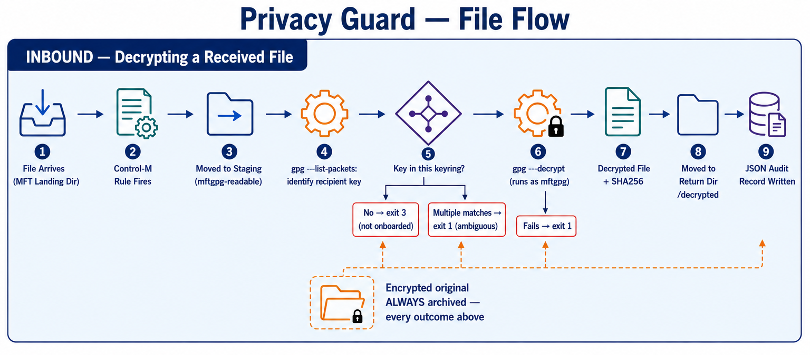
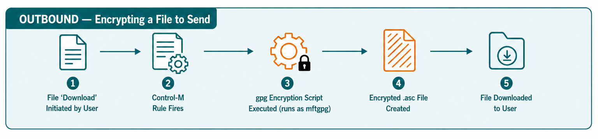

# Privacy Guard

## Purpose

Privacy Guard is a set of hardened bash scripts that add GPG encryption/decryption and BMC Control-M MFT Enterprise (MFTE) rule-variable auditing to a Control-M Managed File Transfer Enterprise deployment. It exists to answer two operational needs that MFTE doesn't handle natively:

1. **Encrypt/decrypt files in flight**, using a dedicated GPG service account (`mftgpg`) and a keyring management workflow — key generation, import/export, a "one dedicated key per customer" onboarding pattern, and an inbound "receive" script that figures out which of many keys a file was encrypted to and decrypts it automatically.
2. **Capture every BMC MFT Enterprise Processing Rule Action variable** (`$$FILE_PATH$$`, `$$FILE_SIZE$$`, etc.) as a structured JSON record, with optional sha256 and Apache Tika enrichment, so file-transfer events are auditable outside of Control-M's own job log.

Everything here runs as a **Control-M Run Command** invoked by a Processing Rule/Action, on the MFT Hub (except the setup script, run once per host). All scripts share one `.env`, one shared `lib/bash` library, and the same Control-M-specific argument-parsing defenses (see [mfte.sh](docs/mfte.sh.md)) — these scripts are called with raw, sometimes-unquoted `$$VAR$$` substitutions, and several production incidents shaped how that parsing works.

**Origin note:** most of the GPG scripts started as training material, written to print every intermediate value (including generated passphrases) so a student could see the mechanism. This is a hardened, production-like-demo version of that same material — passphrases now live only in locked-down files, gpg calls run under a least-privilege service account, and nothing sensitive is ever echoed or logged. It is still a lab-grade demo in places (see individual docs' "risk"/"accepted risk" notes, especially in the onboarding scripts) — read those before using this as-is in production.

## Tested on

**RHEL 9.x.** All shell behavior, `gpg` invocations (gpg 2.2.27), and permission/NFS notes throughout these docs (`no_root_squash`, `nfs4_setfacl` vs `setfacl`, `runuser` requiring a root caller, etc.) were verified against that OS/gpg combination specifically. Nothing here is known to require RHEL 9 rather than another modern systemd-based Linux distribution, but if you deploy on something else (a different RHEL major version, a Debian/Ubuntu derivative, etc.), re-verify at least:

- `gpg --list-keys --with-colons` output shape (used throughout [mfte.gpg.sh](docs/mfte.gpg.sh.md)'s fingerprint/uid parsing) — stable across recent gpg 2.2/2.4 releases, but not guaranteed byte-for-byte across major versions.
- Whether a freshly generated key needs the explicit sign/encrypt subkey workaround described in [werkstatt.gpg.generate.key.sh](docs/werkstatt.gpg.generate.key.sh.md) — this was required on gpg 2.2.27; a newer gpg may behave differently with `--quick-generate-key ... default`.
- Whether `gpg-agent` needs `allow-loopback-pinentry` set explicitly (see [setup.mftgpg.sh](docs/setup.mftgpg.sh.md)) — not required in RHEL 9 testing, but agent defaults vary by build.
- NFS ACL tooling (`setfacl` vs `nfs4_setfacl`) if this deployment's shared storage isn't NFSv4 — see the main NFS note below.

## How a file flows through the system

Privacy Guard uses standard [asymmetric (public/private key)](images/pgp.asym.png) GPG encryption, not [symmetric/shared-secret](images/pgp.sym.png) encryption — every operation below resolves a specific key by fingerprint rather than a shared passphrase.

### Inbound: a file arrives and needs decrypting



This is the automated path — [werkstatt.gpg.receive.file.sh](docs/werkstatt.gpg.receive.file.sh.md) figures out which key applies from the file itself, so nothing upstream has to tell it. The encrypted original is archived on **every** outcome (step 5's branches and step 6's failure included), not just success — staging is only reachable by `mftgpg`/root, so leaving a file there after anything but a clean decrypt would strand it somewhere the admin can never reach again. See [werkstatt.gpg.receive.file.sh](docs/werkstatt.gpg.receive.file.sh.md) for the exact exit codes and the `$MFTE_GPG_RETURN_DIR` path resolution.

### Outbound: encrypting a file to send



A user-initiated download triggers a Control-M rule that runs [werkstatt.gpg.encrypt.file.sh](docs/werkstatt.gpg.encrypt.file.sh.md) before the file is handed back. `--trust-model always` (step 3) is safe here specifically because every public key ever imported into this keyring had its fingerprint verified out of band first (see [werkstatt.gpg.inspect.key.file.sh](docs/werkstatt.gpg.inspect.key.file.sh.md)) — see that script's doc for the tradeoff.

## Layout

```
privacy-guard/
├── README.md              this file
├── docs/                  one doc per script/library (this directory)
├── images/                 diagrams referenced from the docs
└── src/
    ├── bin/                the scripts themselves (Control-M Run Commands)
    ├── lib/bash/           shared libraries, sourced by every script in bin/
    └── config/
        ├── sample.env      template for the framework's single .env
        └── data.mftgpg.json  input data for setup.mftgpg.sh
```

Deploy `src/` to a fixed path (e.g. `/opt/werkstatt/ops`) on every MFT Hub node; scripts derive their own location (`MFTE_OPS_HOME`) relative to `bin/`, and expect the framework's `.env` to be readable at `/opt/werkstatt/ops/config/.env` (copy `src/config/sample.env` there and fill it in — see [mfte.sh](docs/mfte.sh.md)).

## Script index

### Shared libraries (`src/lib/bash/`)

| Script | Purpose |
|---|---|
| [mfte.sh](docs/mfte.sh.md) | Sourced by every script below. Loads `.env`, execution-trace logging, Control-M-safe argument parsing, JSON field builders. |
| [mfte.gpg.sh](docs/mfte.gpg.sh.md) | Sourced by every `werkstatt.gpg.*.sh` / `onboarding-4gpg-*.sh` script, after `mfte.sh`. Privilege-dropping gpg invocation, passphrase-file handling, fingerprint lookup/import helpers. |

### Rule-variable capture

| Script | Purpose |
|---|---|
| [mfte.rule.vars.all.jsonl.sh](docs/mfte.rule.vars.all.jsonl.sh.md) | Captures every BMC MFTE Processing Rule Action variable as one JSON record per file event, with optional sha256/Tika enrichment. |

### GPG — core operations

| Script | Purpose |
|---|---|
| [werkstatt.gpg.generate.key.sh](docs/werkstatt.gpg.generate.key.sh.md) | Generate a new keypair (certify-only primary + sign/encrypt subkeys) for `mftgpg`. |
| [werkstatt.gpg.encrypt.file.sh](docs/werkstatt.gpg.encrypt.file.sh.md) | Encrypt a file to a recipient's public key already in the keyring. |
| [werkstatt.gpg.decrypt.file.sh](docs/werkstatt.gpg.decrypt.file.sh.md) | Decrypt a file with a known (or default) private key. |
| [werkstatt.gpg.receive.file.sh](docs/werkstatt.gpg.receive.file.sh.md) | Inbound file handler: figures out which of possibly many keys a file was encrypted to, decrypts it, and writes a full audit record. The one script built for the "one key per customer" pattern. |
| [werkstatt.gpg.delete.key.sh](docs/werkstatt.gpg.delete.key.sh.md) | Remove a key (public/secret/both). Dry-run by default. |
| [werkstatt.gpg.list.keys.sh](docs/werkstatt.gpg.list.keys.sh.md) | List every identity in the keyring, human-readable or JSON. |
| [werkstatt.gpg.set.default.key.sh](docs/werkstatt.gpg.set.default.key.sh.md) | Point `default-key.json` at a key already present, without generating/importing anything. |

### GPG — export / import (single key)

| Script | Purpose |
|---|---|
| [werkstatt.gpg.export.key.sh](docs/werkstatt.gpg.export.key.sh.md) | Export a public key, or (`-s`) a private key, for handoff/migration. |
| [werkstatt.gpg.export.passphrase.sh](docs/werkstatt.gpg.export.passphrase.sh.md) | Export just a key's passphrase file, on its own. |
| [werkstatt.gpg.import.public.key.sh](docs/werkstatt.gpg.import.public.key.sh.md) | Import a partner/recipient's public key. |
| [werkstatt.gpg.import.private.key.sh](docs/werkstatt.gpg.import.private.key.sh.md) | Import a private key (identity migration, partner decrypt-only key). |
| [werkstatt.gpg.import.key.sh](docs/werkstatt.gpg.import.key.sh.md) | Generic import — dispatches to public or private import logic via `-m`. |
| [werkstatt.gpg.import.keyserver.sh](docs/werkstatt.gpg.import.keyserver.sh.md) | Fetch a public key from a keyserver by full fingerprint. The only script in this family that touches the network. |
| [werkstatt.gpg.import.passphrase.sh](docs/werkstatt.gpg.import.passphrase.sh.md) | File a staged passphrase for a key whose secret half is already imported; validates it with an encrypt/decrypt round trip first. |

### GPG — batch import & inspection

| Script | Purpose |
|---|---|
| [werkstatt.gpg.import.all.public.sh](docs/werkstatt.gpg.import.all.public.sh.md) | Import every public key staged in a directory in one pass. Safe to re-run. |
| [werkstatt.gpg.import.all.private.sh](docs/werkstatt.gpg.import.all.private.sh.md) | Batch counterpart for private keys. Does not file passphrases (see doc). |
| [werkstatt.gpg.fingerprint.file.sh](docs/werkstatt.gpg.fingerprint.file.sh.md) | Given an **encrypted message**, list which key(s) are needed to decrypt it and whether this keyring can. |
| [werkstatt.gpg.inspect.key.file.sh](docs/werkstatt.gpg.inspect.key.file.sh.md) | Given a **key file**, show its fingerprint/uid(s) without importing it — the out-of-band verification step before trusting a key. |

### GPG — customer onboarding (demo convenience wrappers)

| Script | Purpose |
|---|---|
| [onboarding-4gpg-server.sh](docs/onboarding-4gpg-server.sh.md) | One-step "onboard a new customer": generate a keypair, export private+passphrase for the cluster, export public for the customer. |
| [onboarding-4gpg-cluster.sh](docs/onboarding-4gpg-cluster.sh.md) | Companion — run on every hub to import a staged customer key **and** file its passphrase in one pass. |

### Host setup

| Script | Purpose |
|---|---|
| [setup.mftgpg.sh](docs/setup.mftgpg.sh.md) | One-time, idempotent provisioning of the `mftgpg` service account and its directories. Run once per hub, as root. |

## Why a dedicated service account (`mftgpg`)

MFTE rule/action scripts always execute as **root** on this platform — there is no Control-M "RunAs" option to switch identity before a Run Command starts. Doing GPG operations directly as root would mean private key material and passphrases are only as protected as root's own reach. Instead, every actual `gpg` call runs via `runuser -u mftgpg`, dropping to a dedicated account that owns the keyring and passphrase files and nothing else — see [setup.mftgpg.sh](docs/setup.mftgpg.sh.md) for how that account is provisioned (no password, no SSH access, no sudo) and [mfte.gpg.sh](docs/mfte.gpg.sh.md) for the privilege-drop mechanics.

## Passphrase handling, at a glance

No script in this family takes a passphrase as a CLI flag or prints one to stdout/a log line. A passphrase is generated with `openssl rand -base64 24`, written straight to a mode-600 file owned by `mftgpg`, and read only via gpg's own `--passphrase-file`. See the individual key-generation/import/export docs for the exact handoff pattern between hubs, and [onboarding-4gpg-server.sh](docs/onboarding-4gpg-server.sh.md) for a deliberate, documented exception where a private key and its passphrase are bundled together for demo convenience.

## Multi-hub / NFS considerations

`/opt/werkstatt` (the framework home) is shared across hubs; `/home/mftgpg` (the keyring itself) is **not** — each hub has its own independent keyring, so a key generated on one hub has to be exported and imported onto every other hub before that hub can decrypt for it (see [onboarding-4gpg-cluster.sh](docs/onboarding-4gpg-cluster.sh.md) and [werkstatt.gpg.export.key.sh](docs/werkstatt.gpg.export.key.sh.md)).

In the other direction, `$MFTE_FTS_HOME`/`$MFTE_B2B_HOME` (`ftshome`/`b2bhome` — the MFT server's own shared NFS-mounted storage, where inbound files actually land and outbound deliveries actually go) is **root-only cluster-wide**: `mftgpg` cannot read or write anywhere under it, on any hub, because the MFT Client component that owns that tree manages it as root. That's why [werkstatt.gpg.receive.file.sh](docs/werkstatt.gpg.receive.file.sh.md) requires a Move File action to relocate each inbound file out of `ftshome` into `$MFTE_GPG_RECEIVE_STAGING_DIR` (a location `mftgpg` actually has access to) before it can be processed, and why that script's own final archival move back into `$MFTE_GPG_RETURN_DIR` (under `b2bhome`) runs as root rather than `mftgpg`. If this environment's NFS exports additionally have `no_root_squash` set, testing `mftgpg`'s actual file access **must** be done as `mftgpg`, never as root — a root shell can look like it has access it doesn't. See [werkstatt.gpg.receive.file.sh](docs/werkstatt.gpg.receive.file.sh.md#nfs-considerations) for the full explanation and the correct way to test.

## Getting started

1. Deploy `src/` to every hub, at a consistent path.
2. Copy `src/config/sample.env` to `/opt/werkstatt/ops/config/.env` and fill in the values for this environment (paths, `MFTE_TIKA_JAR` if using enrichment, etc.).
3. Run [setup.mftgpg.sh](docs/setup.mftgpg.sh.md) as root, once per hub.
4. Generate or import a key ([werkstatt.gpg.generate.key.sh](docs/werkstatt.gpg.generate.key.sh.md)), or start onboarding customers ([onboarding-4gpg-server.sh](docs/onboarding-4gpg-server.sh.md) + [onboarding-4gpg-cluster.sh](docs/onboarding-4gpg-cluster.sh.md)).
5. Wire the relevant script into a Control-M Processing Rule's Run Command — every script's own `-h` output includes a recommended Run Command line; the per-script docs reproduce it and explain the `$$VAR$$` quoting requirement.
