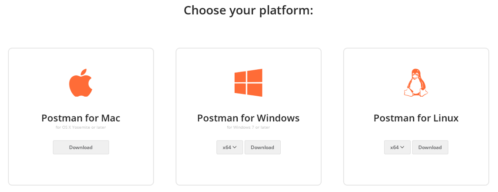

# Postman Rest Client


**What is Postman?**

The Postman Rest Client is a very popular and easy to use HTTP Request composer that makes it easy to call web services - in our case Control-M Automation API Services. 

To use Postman you have to download and install it. Please note, that there was a Chrome extension - this is not the one. Please use full version from https://www.getpostman.com/apps



After installing you can to import provided files - TLV.postman_environment.json and Control-M_Automation_API.postman_collection.json.
Once imported it will populate a list of available operations that can be selected and easily called from within the Postman UI.
It will add as well environment definition (upper right corner) - the TLV Lab one. You can copy it later on and add your own definitions to match your environments. 


**What Postman can do for me?**


From pre-populated list of actions you can call API services in Control-M AAPI. Usually you will start with Login (Session->Login), and later on pass to other different calls, 
like run a job from JSON (remember to attach file), or check the status of the job/jobs/request. 

Postman has posibility to work with multiple environments - you have to just switch the one you want to use in right upper corner. 

The very helpful feature for calling services is that you can program Postman to automatically fetch value from results. Check the Tests tab in Login call to see how it works - it fetches Token to be used in later calls.


**Magic button**

When working with given call (like Login) you can find a *magic button* on the right side.


When you will press this button, a window will pop up 


The Postman can generate a code in many different languages (including bash, python, etc) that will call exactly the service you have chosen. 

This can help you or customers to quickly find the right syntax and pass all parameters to call.

Example of the Login call is below - in Python:


```python
import requests
url = "https://ctmem.tlvlab.ctm.bmc.com:8443/automation-api/session/login"
payload = "{\"username\": \"user\", \"password\": \"password\"}"
headers = {'Content-Type': 'application/json'}
response = requests.request("POST", url, data=payload, headers=headers)
print(response.text)
```


**Error 405**

Our Enterprise Managers usually don't have SSL certificate or they are Self-Signed. 

Postman is checking by default this, and you can turn this off in Settings:


Here you can turn off as well the Postman headers to avoid "spam" in generated code. 


