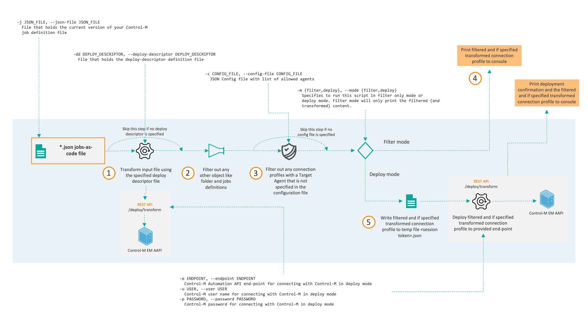

# Filter connection profile

This utility is designed to deploy connection profiles in scenarios where the application team cannot be authorized for the Control-M Configuration Manager (CCM).
It's designed to deploy connection profiles using a privileged account where the security is dealt with on a different layer (either in a CI/CD pipeline or by running this utility as a control-m job). 

In order to ensure only connection profiles will be process, it filters any other object out of a provided input file. 

> __Note:__ This script is developed and tested in a lab environment. Ensure proper testing is done before implementing this into a production environment. 

## Introduction

This python-based utility filters on connection profiles only. Although it is not a best practice, json files can include both job definitions as connection profiles. The authorization model for jobs is more granular. This utility is intended for a situation where jobs are getting deployed via a user account (personal or non-personal) which has the required granularity configured.
The utility supports a filter only mode. This supports scenarios where the actual deployment will be dealt with separately. The deployment mode will deploy the connection profile(s) to the provided endpoint. It does support deploy descriptor to transform the connection profile(s) for the targeted environment.

## Installation

Run ```pip install -r requirements.txt``` to install the required dependencies. 

## Filter on allowed agents

In addition to filtering the connection profiles out of a json, this filter can be set narrower to only include connection profiles on a target agent that are specified to be allowed in a separate json config file using the following format:

{
	"allowed_agents" : [ "agent1", "agent2"]
}

This configuration file can be provided with the -c option (see below). 
```

```

## Usage

```
usage: filter-connection-profile.py [-h] -j JSON_FILE [-dd DEPLOY_DESCRIPTOR]
                                    [-m {filter,deploy}] [-e ENDPOINT]
                                    [-u USER] [-p PASSWORD] [-c CONFIG_FILE]
                                    [-v] [--version]

Checks if folders are deleted from a Control-M jobs-as-code file by comparing
it with the previous version

optional arguments:
  -h, --help            show this help message and exit
  -j JSON_FILE, --json-file JSON_FILE
                        File that holds the Control-M jobs-as-code definition
                        file
  -dd DEPLOY_DESCRIPTOR, --deploy-descriptor DEPLOY_DESCRIPTOR
                        File that holds the deploy-descriptor definition file
  -m {filter,deploy}, --mode {filter,deploy}
                        Specifies to run this script in filter only mode or
                        deploy mode. Filter mode will only print the filtered
                        content.
  -e ENDPOINT, --endpoint ENDPOINT
                        Control-M Automation API end-point for connecting with
                        Control-M in deploy mode
  -u USER, --user USER  Control-M user name for connecting with Control-M in
                        deploy mode
  -p PASSWORD, --password PASSWORD
                        Control-M password for connecting with Control-M in
                        deploy mode
  -c CONFIG_FILE, --config-file CONFIG_FILE
                        JSON Config file with list of allowed agents
  -v, --verbose         Enables verbose mode
  --version             show program's version number and exit
```

### Flow

This utility follows the following flow:



Description:
1. Perform a transformation of the input file provided with the -j parameter using deploy descriptor if provided with the -dd option. This step requires the credentials (-u and -p) and endpoint information (-e) to be defined. If no deploy descriptor is used, it will continue with the provided input file as is. 

2. In this step, the connection profiles of the (transformed) input file will be filters out. All other type of objects will be ignored.

3. Only the connection profiles will be filtered out that are in the provided list of allowed agents specified in the configuration file via the -c option

4. If in filter mode (specified with the -m parameter), the result will be printed to the console.

5. If in deploy mode (specified with the -m parameter), a deployment will be done using the provided credentials (-u and -p) and endpoint information (-e). Before the deployment, a temporary json file will be written to the working directory. This will be deleted once the deployment was successful.  
