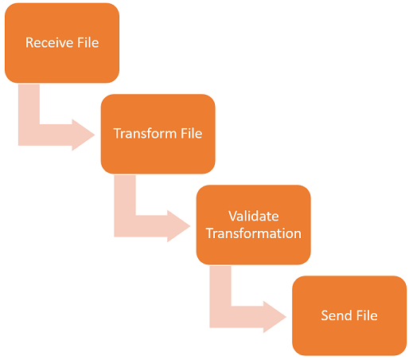
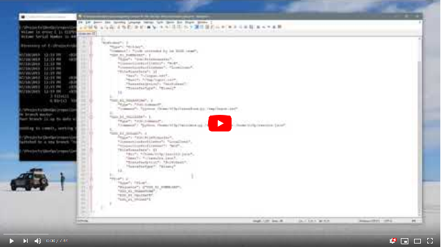

# How to get started using Control-M in a DevOps/CICD lifecycle

Leveraging Control-M Automation API's Jobs as Code feature in a CICD pipeline alongside standard DevOps tools allows:
* Centralized and versioned job definition storage
* Automated testing
* Trackable deployment to different environments

## Scenario
We are developing an application that will handle payroll disbursements from the Bank of England to the Defense Ministry.  We will develop the transformation and validation code concurrently with the automation code used by Control-M to handle file movement, transformation and transformation validation.  This will be done through our standard CI/CD process. Since the Bank of England regularly adjusts the format of the file, there will be a weekly code deployment.

Basic Application Workflow

Pre-Requisites:
* Control-M/Server
* Control-M/Enterprise Manager
* UserID and Password for Control-M Automation API
* Control-M Agent with Managed File Transfer installed
* Connection information for source and destination FTP servers 
* Automation API's ctm cli installed

## Code Walkthrough
1. [Writing JSON Definitions](./writing-json-definitions)
2. [Automating testing and deployment](./Jenkinsfile.md)

## Video

the following video demonstrates an example CI/CD pipeline with Gitlab and 
Jenkins using the files from this project.

Click the above image to watch the video on YouTube.