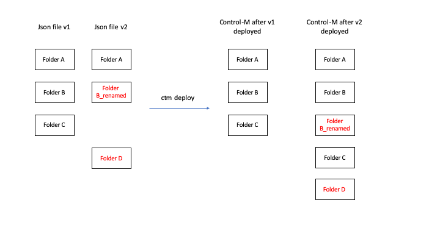
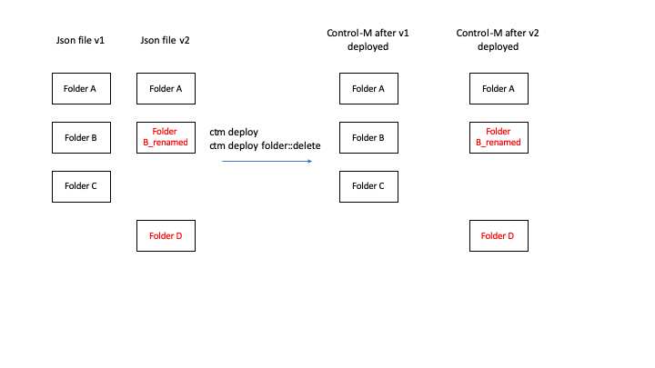
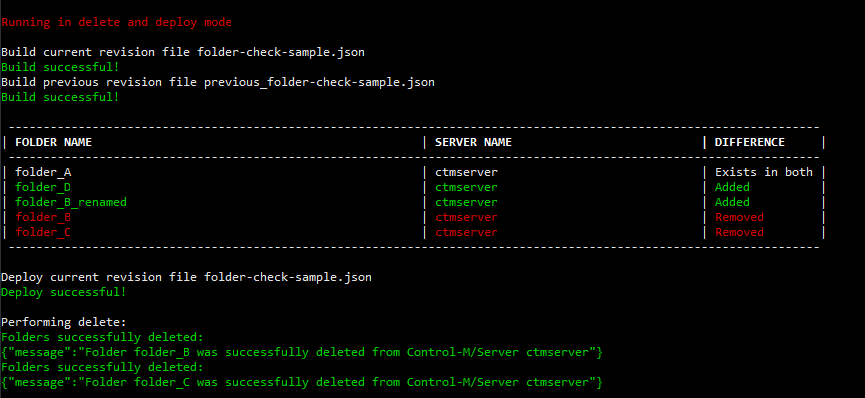
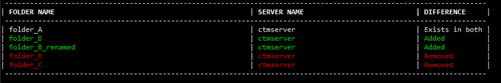

# Folder check

This utility is designed to detect the removal of the top level folders. 

> __Note:__ This script actually deletes folders from the end-point specified in case it detects a folder removal in the jobs-as-code json file. It is highly recommended to test this script in your specific environment. 

## Inroduction

The automation-api deploys json files. These json files holds folders. Control-M will replace any existing top level folder with the top level folder of a json file. However, since the json files are edited outside Control-M (in an IDE most likely), the removal of folders isn't tracked. If a folder got deleted, Control-M will deploy the new version of the json file leaving folders that are not part of the json file untouched. Same goes for renaming folders (which is basically a deleting a folder and adding a new one).

This can lead to the challenge described in the picture below: After the updated json file is deployed, the deleted or renamed folders are not removed from Control-M:



The folder_check utility compares the updated json file (v2) with the previous version (v1) and detects which folders are deleted or renamed. The utility can run in test mode or can actually perform a delete. This example repo holds a bash script that called compare_with_previous.sh. It pulls the HEAD - 1 version from the git repository including the deploy descriptor file. 




# Features

The folder check utility does a diff on both versions of the jobs-as-code definition file and detects the changes



Additional features include:
* It supports deploy descriptor for both current and previous revision file
* It will build the files first against the provided endpoint (we don’t want to delete anything based on an invalid definition file)
* It will determine the server of the folder by the priority of 
    1. specified on the folder
    2. specified in the defaults.
    3. Auto discover from the EM if this option is enabled.
* It has an option to auto discover the server if it is not specified on the folder level or on the defaults. This is controlled by the parameter ```--auto-discover-server```
* It has a test mode, a delete mode and a delete and deploy mode. In the last mode, it will build and deploy the current revision and delete the removed folders. This option can be controlled with the ```-m {test,delete}``` option.

Below a screenshot of the script running in delete mode:




## Files in repo:

* compare_with_previous.sh: Example script that pulls the previous version of a jobs-as-code and deploy descriptor json file from the git repository and then calls the folder_check script.
* DeployDescriptor.json: Example deploy descriptor file 
* folder-check-sample.json: Example jobs-as-code file
* previous_DeployDescriptor.json: Example of the previous deploy descriptor file (pulled from git HEAD-1 with compare_with_previous.sh)
* previous_folder-check-sample.json: Example of the previous jobs-as-code file (pulled from git HEAD-1 with compare_with_previous.sh)
* folder_check.py: The python script that does the actual comparison between 2 jobs-as-code json files and removes the folders from the end-point.
 

## Prerequisists

This script is based on python 3 and requires the request package. This can be installed by running the following command:

```pip install requests```


## Usage
```
usage: folder_check.py [-h] -c CURRENT_REVISION
                       [-c_dd CURRENT_DEPLOY_DESCRIPTOR] -o PREVIOUS_REVISION
                       [-o_dd PREVIOUS_DEPLOY_DESCRIPTOR] [-m {test,delete}]
                       -e ENDPOINT -u USER -p PASSWORD
                       [--auto-discover-server AUTO_DISCOVER_SERVER] [-v]

Checks if folders are deleted from a Control-M jobs-as-code file by comparing
it with the previous version

optional arguments:
  -h, --help            show this help message and exit
  -c CURRENT_REVISION, --current-revision CURRENT_REVISION
                        File that holds the current version of your Control-M
                        job definition file
  -c_dd CURRENT_DEPLOY_DESCRIPTOR, --current-deploy-descriptor CURRENT_DEPLOY_DE
                        File that holds the current deploy-descriptor
                        definition file
  -o PREVIOUS_REVISION, --previous-revision PREVIOUS_REVISION
                        File that holds the previous version of your Control-M
                        job definition file
  -o_dd PREVIOUS_DEPLOY_DESCRIPTOR, --previous-deploy-descriptor PREVIOUS_DEPLOY
                        File that holds the current deploy-descriptor
                        definition file
  -m {test,delete}, --mode {test,delete}
                        Specifies to run this script in test mode or delete
                        mode. Test mode will only print the folders to be
                        deleted.
  -e ENDPOINT, --endpoint ENDPOINT
                        Control-M Automation API end-point for connecting with
                        Control-M
  -u USER, --user USER  Control-M user name for connecting with Control-M
  -p PASSWORD, --password PASSWORD
                        Control-M password for connecting with Control-M
  --auto-discover-server AUTO_DISCOVER_SERVER
                        Toggles if the control-m server must be auto
                        discovered if not specified in the job definition. If
                        selected, the
  -v, --verbose         Enables verbose mode
  
```