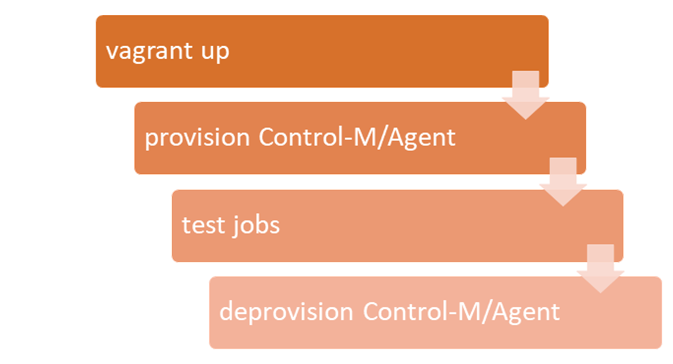

# Provision Control-M Agent with Vagrant

## Requirement

The development team uses Vagrant to provision various virtual machines to develop and test their programs.  Vagrant allows them to quickly and easily provision 
virtual machines as needed for various platforms and configuration.  As part of the testing they would like to test their programs while running under a Control-M/Agent
environment but they are not familar with Control-M.  As a solution the Control-M Automation API is able to provision a Control-M Agent and register it with a 
Control-M Server automatically.  It can also unregister,undeploy, and uninstall the Control-M Agent.  This allows developers to test against Control-M Agent without 
having to involve the Control-M administrator.

## Prerequisites
* Vagrant 2.2.4+
* VirtualBox 6.0+
* Privileges > Control-M Configuration Manager: Full
* Privileges > Configuration: Update
* Privileges > Configuration: Full (allows agent to be deleted)
* Additional Folder and Run As User permissions may be needed for job deployment and execution.

## Implementation

## Table of Contents
1. [Vagrantfile & scripts](./scripts)

