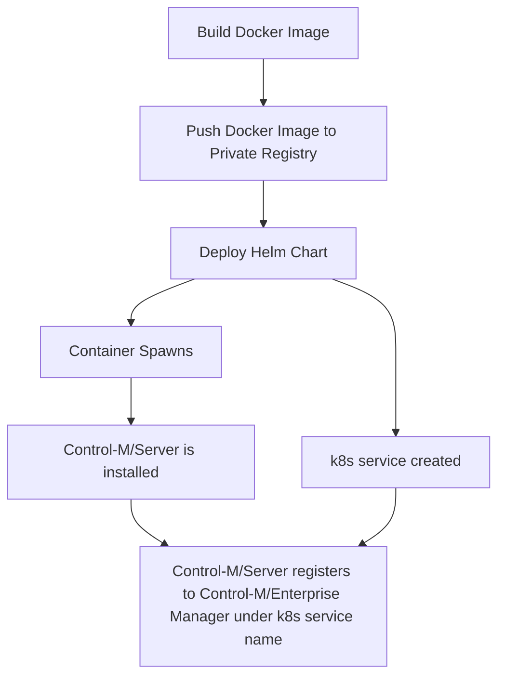

# Run Containerized Control-M Server in Kubernetes

## Requirement
XYZ Corp wants move it's job scheduling infrastructure into a containerized environment to allow better resource monitoring/utilization and flexibility when applying system updates to the underlying OS.

The following specifications were decided for the implementation:
* Must be able use any standard Kubernetes infrastructure (gke, aws, baremetal) to avoid vendor lock in
* Be transparent to the application owners
* Allow for change roll back in case of errors with a new version

## Prerequisites
* Control-M/Enterprise Manager 9.0.19 or higher
* Control-M Automation API 9.0.18.300 or higher
* Control-M User with following Privileges
  * Privileges > Control-M Configuration Manager: Full
  * Privileges > Configuration: Full (allows Control-M/Server to be added and deleted)
* Kubernetes Cluster with Helm Tiller server deployed
* Helm client
* Private Docker/Container Image registry

## Implementation
We will utilize a Helm Chart to deploy our containerized Control-M/Server into Kubernetes. If you're not familiar with Helm, you can read the Helm project's documentation here: [https://helm.sh/docs/](https://helm.sh/docs/).

To perform the installation and configuration of the Control-M/Server inside of the container, the Control-M Automation API provision service will be used.

The over all process will look like:

## Demo
Click on the below image to watch a demonstration on YouTube.  

## Table of Contents

1. [Setting up the Container Image](./container.md)
2. [Creating the Helm Chart](./chart.md)
3. [Deploying to Kubernetes](./deploy.md)
