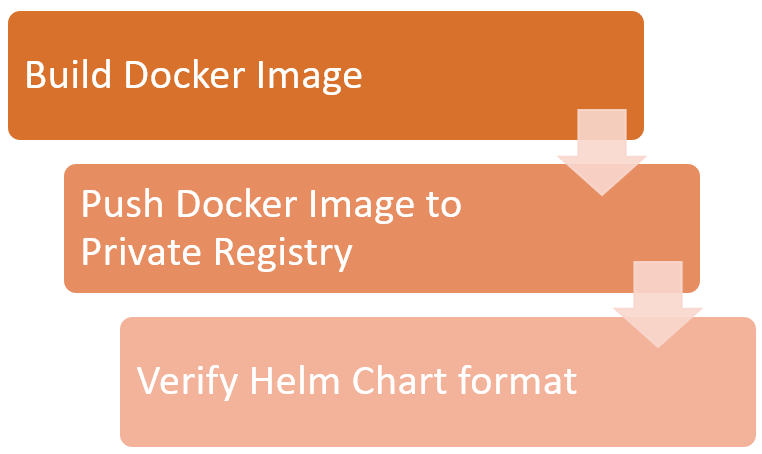
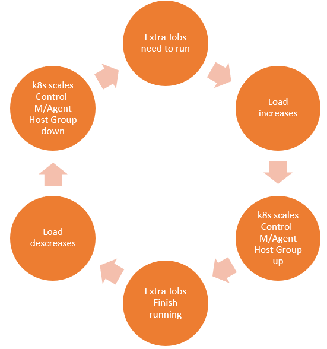

# Scaling Control-M/Agent Host Group with a dynamic workload

## Requirement

A particular job flow has a highly variable load. At times, the load (number of jobs) can be very low, however at other times (end of month processing) this load can be very high. To avoid unnecessary resource use, the Control-M Administrator wants the number of agents in the host group that runs this set of jobs to be low when the load down, and automatically scaled up when the number of jobs rises to avoid a bottle neck.

## Prerequisites

* Control-M/Enterprise Manager 9.0.18.000 or higher
* Control-M Automation API 9.0.00.500 or higher
* Control-M/Server
* Control-M User with following Privileges
  * Privileges > Control-M Configuration Manager: Full
  * Privileges > Configuration: Full (allows agents to be added and deleted)
* Kubernetes Cluster with Helm Tiller server deployed
* Helm client
* Private Docker/Container Image registry

## Implementation

We will utilize a Helm Chart to deploy our Control-M/Agent(s) into Kubernetes. If you're not familiar with Helm, you can read the Helm project's documentation here: [https://helm.sh/docs/](https://helm.sh/docs/).

Prior to deploying the Control-M/Agent into Kubernetes, the following steps must be performed.

These steps can be done automatically as part of a CI/CD flow. In this example, we'll be using Gitlab-CI.

Once the Helm Chart is deployed in to Kubernetes, the following logic is performed automatically to scale the host group to correspond to the load caused by the number of jobs that need to run:

## Table of Contents

1. [Setting up the Container Image](./container.md)
2. [Creating the Helm Chart](./chart.md)
3. [Deploying to Kubernetes](./deploy.md)
