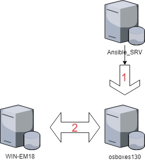
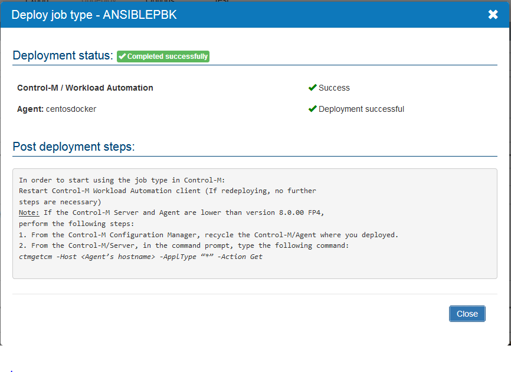
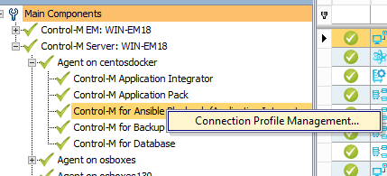
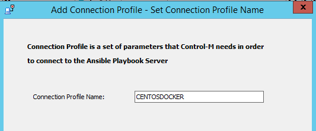
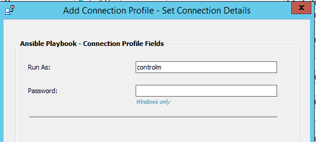
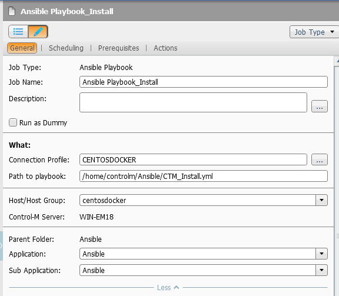
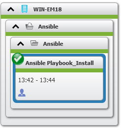
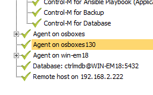
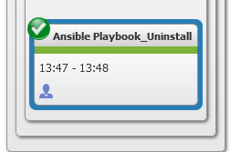

**Introduction**

Ansible is an open source software that automates software provisioning (including cloud), configuration management, and application deployment. It uses no agents and no additional custom security infrastructure, so it's easy to deploy. It uses a very simple language (YAML) to describe automation jobs.

More and more companies are using Ansible as easy and free configuration management tool.

This document will show, how Ansible and Control-M, using Automation API, can work together. The attached example allows to install Control-M Agent (using Control-M Automation API) on Linux host that is managed by Ansible.

**Architecture**

The Architecture of the example is as follows:

WIN-EM18 – Windows Control-M server running Control-M 9.18.1 (9.18 FP1), IP 192.168.200.118

Ansible\_SRV – Centos7, Ansible controlling machine, IP 192.168.200.110

osboxes130 – Centos7, Ansible node (no Ansible installed), IP 192.168.200.130

**Prerequisites**

All servers see each other (ping and other ports open), and each can be reached via hostname (not only IP – so check hosts if needed).

Ansible Controlling Machine (Ansible\_SRV) must be able to **ssh** to osboxes130 with no password – instruction below.

When we run Ansible Playbook on Ansible Controlling Machine, it will ssh into osboxes130 and performs steps (tasks) from playbook. These steps are explained in the later part of the document, but this step is critical for Ansible itself to run.

**Install and configure Ansible (on Ansible Controlling Machine – in this example Ansible\_SRV)**

Ansible can be installed from yum (sudo yum install ansible), and this is the easiest way.

After installing you need to configure Ansible hosts (with which hosts Ansible will talk). This is done by setting groups and hosts in /etc/ansible/hosts file. On my server Ansible\_SRV this file has following entry:

\[centos\]

osboxes130

This means I have a group of hosts named **centos** and in this group I have only one server connected (**osboxes130**). As you can see, it is easy to add hosts to group or groups (like same host can be in multiple groups).

When you are done you can check if Ansible is configured right by running the following:

> ansible -m ping all

This – at this moment – will fail as we did not set up ssh connection with no password between our servers.

**Configure SSH connection**

To make Ansible with no problems to reach to managed hosts, it is needed to create trusted connection between the servers. It means we should be able to do:

> ssh root@osboxes130

and we should be able to enter the system with no password.

To achieve this, on Ansible host (Ansible\_SRV):

-   generate key pairs (ssh-keygen) if not generated – 2 files will be generated, id\_rsa and id\_rsa.pub in .ssh folder (i.e. /home/controlm/.ssh). Do it for the user that you will use to trigger Ansible.

> At this moment you can choose to use password for the key – this is common for companies to use it.

-   You need to move your public key (id\_rsa.pub) to your target systems. It must be put in the .ssh/authorized\_hosts folder with special file/folder permissions. The easiest way is to run from Ansible host the following command:

> ssh-copy-id root@osboxes130
>
> This logs into the host (as root), and copies keys to the server, and configures them to grant access by adding them to the authorized\_keys file. The copying will ask for a password for root@osboxes130.

You can check finally that all works fine:
>
> ssh root@osboxes130

**If you will use password for the key**, you will be asked for this password at this connection – and remember, that Ansible will be asked as well. There is a solution for that – tool called ssh-agent.

> Run the following (once per session):
>
> ssh-agent bash
>
> ssh-add \~/.ssh/id\_rsa
>
> and enter password for your key. This will monitor all ssh connections and supply this password when needed.

**Which accounts?**

I am working as controlm user on Ansbile host (Ansible\_SRV), and I use root and controlm users on osboxes130. Root account is needed to install node.js package, as well install AAPI package. Later I switch to controlm user to install agent (Control-M does not like that install folder is owned by root), so for this example I force Ansible to switch user.

**Other**

You need to have agent and control modules installation files on EM server. They should be put into AUTO\_DEPLOY folder as downloaded from BMC EPD (no extraction, all zips and Z files). Example of the path for Windows is “c:\\Program Files\\BMC Software\\Control-M EM\\Default\\AUTO\_DEPLOY\\”.

The files, that will be installed using AAPI commands, are described in descriptor files. Descriptor files are in the folder \<EM\_HOME\>/emweb/automation-api/downloads/descriptors (example of Windows path is c:\\Program Files\\BMC Software\\Control-M EM\\Default\\emweb\\automation-api\\downloads\\descriptors\\).

You can change them, even create new ones. Please check and adopt these files, as the versions might change, you want to add something etc. Additionally, in the same folder, there is a file ProvisionConfig.json which has the configuration, where from install packages are downloaded (i.e. SMB share).

Example of my Agent.Linux file:

{

"OS": "Linux-x86\_64",

"Installers":

\[

"DRKAI.9.0.18.100\_Linux-x86\_64.tar.Z"

\]

}

**Ansible playbooks**

Attached are 2 playbooks and variables file. The first one (CTM\_Install.yml) installs and registers Control-M agent, and the second one (CTM\_Uninstall.yml) will do the opposite (uninstall).

These playbooks are written in YAML language, which is very sensitive to position of the give string in the file. I am just pointing you to this as you will want to change it and YAML will show error and there will be no error, it might be just wrong TAB or space placeholder.

The playbooks are self-explanatory, the scenario is general for this type of activities:

Install:

-   Add repo and install node.js

-   Download and install AAPI (ctm-cli.zip) from the EM server

-   Add endpoint pointing the EM server

-   Provision agent via AAPI

Uninstall:

-   Stop agent

-   Unregister in EM

-   Uninstall Agent (this step can be omitted if i.e. VM or image will be destroyed)

**How to run**

    On Ansible\_SRV (as controlm) run ansible-playbook \<playbook\> so, for example:

    ansible-playbook CTM\_Install.yml

    The install playbook should return results like this:

    \[controlm@Ansible\]$ ansible-playbook CTM\_Install.yml

    PLAY \[install CTM Agent\] \*\*\*\*\*\*\*\*\*\*\*\*\*\*\*\*\*\*\*\*\*\*\*\*\*\*\*\*\*\*\*\*\*\*\*\*\*\*\*\*\*\*\*\*\*\*\*\*\*\*\*\*\*\*\*\*\*\*\*\*\*\*\*\*\*\*\*\*\*\*\*\*\*\*\*\*\*\*\*\*

    TASK \[Gathering Facts\] \*\*\*\*\*\*\*\*\*\*\*\*\*\*\*\*\*\*\*\*\*\*\*\*\*\*\*\*\*\*\*\*\*\*\*\*\*\*\*\*\*\*\*\*\*\*\*\*\*\*\*\*\*\*\*\*\*\*\*\*\*\*\*\*\*\*\*\*\*\*\*\*\*\*\*\*\*\*\*\*

    ok: \[osboxes130\]

    TASK \[include\_vars\] \*\*\*\*\*\*\*\*\*\*\*\*\*\*\*\*\*\*\*\*\*\*\*\*\*\*\*\*\*\*\*\*\*\*\*\*\*\*\*\*\*\*\*\*\*\*\*\*\*\*\*\*\*\*\*\*\*\*\*\*\*\*\*\*\*\*\*\*\*\*\*\*\*\*\*\*\*\*\*\*

    ok: \[osboxes130\]

    TASK \[add repo\] \*\*\*\*\*\*\*\*\*\*\*\*\*\*\*\*\*\*\*\*\*\*\*\*\*\*\*\*\*\*\*\*\*\*\*\*\*\*\*\*\*\*\*\*\*\*\*\*\*\*\*\*\*\*\*\*\*\*\*\*\*\*\*\*\*\*\*\*\*\*\*\*\*\*\*\*\*\*\*\*

    ok: \[osboxes130\]

    TASK \[execute repo\] \*\*\*\*\*\*\*\*\*\*\*\*\*\*\*\*\*\*\*\*\*\*\*\*\*\*\*\*\*\*\*\*\*\*\*\*\*\*\*\*\*\*\*\*\*\*\*\*\*\*\*\*\*\*\*\*\*\*\*\*\*\*\*\*\*\*\*\*\*\*\*\*\*\*\*\*\*\*\*\*

    changed: \[osboxes130\]

    TASK \[install node.js\] \*\*\*\*\*\*\*\*\*\*\*\*\*\*\*\*\*\*\*\*\*\*\*\*\*\*\*\*\*\*\*\*\*\*\*\*\*\*\*\*\*\*\*\*\*\*\*\*\*\*\*\*\*\*\*\*\*\*\*\*\*\*\*\*\*\*\*\*\*\*\*\*\*\*\*\*\*\*\*\*

    ok: \[osboxes130\]

    TASK \[check node\] \*\*\*\*\*\*\*\*\*\*\*\*\*\*\*\*\*\*\*\*\*\*\*\*\*\*\*\*\*\*\*\*\*\*\*\*\*\*\*\*\*\*\*\*\*\*\*\*\*\*\*\*\*\*\*\*\*\*\*\*\*\*\*\*\*\*\*\*\*\*\*\*\*\*\*\*\*\*\*\*

    changed: \[osboxes130\]

    TASK \[debug\] \*\*\*\*\*\*\*\*\*\*\*\*\*\*\*\*\*\*\*\*\*\*\*\*\*\*\*\*\*\*\*\*\*\*\*\*\*\*\*\*\*\*\*\*\*\*\*\*\*\*\*\*\*\*\*\*\*\*\*\*\*\*\*\*\*\*\*\*\*\*\*\*\*\*\*\*\*\*\*\*

    ok: \[osboxes130\] =\> {

    "node.stdout\_lines": \[

    "v6.14.3"

    \]

    }

    TASK \[Creates directory\] \*\*\*\*\*\*\*\*\*\*\*\*\*\*\*\*\*\*\*\*\*\*\*\*\*\*\*\*\*\*\*\*\*\*\*\*\*\*\*\*\*\*\*\*\*\*\*\*\*\*\*\*\*\*\*\*\*\*\*\*\*\*\*\*\*\*\*\*\*\*\*\*\*\*\*\*\*\*\*\*

    ok: \[osboxes130\]

    TASK \[download ctm-automation-api\] \*\*\*\*\*\*\*\*\*\*\*\*\*\*\*\*\*\*\*\*\*\*\*\*\*\*\*\*\*\*\*\*\*\*\*\*\*\*\*\*\*\*\*\*\*\*\*\*\*\*\*\*\*\*\*\*\*\*\*\*\*\*\*\*\*\*\*\*\*\*\*\*\*\*\*\*\*\*\*\*

    ok: \[osboxes130\]

    TASK \[install ctm-automation-api\] \*\*\*\*\*\*\*\*\*\*\*\*\*\*\*\*\*\*\*\*\*\*\*\*\*\*\*\*\*\*\*\*\*\*\*\*\*\*\*\*\*\*\*\*\*\*\*\*\*\*\*\*\*\*\*\*\*\*\*\*\*\*\*\*\*\*\*\*\*\*\*\*\*\*\*\*\*\*\*\*

    changed: \[osboxes130\]

    TASK \[debug\] \*\*\*\*\*\*\*\*\*\*\*\*\*\*\*\*\*\*\*\*\*\*\*\*\*\*\*\*\*\*\*\*\*\*\*\*\*\*\*\*\*\*\*\*\*\*\*\*\*\*\*\*\*\*\*\*\*\*\*\*\*\*\*\*\*\*\*\*\*\*\*\*\*\*\*\*\*\*\*\*

    ok: \[osboxes130\] =\> {

    "out.stdout\_lines": \[

    "/usr/bin/ctm -\> /usr/lib/node\_modules/ctm-cli/bin/ctm",

    "/usr/lib",

    "└── ctm-cli@9.18.1 "

    \]

    }

    TASK \[Del endpoint (if exists)\] \*\*\*\*\*\*\*\*\*\*\*\*\*\*\*\*\*\*\*\*\*\*\*\*\*\*\*\*\*\*\*\*\*\*\*\*\*\*\*\*\*\*\*\*\*\*\*\*\*\*\*\*\*\*\*\*\*\*\*\*\*\*\*\*\*\*\*\*\*\*\*\*\*\*\*\*\*\*\*\*

    changed: \[osboxes130\]

    TASK \[Add endpoint\] \*\*\*\*\*\*\*\*\*\*\*\*\*\*\*\*\*\*\*\*\*\*\*\*\*\*\*\*\*\*\*\*\*\*\*\*\*\*\*\*\*\*\*\*\*\*\*\*\*\*\*\*\*\*\*\*\*\*\*\*\*\*\*\*\*\*\*\*\*\*\*\*\*\*\*\*\*\*\*\*

    ok: \[osboxes130\]

    TASK \[set default endpoint\] \*\*\*\*\*\*\*\*\*\*\*\*\*\*\*\*\*\*\*\*\*\*\*\*\*\*\*\*\*\*\*\*\*\*\*\*\*\*\*\*\*\*\*\*\*\*\*\*\*\*\*\*\*\*\*\*\*\*\*\*\*\*\*\*\*\*\*\*\*\*\*\*\*\*\*\*\*\*\*\*

    ok: \[osboxes130\]

    TASK \[install agent\] \*\*\*\*\*\*\*\*\*\*\*\*\*\*\*\*\*\*\*\*\*\*\*\*\*\*\*\*\*\*\*\*\*\*\*\*\*\*\*\*\*\*\*\*\*\*\*\*\*\*\*\*\*\*\*\*\*\*\*\*\*\*\*\*\*\*\*\*\*\*\*\*\*\*\*\*\*\*\*\*

    changed: \[osboxes130\]

    PLAY RECAP \*\*\*\*\*\*\*\*\*\*\*\*\*\*\*\*\*\*\*\*\*\*\*\*\*\*\*\*\*\*\*\*\*\*\*\*\*\*\*\*\*\*\*\*\*\*\*\*\*\*\*\*\*\*\*\*\*\*\*\*\*\*\*\*\*\*\*\*\*\*\*\*\*\*\*\*\*\*\*\*

    osboxes130 : ok=15 changed=5 unreachable=0 failed=0

    The uninstall playbook should return results like this:

    \[controlm@Ansible\]$ ansible-playbook CTM\_Uninstall.yml

    PLAY \[Remove Control-M Agent\] \*\*\*\*\*\*\*\*\*\*\*\*\*\*\*\*\*\*\*\*\*\*\*\*\*\*\*\*\*\*\*\*\*\*\*\*\*\*\*\*\*\*\*\*\*\*\*\*\*\*\*\*\*\*\*\*\*\*\*\*\*\*\*\*\*\*\*\*\*\*\*\*\*\*\*\*\*\*\*\*

    TASK \[Gathering Facts\] \*\*\*\*\*\*\*\*\*\*\*\*\*\*\*\*\*\*\*\*\*\*\*\*\*\*\*\*\*\*\*\*\*\*\*\*\*\*\*\*\*\*\*\*\*\*\*\*\*\*\*\*\*\*\*\*\*\*\*\*\*\*\*\*\*\*\*\*\*\*\*\*\*\*\*\*\*\*\*\*

    ok: \[osboxes130\]

    TASK \[include\_vars\] \*\*\*\*\*\*\*\*\*\*\*\*\*\*\*\*\*\*\*\*\*\*\*\*\*\*\*\*\*\*\*\*\*\*\*\*\*\*\*\*\*\*\*\*\*\*\*\*\*\*\*\*\*\*\*\*\*\*\*\*\*\*\*\*\*\*\*\*\*\*\*\*\*\*\*\*\*\*\*\*

    ok: \[osboxes130\]

    TASK \[Stop agent\] \*\*\*\*\*\*\*\*\*\*\*\*\*\*\*\*\*\*\*\*\*\*\*\*\*\*\*\*\*\*\*\*\*\*\*\*\*\*\*\*\*\*\*\*\*\*\*\*\*\*\*\*\*\*\*\*\*\*\*\*\*\*\*\*\*\*\*\*\*\*\*\*\*\*\*\*\*\*\*\*

    changed: \[osboxes130\]

    TASK \[unregister\] \*\*\*\*\*\*\*\*\*\*\*\*\*\*\*\*\*\*\*\*\*\*\*\*\*\*\*\*\*\*\*\*\*\*\*\*\*\*\*\*\*\*\*\*\*\*\*\*\*\*\*\*\*\*\*\*\*\*\*\*\*\*\*\*\*\*\*\*\*\*\*\*\*\*\*\*\*\*\*\*

    changed: \[osboxes130\]

    PLAY RECAP \*\*\*\*\*\*\*\*\*\*\*\*\*\*\*\*\*\*\*\*\*\*\*\*\*\*\*\*\*\*\*\*\*\*\*\*\*\*\*\*\*\*\*\*\*\*\*\*\*\*\*\*\*\*\*\*\*\*\*\*\*\*\*\*\*\*\*\*\*\*\*\*\*\*\*\*\*\*\*\*

    osboxes130 : ok=4 changed=2 unreachable=0 failed=0

**Extras**

    There is a bug in Control-M EM 9.18.1, which generates an error while trying to install Control-M Agent via AAPI. To fix it, you need to change one file at:

    \<EM\_HOME\>\\emweb\\automation-api\\downloads\\silent\\agent.linux.xml

    There is a line with:

    \<target.product\>Control-M/Agent 9.0.00\</target.product\>

    Please replace it with the product you are using - Agent 9.0.18 or Agent 9.0.18.100.

    On version 9.0 (FP X) it works with no error.

**Application Integrator job**

    I also include a simple Application Integrator job to play Ansible playbooks. This job must be deployed on ANSIBLE\_SRV server, and this will trigger Ansible to run playbooks.

    How to run:

-   Deploy AI job to specific hosts:

-   Restart Control-M Client

-   Create connection profile:

    This is very important, this is user that will run the Ansible jobs!

-   Create and run Ansible job: 

	

	

-   You can check the agent was installed and registered in Control-M Configuration Manager:

 
-   The same way you can uninstall Control-M Agent: 

