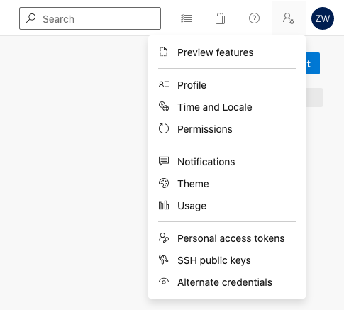
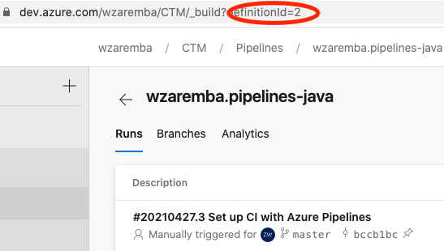

# Copyright © BMC Software, Inc. All rights reserved.

Access and use of the following is governed by the terms and conditions set forth in LICENSE in the project root.

Changes may cause incorrect behavior and will be lost if the code is regenerated.

# Control-M Integration for Azure DevOps Pipelines
Azure DevOps (formerly Visual Studio Team Services) is a hosted service providing development and collaboration tools.   
[Azure DevOps](https://dev.azure.com)  
DevOps include many tools, like:  
    - Git repositories for source control  
    - Build and Release pipelines for CI/CD automation  
    - Agile tools covering Kanban/scrum project methodologies  
    and many others. 


## Azure DevOps Pipelines 
[What are Azure Pipelines](https://azure.microsoft.com/en-us/services/devops/pipelines/)

This folder contains sample Application Integrator jobtype for running and monitoring Azure DevOps Pipeline. 

__Note:__The authentication method used by these job types is PAT (Personal Access Token) as described in [API Doc](https://docs.microsoft.com/en-us/rest/api/azure/devops/pipelines/runs/run%20pipeline?view=azure-devops-rest-6.1#security). For other DevOps Services please   
Personal Access Token can be obtained from User Settings:


<hr>

### AI AzurePipes.ctmai  << Need to check proper AI name
This AI job triggers Azure Pipeline via REST API.   
Required parameters (connection profile and job parameters):
- username
- PAT
- organization name (DevOps organization name like BMC)
- Project name (like DataPipeline)
- Pipeline ID (This can be short or can be proper Pipeline ID)

The actions taken by this AI job are the following:
1. Run pipeline
2. Monitor pipeline
3. Gather logs


<hr>

1. Run pipeline
- URL: https://dev.azure.com/{{Organization}}/{{Project}}/_apis/pipelines/{{PipelineID}}/runs?api-version=6.0-preview.1
- Method: POST
- Headers: Content-Type=application/json
- Body: {} (you can change it if needed)  
REST API using basic authentication.  
After successful execution, get RUNID. 

<br>

2. Monitor pipeline
Monitoring is done by calling the following URL:
```
https://dev.azure.com//{{Organization}}/{{Project}}/_apis/pipelines/{{PipelineID}}/runs/{{RUNID}}?api-version=6.1-preview.1
```
In the output there are 2 parameters that are interesting: state and result.
The following logic was implemented:
- if STATE is "completed" and result is "failed" -> fail the job
- if STATE is "completed" and result is "canceled" -> fail the job
- if STATE is "completed" and result is "succeeded" -> Complete and proceed


<br>

3. Gather logs  
This step requires some additional script to traverse throught the logs. This call:
```
https://dev.azure.com/{{Organization}}/{{Project}}/_apis/pipelines/{{PipelineID}}/runs/{{RUNID}}/logs?$expand=signedContent&api-version=6.0-preview.1  
```
gets the list of the logs and returns also signed URLs to get them. The URL is valid for short time. 
Customer can create a short script to get all the logs. 


---
How to get parameters:
- username - it is actually not used by Azure, but is required by AI Authentication - so put here anything
- PAT - get as described above
- Pipeline ID (in my case it is 2):

  
You can also get pipeline ID from [REST API call](https://docs.microsoft.com/en-us/rest/api/azure/devops/pipelines/pipelines/list?view=azure-devops-rest-6.1) 


---
To be added/changed:
- check project listing in Web Gui
- add pipeline load button 