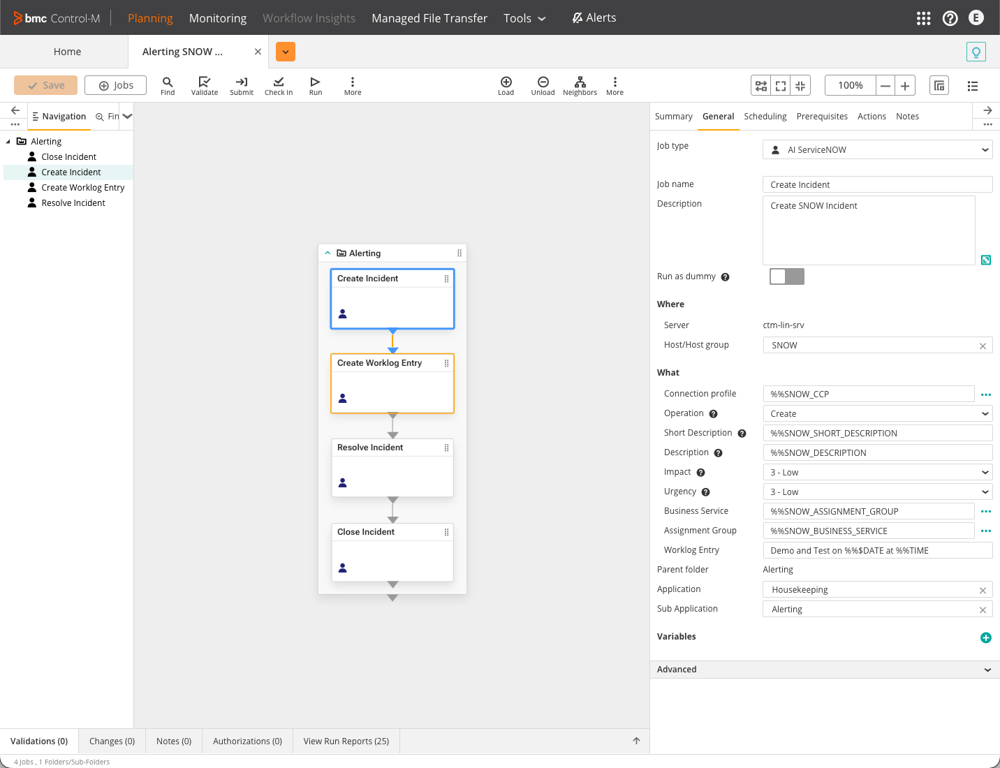
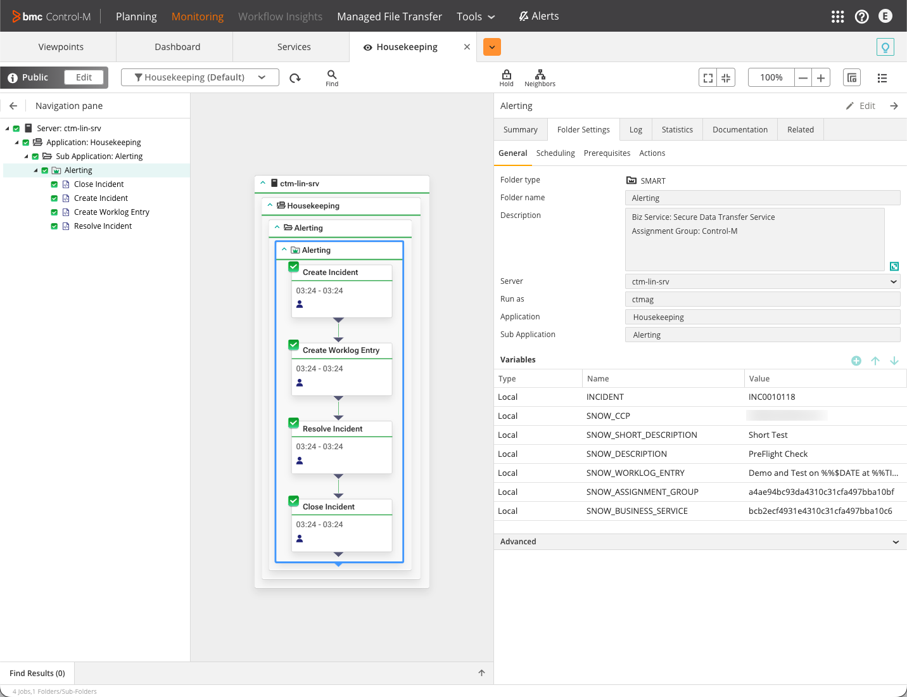
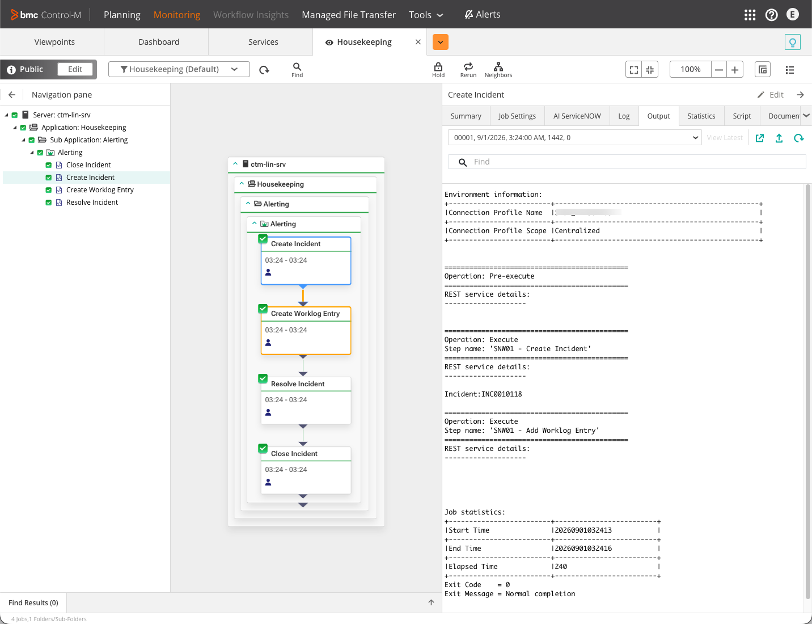
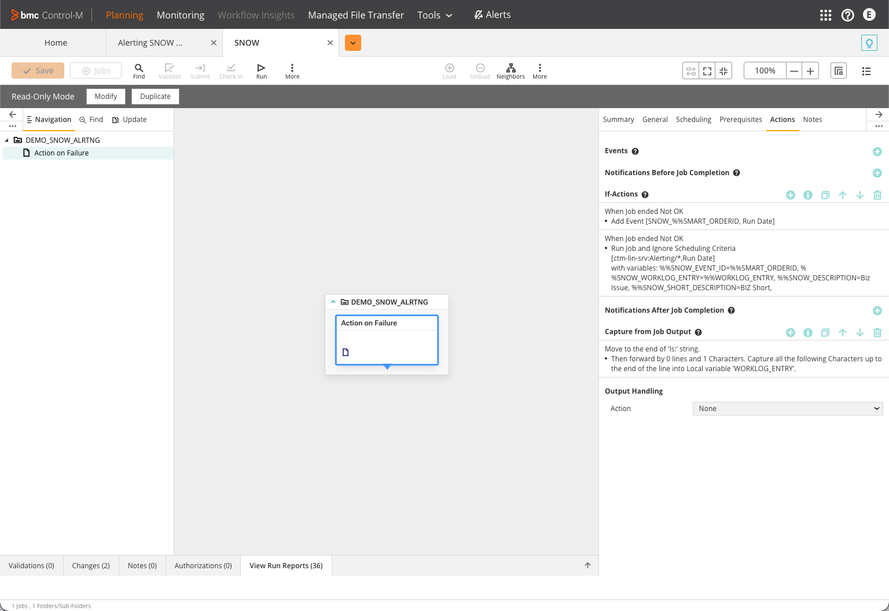
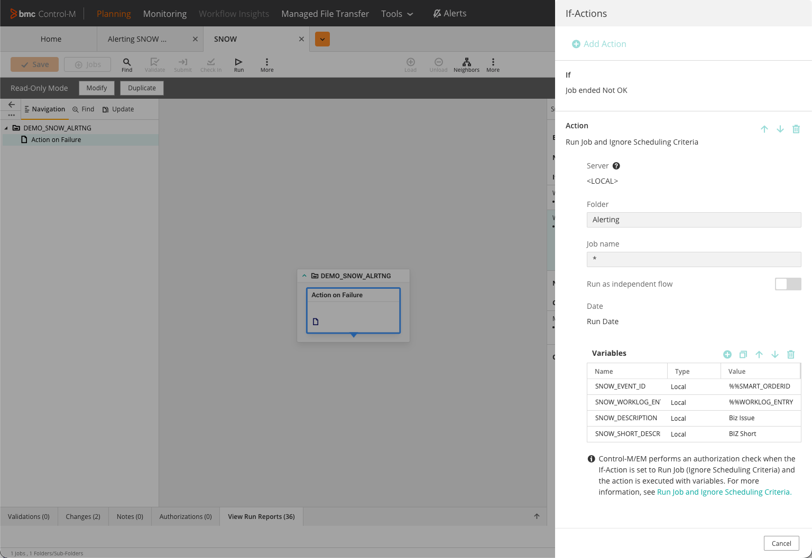
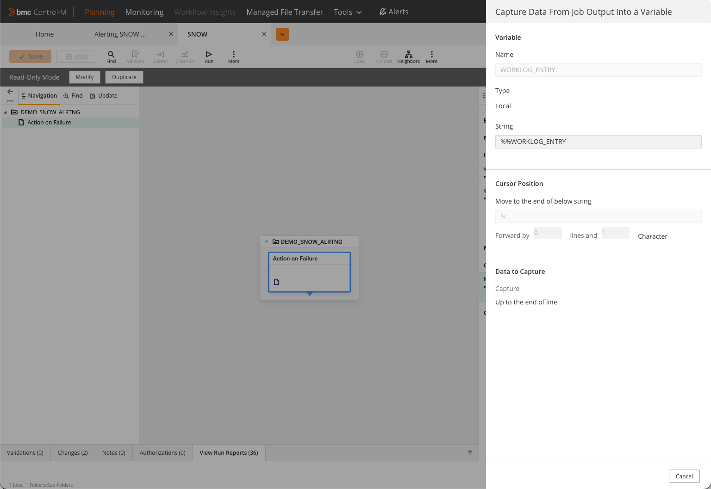
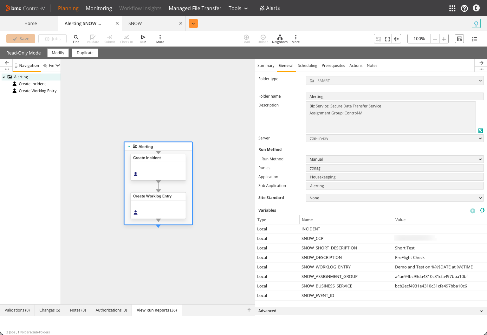
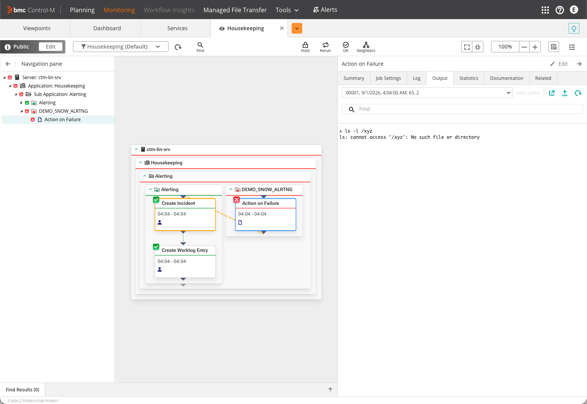
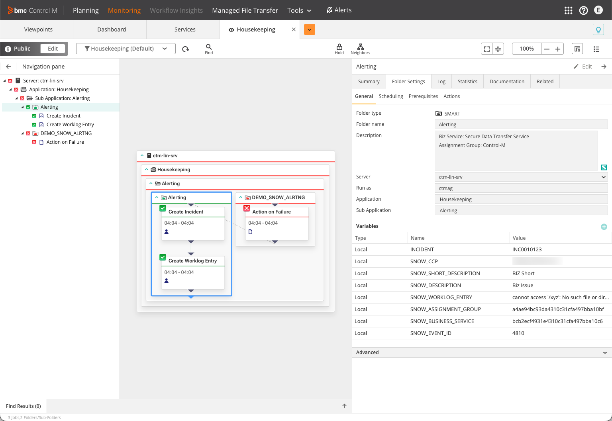

# Alerting Integration with ServiceNOW

A Control-M **Application Integrator** job type that creates, updates and
resolves ServiceNow incidents over the standard Table API, plus a sample
job folder that chains the operations together and a demo of triggering
it from a failing job.

## What it does

Control-M orders a ServiceNow incident through the **AI ServiceNOW** job
type. Each job runs one operation, chosen by its `ACTION` attribute:

| `ACTION` | Effect |
| -------- | ------ |
| `CREATE` | `POST` a new incident from the job's attributes (short description, description, impact, urgency, assignment group, business service, caller). |
| `UPDATE` | `PATCH` an existing incident (by `TICKET_NUMBER`) with the same field set. |
| `RESOLVE` | `PATCH` state / resolution code / resolution notes to move the incident to Resolved, Closed, On Hold or Canceled. |

A separate **Add Worklog Entry** step appends a `work_notes` journal
entry after any of the above.

It is all plain REST against a standard instance - an OAuth token call
plus the Table API (`/api/now/table/...`). No scripted REST resource, no
Import Set, no custom endpoint. The job type covers **only the ServiceNow
side**: authenticate, then act on one incident. Whatever decides *when*
to raise an incident (a failing job, an alert rule, a monitoring tool)
lives outside it - see *Wiring it to a failing job* below for one way.

## Files in this example

| Path | What it is |
| ---- | ---------- |
| [`ctmai/VFSSNOW.ctmai`](ctmai/VFSSNOW.ctmai) | The **AI ServiceNOW** Application Integrator job type - connection-profile fields, attributes, and the REST steps. |
| [`jobs/Alerting SNOW Integration.json`](jobs/Alerting%20SNOW%20Integration.json) | The sample `Alerting` folder - one job per operation (Create -> Worklog -> Resolve -> Close), chained with events. |
| [`postman/ServiceNow Incident Integration.postman_collection.json`](postman/ServiceNow%20Incident%20Integration.postman_collection.json) | Every ServiceNow REST call the job type makes, as stand-alone Postman requests (OAuth, load-button lookups, create / update / worklog / resolve, choice lists). |
| [`images/`](images/) | Planning / Monitoring screenshots used in this doc. |

## Deploy the example

1. **Import the job type.** In the Control-M web UI: *Configuration ->
   Application Integrator -> Import*, select `ctmai/VFSSNOW.ctmai`. This
   adds the `AI ServiceNOW` job type.

2. **Register an OAuth application in ServiceNow.** *System OAuth ->
   Application Registry -> New -> Create an OAuth API endpoint for
   external clients*. Grant type **client credentials**. Note the client
   id and client secret. The account behind it needs the roles in
   *Required roles on the OAuth account* below.

3. **Create the connection profile.** A Centralized connection profile
   of type `AI ServiceNOW`:

   | Field | Value |
   | ----- | ----- |
   | `CLIENT_ID` / `CLIENT_SECRET` | from step 2 |
   | `INSTANCE_ID` | the bare instance name, e.g. `dev00000` (host is `https://{{INSTANCE_ID}}.service-now.com`) |
   | `CALLER_ID` | `sys_id` of the ServiceNow user to record as the incident's Caller |

   Name it to match `SNOW_CCP` in the sample folder (`SNOW_DEV_CCP` as
   shipped) or change that variable.

4. **Deploy the sample folder.** `ctm deploy "jobs/Alerting SNOW
   Integration.json"`, or import it in Planning. Fill the placeholders
   first:

   | Placeholder | Value |
   | ----------- | ----- |
   | `{{CONTROL_M_SERVER}}` / `{{CONTROL_M_USER}}` | your Control-M/Server and run-as user |
   | `{{DMEO_ASSIGNMENT_GROUP}}` | `sys_id` of the assignment group (use the load button - see *2. Load-button lookups*). Note the file spells the placeholder `DMEO`. |
   | `{{DMEO_BUSINESS_SERVICE}}` | `sys_id` of the business service |
   | `SNOW_CCP` | the connection-profile name from step 3 |

5. *(Optional)* **Import the Postman collection** to exercise the raw
   ServiceNow calls outside Control-M. Set the collection variables
   (`instance`, `client_id`, `client_secret`, `caller_id`), run **Get
   OAuth Token** first; the rest chain off the stored `access_token` /
   `incident_sys_id`.

## Example job folder

[`jobs/Alerting SNOW Integration.json`](jobs/Alerting%20SNOW%20Integration.json)
is a SMART folder (`Alerting`) with four **AI ServiceNOW** jobs, chained
with events in order: **Create Incident -> Create Worklog Entry ->
Resolve Incident -> Close Incident**. Each job sets its `AI-Operation`
(`Create` / `Update` / `Resolve`) and pulls its attribute values from
folder-level `Local` variables.



Folder-level variables feed the job attributes - `SNOW_CCP` (connection
profile), `SNOW_SHORT_DESCRIPTION`, `SNOW_DESCRIPTION`,
`SNOW_ASSIGNMENT_GROUP` / `SNOW_BUSINESS_SERVICE` (the sys_ids from the
load buttons), `SNOW_WORKLOG_ENTRY`, and `INCIDENT` - the last is empty
at deploy time and filled by the Create Incident job: a `CaptureOutput`
action scrapes the number off its output line `Incident:INC00xxxxx` into
the folder variable, so the Worklog / Resolve / Close jobs can pass it as
`AI-Incident Number` (`%%INCIDENT`).



A completed run in the Monitoring domain - all four jobs OK, with the
Create Incident job's Output tab showing the pre-execute OAuth call, the
`Create Incident` step returning its `Incident:INC...` line, and the
`Add Worklog Entry` step.



> **Attribute label swap in this module version.** In the shipped job
> JSON the Create Incident job sets `AI-Business Service` from
> `%%SNOW_ASSIGNMENT_GROUP` and `AI-Assignment Group` from
> `%%SNOW_BUSINESS_SERVICE` - i.e. crossed over. Runs still land the
> right sys_id in each incident field (`business_service` /
> `assignment_group`), which means the `VFSSNOW.ctmai` module maps the
> two attribute labels to the opposite API fields. Set the values crossed
> (as the sample does) until the module is fixed, or the incident comes
> out with the service and the group transposed.

## Wiring it to a failing job (one of many ways)

The `Alerting` folder is a reusable target. Any monitored job can raise
an incident from it on failure - here via an **If-Action**, keeping the
SNOW jobs completely separate from the workload that triggers them.

The demo job `Action on Failure` (folder `DEMO_SNOW_ALRTNG`) is a plain
command job that deliberately fails (`ls -l /xyz`). Its **Actions** tab
does three things:

1. **Capture from Job Output** - scrape the error text off the job's
   output (`Move to the end of "ls:"`, capture to end of line) into a
   local variable `WORKLOG_ENTRY`.
2. **If** *Job ended Not OK* -> **Add Event** `SNOW_%%SMART_ORDERID`.
   The event is what draws the dotted connector in the Monitoring domain
   between the failing job and the incident folder it triggers.
3. **If** *Job ended Not OK* -> **Run Job and Ignore Scheduling
   Criteria** on `Alerting/*`, passing the alert context down as
   variables: `SNOW_EVENT_ID=%%SMART_ORDERID`,
   `SNOW_WORKLOG_ENTRY=%%WORKLOG_ENTRY`, `SNOW_DESCRIPTION=...`,
   `SNOW_SHORT_DESCRIPTION=...`.







The variables passed by the If-Action **override the folder's own
defaults** for that run, so the incident's short description /
description / worklog come from the failing job while the connection
profile, assignment group and business service stay as the `Alerting`
folder defines them.



In the Monitoring domain the failing job and the ordered `Alerting`
folder sit side by side, linked by the event; `Action on Failure` is red,
`Create Incident` and `Create Worklog Entry` run green.



The `Alerting` folder's runtime variables show what actually came
through - `INCIDENT` holding the new incident number, `SNOW_SHORT_DESCRIPTION`
and `SNOW_DESCRIPTION` from the If-Action, and the captured
`ls: cannot access '/xyz'...` text as `SNOW_WORKLOG_ENTRY`.



This is only one option. The same folder could just as well be ordered
from an On-Do/Notification, a Control-M/EM alert script, an external
trigger, or a REST call to the Automation API - the job type itself does
not care how it was started.

## The job type

The definitions imported from `ctmai/VFSSNOW.ctmai`.

### Connection Profile

| Label | Variable | Type |
| ------------ | ----- | ------- |
| Client ID | CLIENT_ID | 💁 |
| Client Secret | CLIENT_SECRET | 🔐 |
| Instance ID | INSTANCE_ID | 💻 |
| Caller ID | CALLER_ID | 💁 |

### Attributes

| Attributes Name | Type | Info |
| ------------ | ----- | ------- |
| ACTION | Drop-Down List |  |
| SHORT_DESCRIPTION | Text Box |  |
| TICKET_NUMBER | Text Box |  |
| DESCRIPTION | Text Box |  |
| IMPACT | Drop-Down List |  |
| URGENCY | Drop-Down List |  |
| ASSIGNMENT_GROUP | Text Box with load button |  |
| BUSINESS_SERVICE | Text Box with load button |  |
| WORK_NOTES | Text Box |  |
| CLOSE_NOTES | Text Box |  |
| CLOSE_STATE | Text Box |  |
| CLOSE_CODE | Drop-Down List |  |

#### Operation

- Attribute: Drop-Down List
- Label: Operation
- Variable: CTM_API_OPERATION
- Comment: Create or Update Ticket

| Display Name | Value | Default |
| ------------ | ----- | ------- |
| Create | CREATE | ✅ |
| Update | UPDATE | 🔳 |
| Resolve | RESOLVE | 🔳 |

#### Ticket Number

- Attribute: Text Box
- Label: Ticket Number
- Variable: TICKET_NUMBER
- Comment: Ticket number to update (required only for update actions).

#### Short Description

- Attribute: Text Box
- Label: Short Description
- Variable: SHORT_DESCRIPTION
- Comment: Provide a brief summary describing the purpose of the ticket.

#### Description

- Attribute: Text Box
- Label: Description
- Variable: DESCRIPTION
- Comment: Enter a detailed description of the issue or change request.

#### Work Notes

- Attribute: Text Box
- Label: Work Notes
- Variable: WORK_NOTES
- Comment: Optional first work note to add when the incident is created (or an appended note on update). Leave blank to skip.

#### Impact

- Attribute: Drop-Down List
- Label: Impact
- Variable: IMPACT
- Comment: Select the impact level to reflect how many users or systems are affected.

| Display Name | Value | Default |
| ------------ | ----- | ------- |
| 1 - High | 1 | 🔳 |
| 2 - Medium | 2 | 🔳 |
| 3 - Low | 3 | ✅  |

#### Urgency

- Attribute: Drop-Down List
- Label: Urgency
- Variable: URGENCY
- Comment: Select how quickly the issue or change needs to be addressed.

| Display Name | Value | Default |
| ------------ | ----- | ------- |
| 1 - High | 1 | 🔳 |
| 2 - Medium | 2 | 🔳 |
| 3 - Low | 3 | ✅  |

#### Business Service

- Attribute: Text Box with load button
- Label: Business Service
- Variable: BUSINESS_SERVICE
- Comment: Business Service

- URL: https://{{INSTANCE_ID}}.service-now.com
- Request Path: /api/now/table/cmdb_ci_service
- Operation: Get
- Parameters: sysparm_query&active=true&sysparm_fields=name,sys_id

#### Assignment Group

- Attribute: Text Box with load button
- Label: Assignment Group
- Variable: ASSIGNMENT_GROUP
- Comment: Assignment Group

- URL: https://{{INSTANCE_ID}}.service-now.com
- Request Path: /api/now/table/sys_user_group
- Operation: Get
- Parameters: sysparm_query&active=true&sysparm_fields=name,sys_id

#### Resolution Notes

- Attribute: Text Box
- Label: Resolution Notes
- Variable: CLOSE_NOTES
- Comment: Resolution Notes.

#### Resolution State

- Attribute: Drop-Down List
- Label: Resolution State
- Variable: CLOSE_STATE
- Comment: Resolution State.

| Display Name | Value | Default |
| ------------ | ----- | ------- |
| 3 - On Hold | 3 | 🔳 |
| 6 - Resolved | 6 | ✅ |
| 7 - Closed | 7 | 🔳 |
| 8 - Canceled | 8 | 🔳 |

#### Resolution Code

- Attribute: Drop-Down List
- Label: Resolution Code
- Variable: CLOSE_CODE
- Comment: Resolution Code.

| Display Name | Value | Default |
| ------------ | ----- | ------- |
| Duplicate | Duplicate | 🔳 |
| Known error | Known error | 🔳 |
| No resolution provided | No resolution provided | 🔳 |
| Resolved by caller | Resolved by caller | 🔳 |
| Resolved by change | Resolved by change | 🔳 |
| Resolved by problem | Resolved by problem | 🔳 |
| Resolved by request | Resolved by request | 🔳 |
| Solution provided | Solution provided | ✅ |
| User error | User error | 🔳 |

### Pre-execution: OAuth token

Runs from the Connection Profile before the step, and stores the token
for the step to use.

- URL: https://{{INSTANCE_ID}}.service-now.com
- Request Path: /oauth_token.do
- Operation: POST
- Parameters: grant_type=client_credentials&client_id={{CLIENT_ID}}&client_secret={{CLIENT_SECRET}}
- Headers: Content-Type=application/x-www-form-urlencoded

| Output Handling | Info | |
| ------------ | ----- | ------- |
| Extract from JSON Body | $.access_token | 🔐 |
| Keep in runtime parameter | ACCESS_TOKEN | 🔐 |

## ServiceNow API calls

Every HTTP call the job type makes to ServiceNow, in the order the job
runs them. The Connection Profile supplies the credentials and the
instance; the job Attributes supply everything in the request bodies.
Field-level details (which incident column, which literal values) are
cross-checked against a working reference implementation verified against
a live instance.

Every call below is also in
[`postman/ServiceNow Incident Integration.postman_collection.json`](postman/ServiceNow%20Incident%20Integration.postman_collection.json)
as a runnable request.

Conventions used below:

- `{{INSTANCE_ID}}` - the `INSTANCE_ID` Connection Profile field (the
  bare instance name, e.g. `dev00000`). The base host is always
  `https://{{INSTANCE_ID}}.service-now.com`.
- `{{CLIENT_ID}}` / `{{CLIENT_SECRET}}` - the OAuth application
  credentials from the Connection Profile.
- `{{CALLER_ID}}` - Connection Profile field: the `sys_id` of the
  ServiceNow user to record as the incident's Caller. A `sys_user`
  reference, unrelated to `{{CLIENT_ID}}` (see call 3).
- `{token}` - the `access_token` from call 1, sent as
  `Authorization: Bearer {token}` on every subsequent call.
- `{{ATTRIBUTE}}` - the run-time value of the job Attribute of that name
  (`ACTION`, `SHORT_DESCRIPTION`, `IMPACT`, ...).

---

### 1. Login - OAuth token (client credentials)

Issued from the Connection Profile before any other call.

```
POST https://{{INSTANCE_ID}}.service-now.com/oauth_token.do
Content-Type: application/x-www-form-urlencoded

grant_type=client_credentials
client_id={{CLIENT_ID}}
client_secret={{CLIENT_SECRET}}
```

- No `Authorization` header on this call - the client id/secret in the
  form body *are* the credential.
- Grant type is **client_credentials**, not `password` - there is no
  ServiceNow user in this exchange. The account behind the OAuth
  application still needs the roles listed below.

**Success - HTTP 200**

```json
{
  "access_token": "abcd1234....",
  "token_type": "Bearer",
  "expires_in": 1800,
  "scope": "Control-M Incident API"
}
```

Only `access_token` is used, passed as `Authorization: Bearer {token}` on
every later call. One token per run - a run makes at most a handful of
calls, well inside the 30-minute default lifetime, so it is never
refreshed.

**Failure** - any non-200 fails the job, as does a 200 with no
`access_token` in the body.

### Required roles on the OAuth account

| Role | Why |
|---|---|
| `itil` | create / update / resolve `incident` (calls 3-5), read `sys_user_group` |
| `service_viewer` | read the Business Service table for the load button (call 2) |

`service_viewer` is a real requirement, not a guess - without it the
Business Service load button returns an empty result set rather than a
403, which looks like a misspelled name.

---

### 2. Load-button lookups (job editor, design time)

The two **Text Box with load button** attributes populate their pickers
directly from ServiceNow when you press the load button in the Control-M
editor. These do not run at job execution.

#### 2a. Assignment Group

```
GET https://{{INSTANCE_ID}}.service-now.com/api/now/table/sys_user_group
      ?sysparm_query=active=true
      &sysparm_fields=name,sys_id
Authorization: Bearer {token}
Accept: application/json
```

#### 2b. Business Service

```
GET https://{{INSTANCE_ID}}.service-now.com/api/now/table/cmdb_ci_service
      ?sysparm_query=active=true
      &sysparm_fields=name,sys_id
Authorization: Bearer {token}
Accept: application/json
```

**Success - HTTP 200**

```json
{ "result": [ { "name": "Secure Data Transfer", "sys_id": "0c43a...e91" } ] }
```

The picker shows `name`; the attribute stores the matching `sys_id`.
That sys_id is what calls 3 and 4 send - `ASSIGNMENT_GROUP` into
`assignment_group`, `BUSINESS_SERVICE` into `business_service` (the
incident column that references `cmdb_ci_service`, matching the table
the load button queries). ServiceNow reference fields accept a bare
sys_id string on write. A live run confirms both resolve: the create
response echoes them back as `{link, value}` objects pointing at
`sys_user_group` and `cmdb_ci_service` (see the sample below).

> The reference implementation instead writes the Business Service into
> `cmdb_ci` and resolves names against the `cmdb_ci_service_business`
> subtable. Both are valid - pick the field your ServiceNow incident
> process actually keys on. This example uses `business_service` to stay
> consistent with the `cmdb_ci_service` load button above.

---

### 3. ACTION = CREATE - create the incident

Runs when the `ACTION` attribute is `CREATE` (the default).

```
POST https://{{INSTANCE_ID}}.service-now.com/api/now/table/incident
Authorization: Bearer {token}
Content-Type: application/json
Accept: application/json

{
  "caller_id": "{{CALLER_ID}}",
  "short_description": "{{SHORT_DESCRIPTION}}",
  "description": "{{DESCRIPTION}}",
  "impact": "{{IMPACT}}",
  "urgency": "{{URGENCY}}",
  "assignment_group": "{{ASSIGNMENT_GROUP}}",
  "business_service": "{{BUSINESS_SERVICE}}"
}
```

| Field | Source | Notes |
|---|---|---|
| `caller_id` | `CALLER_ID` (Connection Profile) | `sys_id` of the ServiceNow user to record as Caller |
| `short_description` | `SHORT_DESCRIPTION` | brief summary of the ticket |
| `description` | `DESCRIPTION` | full detail of the issue or change |
| `impact` | `IMPACT` | `1` / `2` / `3`, default `3` |
| `urgency` | `URGENCY` | `1` / `2` / `3`, default `3` |
| `assignment_group` | `ASSIGNMENT_GROUP` | sys_id from the load button; omit the key if blank |
| `business_service` | `BUSINESS_SERVICE` | sys_id from the load button; omit the key if blank |

`TICKET_NUMBER` and `WORK_NOTES` are **not** sent on a create - the
worklog entry is a separate step (call 6).

> **The worklog is its own step.** `work_notes` could be set here on the
> create POST (it is a journal field - it would record the first entry),
> but the job type posts it separately via call 6 so the note can be
> built from the create response. Use `comments` rather than
> `work_notes` for a customer-visible ("Additional comments") entry.
>
> **`caller_id` is a user, not the OAuth client.** It takes the `sys_id`
> of a `sys_user` record (the incident's Caller) - a different concept
> from `{{CLIENT_ID}}`, which identifies the OAuth application. The two
> values look alike (both 32-hex sys_ids) but point at different tables.
> An early run passed `{{CLIENT_ID}}` here and ServiceNow silently left
> the field blank; with a real user sys_id in `CALLER_ID` it resolves
> (the sample response shows `caller_id` echoed back as `{link, value}`).

**Success - HTTP 201**

```json
{
  "result": {
    "sys_id": "9a8b7c6d5e4f...",
    "number": "INC0012345",
    "caller_id":        { "link": "https://.../sys_user/a1b2...", "value": "a1b2..." },
    "assignment_group": { "link": "https://.../sys_user_group/c1a2...", "value": "c1a2..." },
    "business_service": { "link": "https://.../cmdb_ci_service/d4c3...", "value": "d4c3..." },
    ...50+ more fields...
  }
}
```

**Output handling.** The create step prints a line `Incident:INC00xxxxx`,
and the sample folder's Create Incident job has a `CaptureOutput` action
that scrapes the number off it into the folder variable `INCIDENT`. The
Worklog / Resolve / Close jobs then pass `%%INCIDENT` as their
`AI-Incident Number`, and the module resolves it to a sys_id at run time
(call 4a). (An earlier job build also kept `$.result.sys_id` as
`INCIDENT_SYS_ID` to skip that lookup.)

**Anything other than 201 fails the job.**

> Reference fields (`caller_id`, `assignment_group`, `business_service`)
> accept a bare sys_id string on write. ServiceNow returns them as
> `{link, value}` objects on read - read `result.number` /
> `result.sys_id`, not the reference objects.
>
> **Verifying the write.** `business_service`, `assignment_group`,
> `description` and `cmdb_ci` are **not on the incident's Self Service
> form view** - an incident opened in that view looks like the fields
> were never set. Confirm with a direct read instead:
> `GET .../api/now/table/incident?sysparm_query=number={{TICKET_NUMBER}}`
> `&sysparm_fields=number,business_service,assignment_group,description`
> `&sysparm_display_value=all`, or switch the form to the Default view.
> The create response above already echoes every field that was set.

---

### 4. ACTION = UPDATE - update an existing incident

Runs when `ACTION` is `UPDATE`. A PATCH needs the incident **sys_id** in
the URL, and `TICKET_NUMBER` (`%%INCIDENT` in the sample) is the `INC...`
number - so the module resolves the number to a sys_id first (4a), then
PATCHes (4b).

#### 4a. Resolve the number to a sys_id

```
GET https://{{INSTANCE_ID}}.service-now.com/api/now/table/incident
      ?sysparm_query=number={{TICKET_NUMBER}}
      &sysparm_fields=sys_id
      &sysparm_limit=1
Authorization: Bearer {token}
Accept: application/json
```

An empty `result` means the number does not exist - fail the job.

#### 4b. PATCH the incident

```
PATCH https://{{INSTANCE_ID}}.service-now.com/api/now/table/incident/{sys_id}
Authorization: Bearer {token}
Content-Type: application/json
Accept: application/json

{
  "caller_id": "{{CALLER_ID}}",
  "short_description": "{{SHORT_DESCRIPTION}}",
  "description": "{{DESCRIPTION}}",
  "impact": "{{IMPACT}}",
  "urgency": "{{URGENCY}}",
  "assignment_group": "{{ASSIGNMENT_GROUP}}",
  "business_service": "{{BUSINESS_SERVICE}}"
}
```

Same field set as call 3 (worklog is call 6). Only the attributes that
are set are sent; ServiceNow leaves every other field on the incident
untouched. **Success - HTTP 200**, anything else fails the job.

---

### 5. ACTION = RESOLVE - resolve an existing incident

Runs when `ACTION` is `RESOLVE`. Same two steps as an update: resolve
`TICKET_NUMBER` to a sys_id (call 4a), then PATCH.

```
PATCH https://{{INSTANCE_ID}}.service-now.com/api/now/table/incident/{sys_id}
Authorization: Bearer {token}
Content-Type: application/json
Accept: application/json

{
  "state": "{{CLOSE_STATE}}",
  "close_code": "{{CLOSE_CODE}}",
  "close_notes": "{{CLOSE_NOTES}}"
}
```

| Field | Source | Notes |
| ----- | ------ | ----- |
| `state` | `CLOSE_STATE` | `3` On Hold / `6` Resolved (default) / `7` Closed / `8` Canceled |
| `close_code` | `CLOSE_CODE` | choice-list label, stored verbatim as the value; default `Solution provided` |
| `close_notes` | `CLOSE_NOTES` | plain text field - shows as "Resolution notes" on the incident |

**Success - HTTP 200**, anything else fails the job.

> `close_code` **and** `close_notes` are both mandatory for `state` `6`
> or `7` - a PATCH that sets the state without them is rejected by the
> standard incident business rules.
>
> `close_notes` is an ordinary string field, **not** a journal field:
> running RESOLVE again *overwrites* it (the activity log shows
> "Resolution notes: new-text was old-text"), unlike `work_notes` in
> call 6, which appends.
>
> A stock instance accepts the state transitions directly: **New ->
> Resolved** (`6`) and **Resolved -> Closed** (`7`) both go through in a
> single PATCH each - the activity log shows "Resolved was New" then
> "Closed was Resolved". No intermediate In Progress is required. If your
> org enables the Incident state model / an enforced state flow, a direct
> jump can be rejected and the job would need to PATCH `state` `2` first.

---

### 6. Add Worklog Entry (optional step)

A separate step, run after a create or update when there is a note to
post (in the sample folder it is the `Create Worklog Entry` job).
Plain PATCH of `work_notes` against the incident - by sys_id, so if only
`%%INCIDENT` (the number) is known it resolves it first, same as 4a:

```
PATCH https://{{INSTANCE_ID}}.service-now.com/api/now/table/incident/{sys_id}
Authorization: Bearer {token}
Content-Type: application/json
Accept: application/json

{
  "work_notes": "{{WORK_NOTES}}"
}
```

Each call appends one entry (journal field - it never overwrites), so
this can run more than once. **Success - HTTP 200.** Skip the step
entirely when `WORK_NOTES` is empty rather than PATCHing an empty
string.

---

### Call sequence per action

| `ACTION`  | Calls             |
| --------- | ----------------- |
| `CREATE`  | 1 -> 3            |
| `UPDATE`  | 1 -> 4a -> 4b     |
| `RESOLVE` | 1 -> 4a -> 5      |
| worklog   | 1 -> 4a -> 6      |

Call 4a (number -> sys_id) is skipped whenever the sys_id is already
known - e.g. a job build that keeps `$.result.sys_id` from the create.
In the sample folder each job is a separate order, so every non-create
job does its own OAuth (call 1) and its own 4a from `%%INCIDENT`.

The load-button lookups (call 2) run only in the job editor, once per
press of the load button.

## Sample JSON

### Get OAuth Token

#### Request

- header: application/x-www-form-urlencoded
- body:
    - grant_type: client_credentials
    - client_id: {{CLIENT_ID}}
    - client_secret: {{CLIENT_SECRET}}


#### Response

```json
{
    "access_token": "<redacted - opaque bearer token>",
    "scope": "Control-M Incident API",
    "token_type": "Bearer",
    "expires_in": 1799
}
```

### Create Incident

#### Request

```json
{
  "caller_id": "{{CALLER_ID}}",
  "short_description": "Short Test",
  "description": "PreFlight Check",
  "assignment_group": "{{ASSIGNMENT_GROUP}}",
  "business_service": "{{BUSINESS_SERVICE}}"
}
```

> Captured from a live run. `impact` / `urgency` / `work_notes` were left
> out of this body, so ServiceNow applied the field defaults (`impact` /
> `urgency` = `3`, blank work note). `caller_id`, `assignment_group` and
> `business_service` all resolve - the response echoes them back as
> `{link, value}` objects. Instance name, token and sys_ids below are
> obfuscated.

#### Response

```json
{
    "result": {
        "parent": "",
        "made_sla": "true",
        "caused_by": "",
        "watch_list": "",
        "upon_reject": "cancel",
        "sys_updated_on": "2026-09-02 19:46:34",
        "child_incidents": "0",
        "hold_reason": "",
        "origin_table": "",
        "task_effective_number": "INC0012345",
        "approval_history": "",
        "skills": "",
        "number": "INC0012345",
        "resolved_by": "",
        "sys_updated_by": "svc_controlm_integration",
        "opened_by": {
            "link": "https://dev00000.service-now.com/api/now/table/sys_user/a1b2c3d4e5f60000a1b2c3d4e5f60000",
            "value": "a1b2c3d4e5f60000a1b2c3d4e5f60000"
        },
        "user_input": "",
        "sys_created_on": "2026-09-02 19:46:34",
        "sys_domain": {
            "link": "https://dev00000.service-now.com/api/now/table/sys_user_group/global",
            "value": "global"
        },
        "state": "1",
        "route_reason": "",
        "sys_created_by": "svc_controlm_integration",
        "knowledge": "false",
        "order": "",
        "calendar_stc": "",
        "closed_at": "",
        "cmdb_ci": "",
        "contract": "",
        "impact": "3",
        "active": "true",
        "work_notes_list": "",
        "business_service": {
            "link": "https://dev00000.service-now.com/api/now/table/cmdb_ci_service/d4c3b2a1e5f60000d4c3b2a1e5f60000",
            "value": "d4c3b2a1e5f60000d4c3b2a1e5f60000"
        },
        "business_impact": "",
        "priority": "5",
        "sys_domain_path": "/",
        "rfc": "",
        "time_worked": "",
        "expected_start": "",
        "opened_at": "2026-09-02 19:46:34",
        "business_duration": "",
        "group_list": "",
        "work_end": "",
        "caller_id": {
            "link": "https://dev00000.service-now.com/api/now/table/sys_user/a1b2c3d4e5f60000a1b2c3d4e5f60000",
            "value": "a1b2c3d4e5f60000a1b2c3d4e5f60000"
        },
        "reopened_time": "",
        "resolved_at": "",
        "approval_set": "",
        "subcategory": "",
        "work_notes": "",
        "universal_request": "",
        "short_description": "Short Test",
        "close_code": "",
        "correlation_display": "",
        "work_start": "",
        "assignment_group": {
            "link": "https://dev00000.service-now.com/api/now/table/sys_user_group/c1a2b3d4e5f60000c1a2b3d4e5f60000",
            "value": "c1a2b3d4e5f60000c1a2b3d4e5f60000"
        },
        "additional_assignee_list": "",
        "business_stc": "",
        "cause": "",
        "description": "PreFlight Check",
        "origin_id": "",
        "calendar_duration": "",
        "close_notes": "",
        "notify": "1",
        "service_offering": "",
        "sys_class_name": "incident",
        "closed_by": "",
        "follow_up": "",
        "parent_incident": "",
        "sys_id": "f9e8d7c6b5a40000f9e8d7c6b5a40000",
        "contact_type": "",
        "reopened_by": "",
        "incident_state": "1",
        "urgency": "3",
        "problem_id": "",
        "company": "",
        "reassignment_count": "0",
        "activity_due": "",
        "assigned_to": "",
        "severity": "3",
        "comments": "",
        "approval": "not requested",
        "sla_due": "",
        "comments_and_work_notes": "",
        "due_date": "",
        "sys_mod_count": "0",
        "reopen_count": "0",
        "sys_tags": "",
        "escalation": "0",
        "upon_approval": "proceed",
        "correlation_id": "",
        "location": "",
        "category": "inquiry"
    }
}
```

### Work Entry

The **Add Worklog Entry** step (call 6) - a `PATCH .../incident/{sys_id}`
that only sets `work_notes`. Each call appends one journal entry.

#### Request

```json
{
  "work_notes": "Automated worklog test from Control-M preflight tooling"
}
```

#### Response

HTTP 200. The response is the full incident record again (same ~90
fields as the create response); the journal input is not echoed back in
`work_notes`. The one field worth checking is `sys_mod_count`, which
increments on each successful PATCH:

```json
{
  "result": {
    "number": "INC0012345",
    "sys_id": "f9e8d7c6b5a40000f9e8d7c6b5a40000",
    "work_notes": "",
    "sys_mod_count": "1",
    "...": "...all other incident fields..."
  }
}
```

### Resolve Incident

The **Resolve Incident** step (call 5) - `PATCH .../incident/{sys_id}`
setting the resolution fields.

#### Request

```json
{
  "state": "6",
  "close_code": "Solution provided",
  "close_notes": "EOL on 20260901 at 031423"
}
```

#### Response

HTTP 200, full incident record. Relevant fields:

```json
{
  "result": {
    "number": "INC0012345",
    "state": "6",
    "incident_state": "6",
    "close_code": "Solution provided",
    "close_notes": "EOL on 20260901 at 031423",
    "resolved_at": "2026-09-02 17:12:59",
    "resolved_by": { "value": "a1b2c3d4e5f60000a1b2c3d4e5f60000" },
    "...": "...all other incident fields..."
  }
}
```

Observed on a live run: `New -> Resolved` in one PATCH, then a second
RESOLVE with `"state": "7"` took it `Resolved -> Closed` and **replaced**
`close_notes` (activity log: `Resolution notes: Closure ... was EOL ...`).
