# Control-M SSH Key Orchestration

This repository contains an example implementation for orchestrating SSH key rotation with Control-M, Control-M Application Integrator, Control-M Automation API, agentless hosts, RunAs users, host groups, resource pools, and Self-Service.

The screenshots in this README are from a local lab. Names such as `ctm-lin-srv`, `LUMBERJACK`, `SSH_KEY_MANAGER`, `SSH_KEY_TARGET`, `planets`, and `remote-host-01` must be changed to match the customer environment.


This example turns SSH key rotation into a governed automation service: secure enough for platform teams, simple enough for approved LOB and application owners to run themselves.

## Vision

SSH key orchestration is not just a credential maintenance task. It is a control point for changing how the business consumes automation.

The goal is to let LOB and application owners rotate SSH keys for approved targets on demand, while Control-M administrators keep ownership of the execution model, RunAs identity, host groups, resource controls, and security policy. That separation is the core design principle: business users get speed and autonomy, while platform teams keep governance and operational control.

This is part of a broader modernization pattern:

- Move from distributed agent sprawl to reusable agentless execution.
- Move from manual credential updates to API-driven security operations.
- Move from administrator-driven request handling to governed Self-Service.
- Move from one-off job changes to reusable deployment patterns controlled by host groups and resources.

The outcome is change without disruption. SSH key rotation becomes repeatable, auditable, and safe to delegate, without weakening the Control-M job administration model.

## Index

- [Vision](#vision)
- [What This Example Does](#what-this-example-does)
- [Assumptions](#assumptions)
- [Repository Contents](#repository-contents)
- [Lab Values To Replace](#lab-values-to-replace)
- [Step 1: Deploy CTMAI To Control-M](#step-1-deploy-ctmai-to-control-m)
- [Step 2: Create The Centralized Connection Profile](#step-2-create-the-centralized-connection-profile)
- [Step 3: Create And Test The RunAs Account](#step-3-create-and-test-the-runas-account)
- [Step 4: Create Host Groups Used By The Folders](#step-4-create-host-groups-used-by-the-folders)
- [Step 5: Deploy The Control-M Folders](#step-5-deploy-the-control-m-folders)
- [Step 6: Configure Resource Control](#step-6-configure-resource-control)
- [Step 7: Create Control-M Self-Service](#step-7-create-control-m-self-service)
- [Step 8: Run And Validate](#step-8-run-and-validate)
- [API Calls Used](#api-calls-used)
- [Educational Postman Reference](#educational-postman-reference)
- [Troubleshooting](#troubleshooting)
- [Notes](#notes)

## What This Example Does

The example uses two Control-M folders:

| Folder | File | Purpose |
| --- | --- | --- |
| `VFS_SSH_KEY_ORCH_PREP` | `src/jobs/ssh.key.orchestration.prep.json` | Self-Service entry point. Prepares variables, host groups, and Control-M resources, then orders the deployment folder. |
| `VFS_SSH_KEY_ORCH_SIMPLE` | `src/jobs/ssh.key.orchestration.simple.json` | Actual deployment. Creates a new SSH key, imports the public key to the target, updates the RunAs user, and tests the new key. |

Control-M resources are used so two requests do not run in parallel against the same target host.

## Assumptions

Before implementing this example, the customer environment should already have:

- Control-M Automation API access.
- A Control-M API token for this use case.
- A Control-M/Agent host that can run the Application Integrator jobs.
- Agentless execution enabled and working.
- A target host reachable through Control-M agentless execution.
- A target operating system account that will be used as the Control-M RunAs user.
- An existing SSH public key already deployed to the target host.
- The Control-M RunAs user tested and operational before this orchestration is introduced.

This example rotates or updates the SSH key configuration after the base agentless and RunAs path is already working. It is not intended to troubleshoot first-time SSH connectivity.

## Repository Contents

| Path | Purpose |
| --- | --- |
| `src/jobs/ssh.key.orchestration.prep.json` | Preparation Control-M folder linked to Self-Service. |
| `src/jobs/ssh.key.orchestration.simple.json` | Deployment Control-M folder that performs SSH key orchestration. |
| `postman/SSH.Orchestration.Postman.Collection.json` | Educational Postman collection that shows the underlying Automation API calls. Not used by Control-M. |
| `src/scripts/postman.create.ssh.md` | Educational notes for Postman variables and API payloads. Not used by Control-M. |
| `images/` | Screenshots from the local lab setup. |

## Lab Values To Replace

The sample JSON and screenshots use lab-specific values. Replace them before deploying to a customer environment.

| Lab value | Replace with |
| --- | --- |
| `ctm-lin-srv` | Customer Control-M server name. |
| `LUMBERJACK` | Customer Centralized Connection Profile name. |
| `SSH_KEY_MANAGER` | Customer Control-M host or host group that runs CTMAI jobs. |
| `SSH_KEY_TARGET` | Customer target host group used for agentless execution. |
| `planets` | Customer RunAs user. |
| `remote-host-01` | Customer target host. |
| `orchestrator@bmc.com` | Customer owner, requester, or service account email. |
| `VFS_*` variables | Customer naming convention if required. |

## Step 1: Deploy CTMAI To Control-M

Deploy the Control-M Application Integrator job type for this use case before importing the folders.

The folders expect an Application Integrator job type named:

```text
AI SSH Key Orchestration
```

The job type must include these operations:

| Operation | Purpose |
| --- | --- |
| `Combo Create SSH Key and Get Public Key` | Creates the private SSH key in Control-M and returns the public key. |
| `Update Run As User` | Updates the Control-M RunAs user with the new SSH key. |
| `Test Run As User` | Tests the RunAs user with the new SSH key. |
| `Update Hostgroup` | Adds or updates the target host group. |
| `Get Resource Pool` | Reads current Control-M resource pool details. |
| `Create Resource Pool` | Creates a resource pool when needed. |
| `Update Resource Pool` | Updates an existing resource pool. |

Use these screenshots as lab references for the CTMAI job type and operations. They show how the custom job type wraps the Automation API calls that Control-M will execute at runtime.

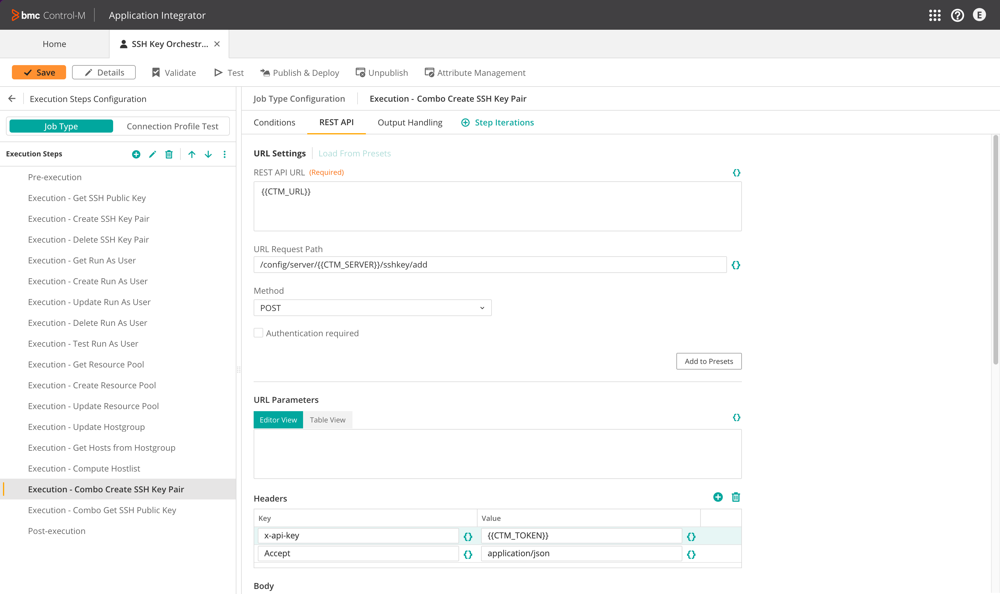

The combo create operation creates the private SSH key in Control-M and starts the same flow that retrieves the matching public key.

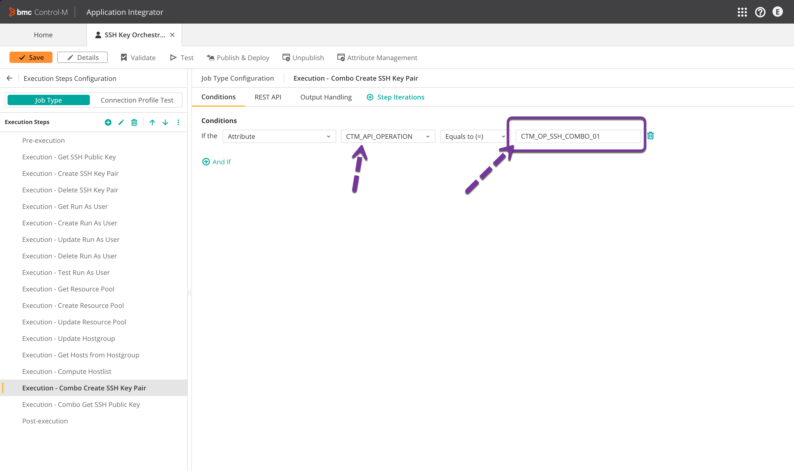

The operation settings define the API inputs that come from the Control-M folder variables and the Centralized Connection Profile.

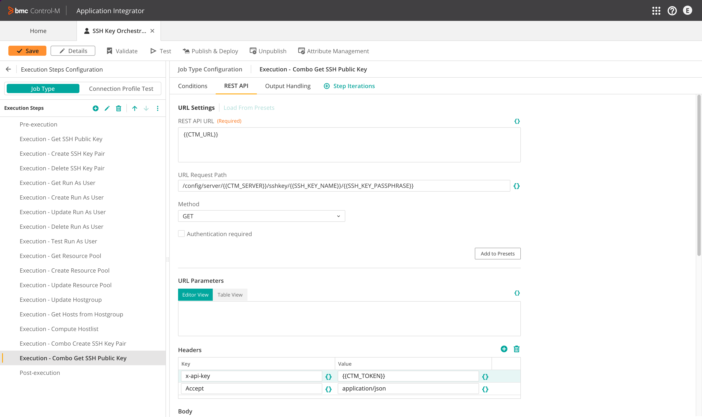

The get public key operation calls Automation API to retrieve the generated public key for the SSH key name.

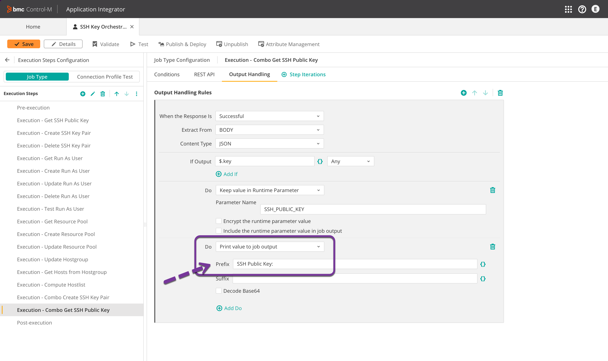

The output handling is important because the deployment folder captures the public key from the CTMAI output and stores it in `VFS_SSH_NEW_KEY_PUB`.

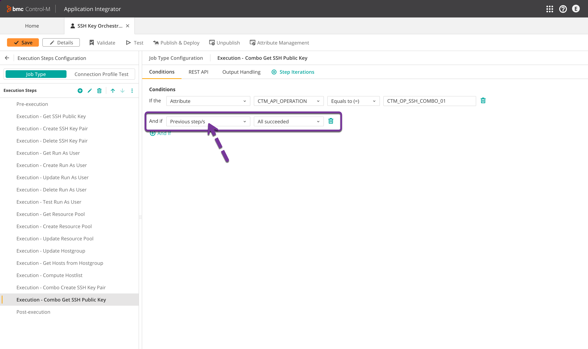

The response screenshot shows the public key output format that the Control-M capture rule depends on.

## Step 2: Create The Centralized Connection Profile

Create a Centralized Connection Profile for the `AI SSH Key Orchestration` job type.

In the lab screenshots and JSON this profile is named:

```text
LUMBERJACK
```

Create one Centralized Connection Profile for each unique SSH key passphrase. The passphrase is part of the protected connection configuration used by the CTMAI job type, so profiles should be separated when different RunAs accounts use different SSH key passphrases.

Example:

| Customer pattern | Required CCP design |
| --- | --- |
| 1 RunAs account with 1 SSH key passphrase | 1 Centralized Connection Profile |
| 100 RunAs accounts sharing the same SSH key passphrase policy | 1 Centralized Connection Profile, if the shared-passphrase model is approved |
| 100 RunAs accounts with 100 unique SSH key passphrases | 100 Centralized Connection Profiles |

For larger environments, manage these profiles with Automation API rather than creating and maintaining them manually in the GUI. The GUI is useful for validating the lab pattern, but profile creation, rotation, and auditability should be automated when the number of RunAs accounts grows.

Do not hard-code passphrases in folder JSON, scripts, or documentation. Store the SSH key passphrase in a Control-M secret or an approved external vault, then reference it from the Centralized Connection Profile according to the customer's security standard.

The profile must be updated with customer-specific values:

| Setting | Customer value |
| --- | --- |
| Automation API URL | Customer Control-M Automation API endpoint. |
| Automation API token | Customer token created for this use case. |
| SSH key passphrase | Control-M secret or external vault reference for the approved passphrase. |
| Control-M server | Customer Control-M server name. |

After creating the profile, test it from Control-M.

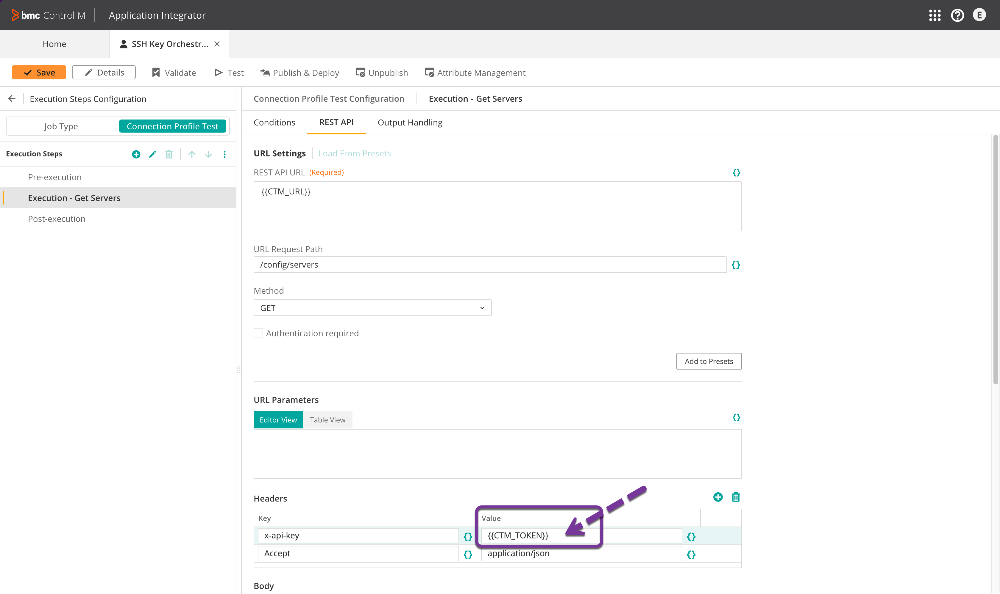

This test confirms that the Centralized Connection Profile can authenticate to Automation API before the folders start using it.

## Step 3: Create And Test The RunAs Account

Create the Control-M RunAs account that will be updated by the orchestration.

In the lab, the RunAs user is:

```text
planets
```

For a customer environment, use the customer-approved operating system account.

Before continuing, confirm:

- The user exists on the target host.
- The user's home directory exists.
- The user's `.ssh` directory exists.
- A working SSH public key is already deployed to `~/.ssh/authorized_keys`.
- The RunAs user can be tested successfully from Control-M.

This baseline test is important. The orchestration assumes the target and RunAs path already work before key rotation is introduced.

The RunAs account should be treated as an administrative control, not as an open Self-Service input. Allowing a requester to dynamically set an arbitrary RunAs value would let users influence the security context of deployed jobs, which is a breach of the intended Control-M job administration model. The RunAs value should be fixed in the approved folder design, selected from a tightly controlled set of approved values, or managed by the Control-M administrator.

## Step 4: Create Host Groups Used By The Folders

Create or validate the host groups referenced by the Control-M folders.

The lab uses:

| Host group | Purpose |
| --- | --- |
| `SSH_KEY_MANAGER` | Runs the Application Integrator jobs that call Automation API. |
| `SSH_KEY_TARGET` | Represents the target agentless host or hosts where the public key is imported. |

Update the folder JSON if the customer uses different host group names.

The deployment folder is intentionally written to be reused. Instead of creating a separate deployment folder for every target host, the deployment jobs point to host groups. The prep folder updates the target host group before the deployment folder is ordered, so the same deployment workflow can run against the requested target without changing the job definitions.

This host group pattern also keeps the RunAs configuration under job administration control. The target host can be changed by updating the host group in the prep phase, but the RunAs account is not opened as a free-form dynamic execution identity. That separation allows the workflow to be reusable while preserving the security boundary around who a job is allowed to run as.

## Step 5: Deploy The Control-M Folders

Import the deployment folder first, then the prep folder.

```bash
ctm deploy src/jobs/ssh.key.orchestration.simple.json
ctm deploy src/jobs/ssh.key.orchestration.prep.json
```

If your environment uses a different deployment workflow, import both JSON files through your standard Control-M deployment process.

### Deployment Folder

File:

```text
src/jobs/ssh.key.orchestration.simple.json
```

Folder:

```text
VFS_SSH_KEY_ORCH_SIMPLE
```

Update these values for the customer environment:

| Value | Description |
| --- | --- |
| `ControlmServer` | Customer Control-M server. |
| `ConnectionProfile` | Customer Centralized Connection Profile. |
| `Host` | Customer CTMAI execution host or host group. |
| `VFS_SSH_HOST_NAME` | Target host. |
| `VFS_SSH_KEY_NAME` | SSH key name to create. |
| `VFS_RUNAS_USER` | Customer-approved RunAs user controlled by job administration. |
| `SSH_KEY_TARGET` | Customer target host group. |
| Application/SubApplication | Customer application naming standard. |

Do not manually populate `VFS_SSH_NEW_KEY_PUB`. The CTMAI job captures the generated public key into this variable.

`src/jobs/ssh.key.orchestration.simple.json` can also be adjusted to run standalone without depending on Control-M host groups. To do that, change the `SSH_KEY_TARGET` job host reference to the target Control-M node ID.

Do not redesign the deployment folder so requesters can supply arbitrary RunAs accounts at order time. The deployment folder should remain reusable through host groups, while RunAs identity remains governed by the approved job definition and customer security policy.

Deployment folder screenshots:

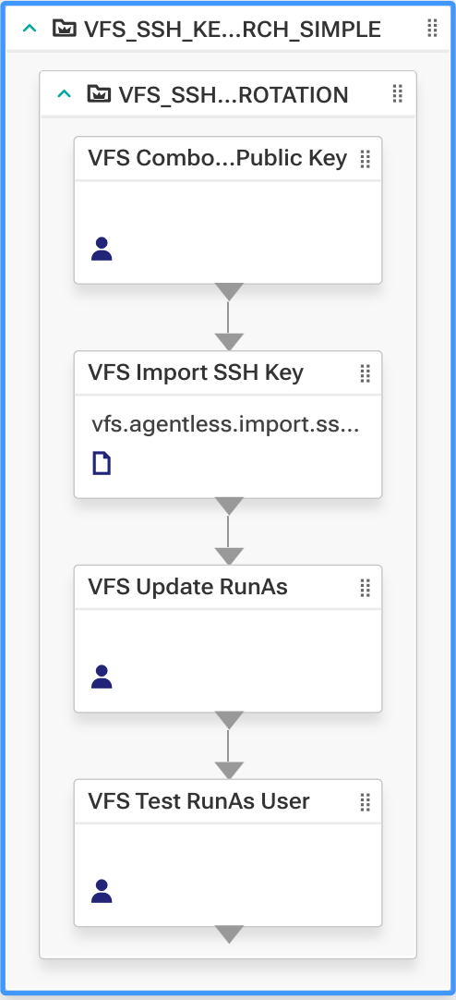

The deployment folder contains the reusable SSH key rotation jobs. It is ordered by the prep folder after the target host group and resource controls are ready.

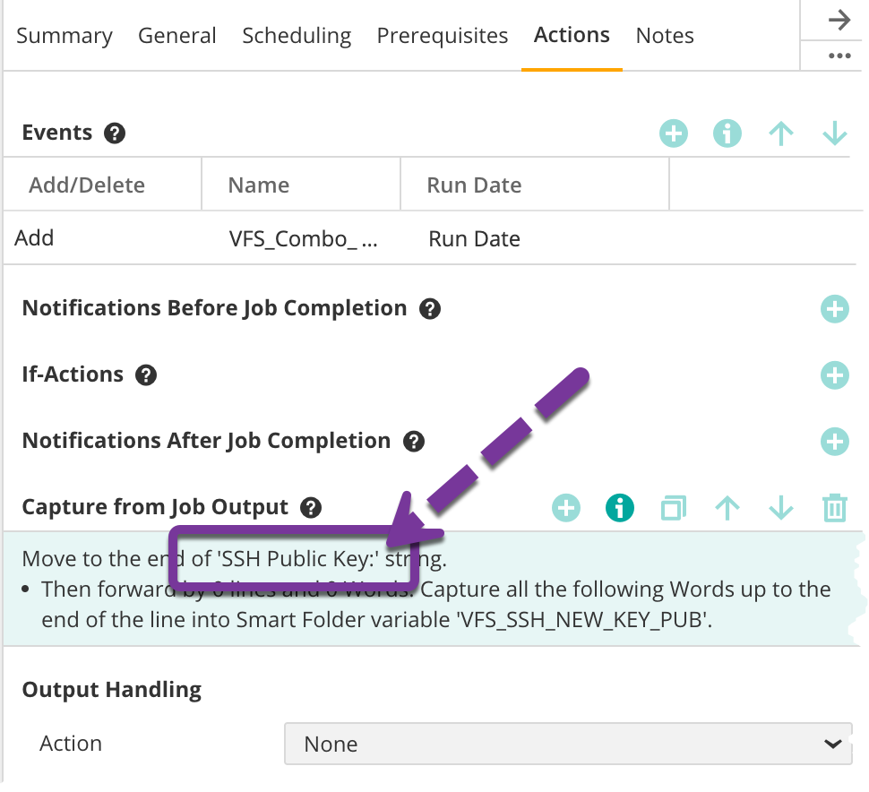

This job creates the new SSH key and retrieves the public key through the CTMAI combo operation.

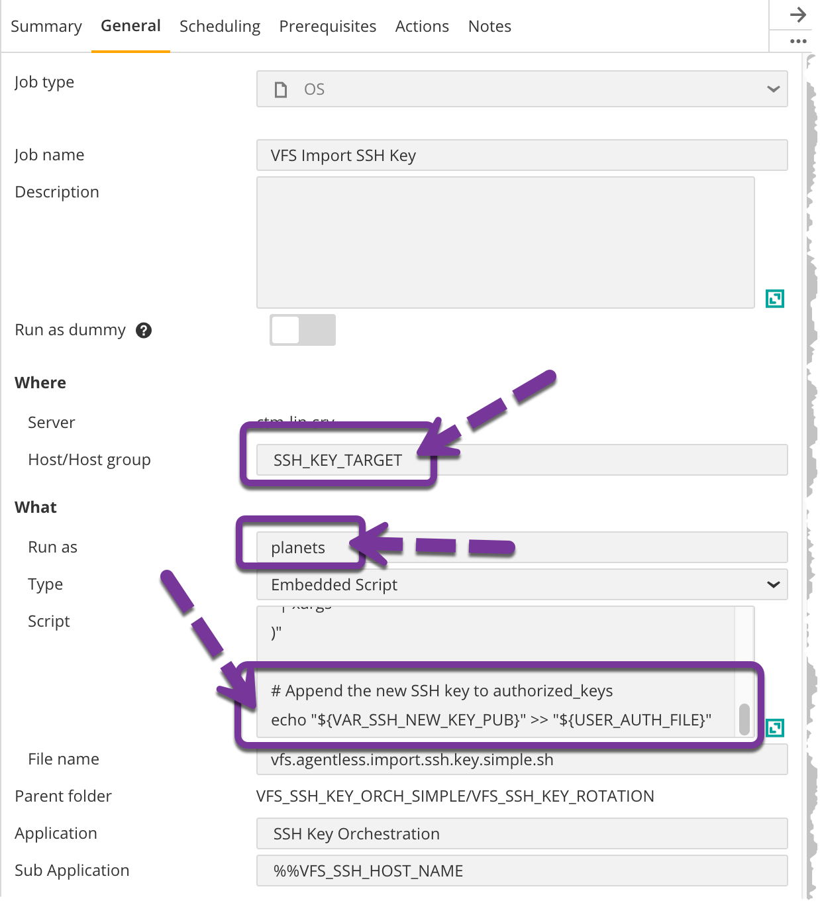

This job runs against the prepared target host group and appends the captured public key to the target user's `authorized_keys` file.

The import job uses an embedded shell script because the prior CTMAI step writes the SSH public key to system output and Control-M captures that output into `VFS_SSH_NEW_KEY_PUB`. System output has a character limit per line, so long SSH public keys can be wrapped with a line break and the line continuation character `\`. An SSH public key must be one consecutive line in `authorized_keys`, so the script sanitizes the captured value before appending it.

The key cleanup logic removes both backslashes and line breaks, then trims extra whitespace:

```bash
# Sanitize: remove backslashes and line breaks
VAR_SSH_NEW_KEY_PUB="$(
  printf '%s' "$VAR_SSH_NEW_KEY_PUB" \
  | tr -d '\\
' \
  | xargs
)"
```

After sanitizing the value, the script appends it to the `authorized_keys` file for the user executing the import job:

```bash
echo "${VAR_SSH_NEW_KEY_PUB}" >> "${USER_AUTH_FILE}"
```

This is why the RunAs user, home directory, `.ssh` directory, and file permissions must be validated before using the orchestration.

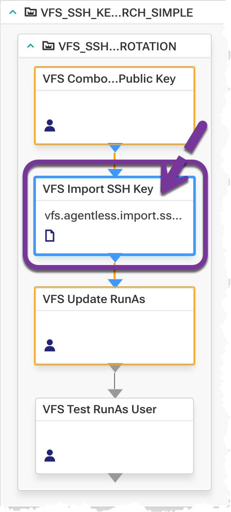

This job updates the approved Control-M RunAs account so it uses the newly created SSH key.

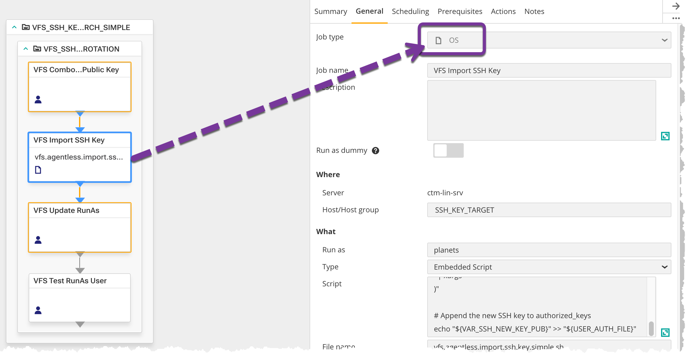

This job validates that the updated RunAs account can connect successfully with the new SSH key.

### Preparation Folder

File:

```text
src/jobs/ssh.key.orchestration.prep.json
```

Folder:

```text
VFS_SSH_KEY_ORCH_PREP
```

Update these values for the customer environment:

| Value | Description |
| --- | --- |
| `ControlmServer` | Customer Control-M server. |
| `ConnectionProfile` | Customer Centralized Connection Profile. |
| `Host` | Customer CTMAI execution host or host group. |
| `VFS_USER_EMAIL` | Requesting user, owner, or service account. |
| `VFS_SSH_HOST_NAME` | Target host requested through Self-Service. |
| `VFS_SSH_KEY_NAME` | SSH key name requested through Self-Service. |
| `VFS_RUNAS_USER` | Approved RunAs user or controlled RunAs selection. Do not allow arbitrary requester input. |
| Resource pool names | Customer resource naming standard. |
| Application/SubApplication | Customer application naming standard. |

The prep folder performs the setup work and then orders the deployment folder when host groups and resources are ready. This order matters: the reusable deployment folder must receive a prepared host group before it starts, otherwise it could run against the wrong target set.

Preparation folder screenshots:

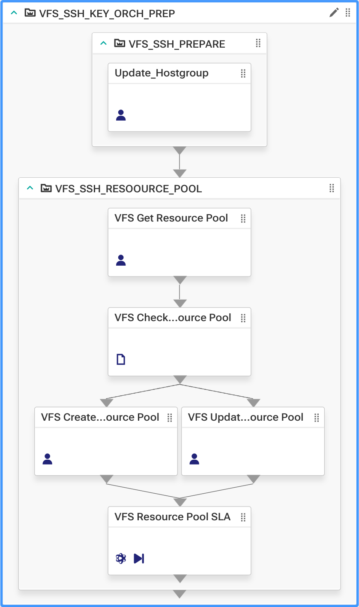

The prep folder is the Self-Service entry point. It prepares the target configuration and then orders the reusable deployment folder.

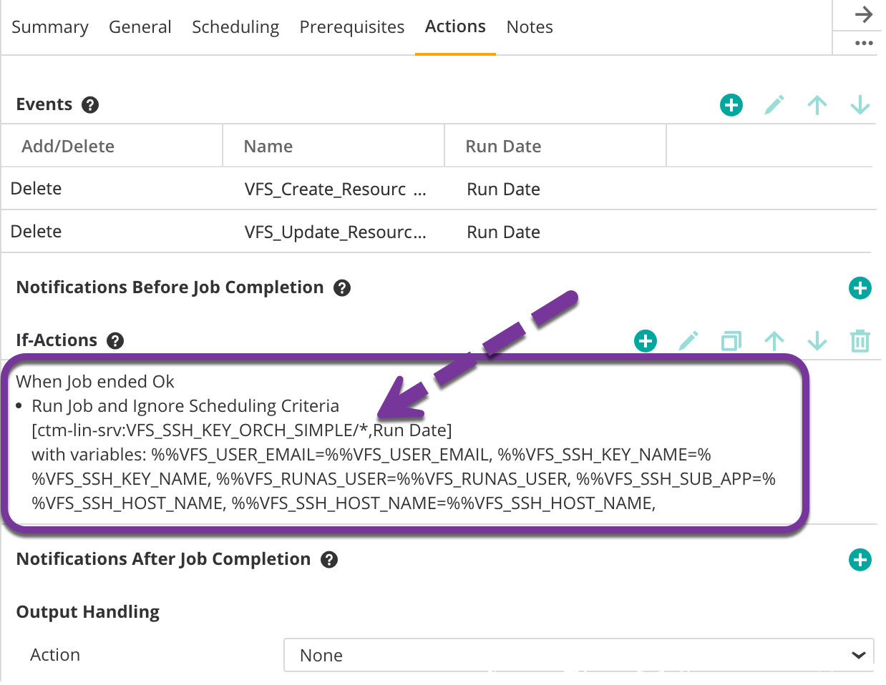

This step updates the target host group so the deployment folder runs against the requested host without changing the deployment job definitions.

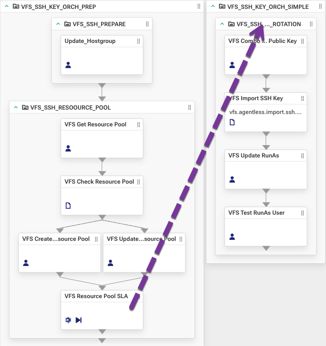

This step checks whether the resource pool for the target already exists and decides whether to create or update it.

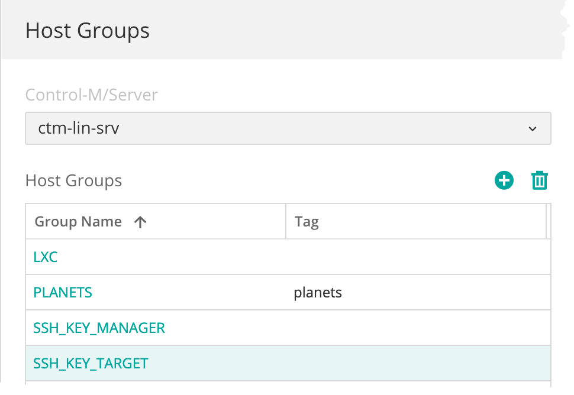

After the host group and resource pool are ready, the prep folder orders the deployment folder and passes the required variables.

## Step 6: Configure Resource Control

The prep folder creates or updates a Control-M resource pool for the requested target. This prevents parallel execution against the same host.

This matters because the deployment flow changes shared target state:

- It creates a new Control-M SSH key.
- It appends the public key to the target user's `authorized_keys`.
- It updates the Control-M RunAs user.
- It tests the new RunAs key configuration.

For customer deployments, review the resource naming convention and quantity values before using the example broadly.

## Step 7: Create Control-M Self-Service

Create a Control-M Self-Service offering that orders:

```text
VFS_SSH_KEY_ORCH_PREP
```

Do not point Self-Service directly at `VFS_SSH_KEY_ORCH_SIMPLE`. The simple folder is the deployment workflow and expects the prep workflow to handle variables, host group updates, and resource control first.

Recommended Self-Service inputs:

| Input | Maps to |
| --- | --- |
| Requester email | `VFS_USER_EMAIL` |
| Target host name drop-down | `VFS_SSH_HOST_NAME` |
| SSH key name | `VFS_SSH_KEY_NAME` |

Use Self-Service enumerations to provide the allowed remote host names for the target host drop-down field. The enumeration entries must be updated for each customer environment so they match the resources assigned to the LOB or application owner.

Do not expose arbitrary RunAs entry as a Self-Service field. If the customer requires multiple RunAs options, expose only pre-approved choices and map them through a controlled administrative process.

The Self-Service definition can be copied to support multiple organizations. Each copy can use its own enumeration values, naming standards, folder variables, and approved resource assignments. Control-M RBAC then controls which LOB or application owner can see and order each Self-Service offering.

This model lets LOB and application owners orchestrate their own SSH key rotation for approved targets without depending on Control-M administrators for each individual rotation request.

Running the flow through Self-Service has the advantage that `Application` and `SubApplication` can support a Control-M Viewpoint showing which host the folder was executed against. The `AI SSH Key Orchestration` job type is the critical piece of the workflow; folders and jobs can be created or adjusted to best fit each customer's operational needs.

Self-Service screenshots:

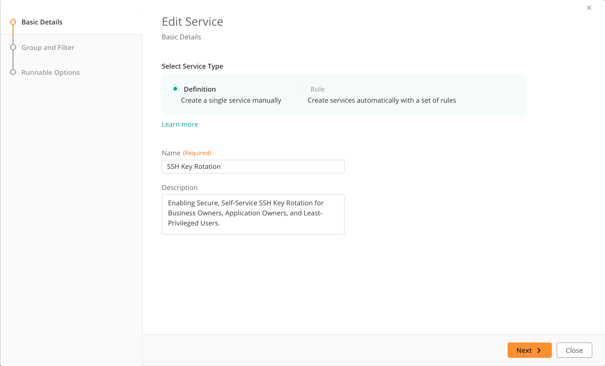

The first Self-Service screen defines the service request that users will order instead of manually running Control-M folders.

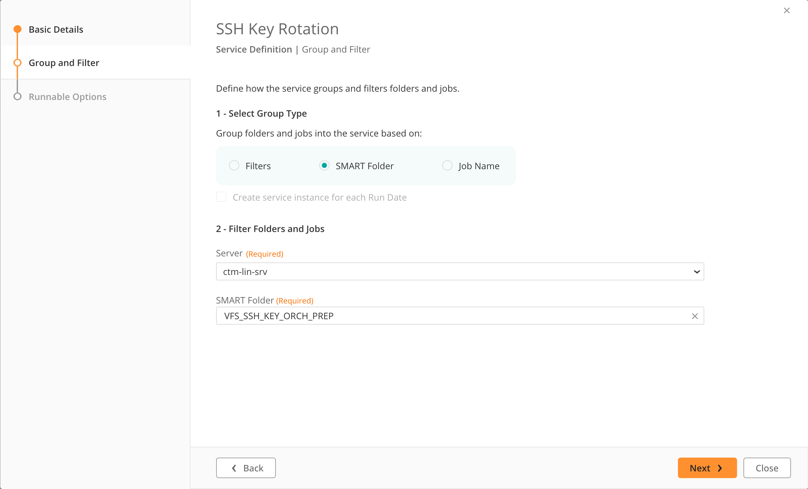

The second screen maps the request inputs to the prep folder variables, such as target host and SSH key name.

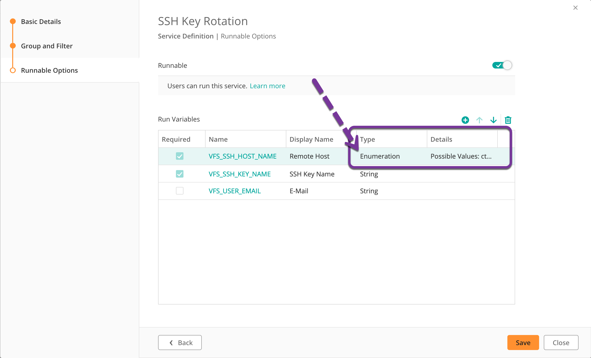

The final Self-Service configuration uses enumerations to populate the remote host drop-down. Update those entries to match the hosts assigned to the relevant LOB or application owner.

## Step 8: Run And Validate

Submit a Self-Service request and monitor the flow.

A successful run should show:

1. Self-Service orders `VFS_SSH_KEY_ORCH_PREP`.
2. The prep folder updates the target host group.
3. The prep folder creates or updates the resource pool.
4. The prep folder orders `VFS_SSH_KEY_ORCH_SIMPLE`.
5. The deployment folder creates the SSH key and retrieves the public key.
6. The deployment folder imports the public key to the target user's `authorized_keys`.
7. The deployment folder updates the Control-M RunAs user.
8. The deployment folder tests the RunAs user successfully.

## API Calls Used

The Postman collection contains the Automation API calls for the educational/basic execution flow. Control-M does not use Postman at runtime. In the Control-M implementation, these calls are executed by the `AI SSH Key Orchestration` CTMAI job type through the Centralized Connection Profile.

The full BMC Automation API service index is here: [BMC Control-M Automation API Services](https://documents.bmc.com/supportu/API/Monthly/en-US/Documentation/API_Services_Main.htm).

### Basic SSH Key Rotation Calls

These are the core calls used to create a new SSH key, retrieve the public key, update the approved RunAs user, and validate the result. Postman-specific request names are documented separately in `src/scripts/postman.create.ssh.md`.

| Method | API path | BMC documentation | Purpose in this example |
| --- | --- | --- | --- |
| `GET` | `/config/server/:server/sshKeysList?keyName=*&format=*` | [SSH Key Configuration](https://documents.bmc.com/supportu/API/Monthly/en-US/Documentation/API_Services_ConfigService_SSHKey.htm) | Lists SSH keys so the workflow can inspect current key state before or after rotation. |
| `POST` | `/config/server/:server/sshkey/add` | [SSH Key Configuration](https://documents.bmc.com/supportu/API/Monthly/en-US/Documentation/API_Services_ConfigService_SSHKey.htm) | Creates the new private SSH key in Control-M. |
| `GET` | `/config/server/:server/sshkey/{{SSH_KEY_NAME}}/{{SSH_KEY_PASSPHRASE}}` | [SSH Key Configuration](https://documents.bmc.com/supportu/API/Monthly/en-US/Documentation/API_Services_ConfigService_SSHKey.htm) | Retrieves the public key so the deployment job can append it to the target user's `authorized_keys` file. |
| `POST` | `/config/server/:server/runasuser/:agent/:user` | [Run as User Configuration](https://documents.bmc.com/supportu/API/Monthly/en-US/Documentation/API_Services_ConfigService_RunAsUser.htm) | Updates the approved RunAs account to use the newly created SSH key. |
| `POST` | `/config/server/:server/runasuser/:agent/:user/test` | [Run as User Configuration](https://documents.bmc.com/supportu/API/Monthly/en-US/Documentation/API_Services_ConfigService_RunAsUser.htm) | Validates that the RunAs account can authenticate with the new key. |
| `DELETE` | `/config/server/:server/sshkey/{{SSH_KEY_NAME}}/{{SSH_KEY_PASSPHRASE}}` | [SSH Key Configuration](https://documents.bmc.com/supportu/API/Monthly/en-US/Documentation/API_Services_ConfigService_SSHKey.htm) | Optional cleanup for older keys when the customer rotation policy requires deletion. |
| `GET` | `/config/server/:server/runasuser/:agent/:user` | [Run as User Configuration](https://documents.bmc.com/supportu/API/Monthly/en-US/Documentation/API_Services_ConfigService_RunAsUser.htm) | Reads the RunAs definition for validation or audit checks. |

### Supporting Configuration Calls

These calls support setup, validation, and operational checks around the agentless target. They are useful during education, testing, and troubleshooting.

| Method | API path | BMC documentation | Purpose in this example |
| --- | --- | --- | --- |
| `POST` | `/config/server/:server/runasuser` | [Run as User Configuration](https://documents.bmc.com/supportu/API/Monthly/en-US/Documentation/API_Services_ConfigService_RunAsUser.htm) | Creates a RunAs account during setup. In production, RunAs creation should remain under administrative control. |
| `DELETE` | `/config/server/:server/runasuser/:agent/:user` | [Run as User Configuration](https://documents.bmc.com/supportu/API/Monthly/en-US/Documentation/API_Services_ConfigService_RunAsUser.htm) | Removes a RunAs account when cleanup is required. |
| `POST` | `/config/server/:server/agentlesshost/:agentlesshost/ping` | [Agentless Host Configuration](https://documents.bmc.com/supportu/API/Monthly/en-US/Documentation/API_Services_ConfigService_Agentless_Host.htm) | Checks whether the target agentless host is reachable. |
| `POST` | `/config/server/:server/agentlesshost/:agentlesshost/enable` | [Agentless Host Configuration](https://documents.bmc.com/supportu/API/Monthly/en-US/Documentation/API_Services_ConfigService_Agentless_Host.htm) | Enables the agentless host when it is part of the setup or recovery process. |
| `POST` | `/config/server/:server/agentlesshost/:agentlesshost/disable` | [Agentless Host Configuration](https://documents.bmc.com/supportu/API/Monthly/en-US/Documentation/API_Services_ConfigService_Agentless_Host.htm) | Disables the agentless host when needed for administration or testing. |
| `POST` | `/config/server/:server/agentlesshost/:agentlesshost/test` | [Agentless Host Configuration](https://documents.bmc.com/supportu/API/Monthly/en-US/Documentation/API_Services_ConfigService_Agentless_Host.htm) | Tests the agentless host configuration. |
| `GET` | `/config/server/:server/agentlesshost/:agentlesshost` | [Agentless Host Configuration](https://documents.bmc.com/supportu/API/Monthly/en-US/Documentation/API_Services_ConfigService_Agentless_Host.htm) | Reads the agentless host configuration for validation or troubleshooting. |

### CTMAI Module Calls Beyond The Postman Collection

The CTMAI module used by the Control-M folders may include additional Automation API calls that are not represented in the educational Postman collection. In this example, the prep workflow uses CTMAI operations such as `Update Hostgroup`, `Get Resource Pool`, `Create Resource Pool`, and `Update Resource Pool`.

| CTMAI operation | BMC documentation | Purpose in this example |
| --- | --- | --- |
| `Update Hostgroup` | [Host Group Configuration](https://documents.bmc.com/supportu/API/Monthly/en-US/Documentation/API_Services_ConfigService_HostGroups.htm) | Updates the target host group before the reusable deployment folder is ordered. |
| `Get Resource Pool`, `Create Resource Pool`, `Update Resource Pool` | [Resource Pools](https://documents.bmc.com/supportu/controlm-saas/en-US/Documentation/Resource_Pools.htm) | Controls concurrency so two key rotations do not run against the same target at the same time. Confirm the exact API implementation in the customer CTMAI module. |

When extending the CTMAI module, use the BMC documentation as the source of truth for method, path, payload, authentication header, and version support.

## Educational Postman Reference

The Postman collection is included for education only. It helps explain the Automation API calls behind the example, but it is not used by Control-M and is not part of the runtime workflow.

In the Control-M implementation, the API calls are executed by the `AI SSH Key Orchestration` Application Integrator job type through the Centralized Connection Profile.

Import:

```text
postman/SSH.Orchestration.Postman.Collection.json
```

Supporting notes:

```text
src/scripts/postman.create.ssh.md
```

Core Postman variables:

| Variable | Description |
| --- | --- |
| `baseUrl` | Automation API URL. |
| `CTM_Server` | Control-M server name. |
| `CTM_AGENTLESS_HOST` | Target agentless host. |
| `SSH_USER_NAME` | RunAs user. |
| `SSH_KEY_NAME` | SSH key name. |
| `SSH_KEY_PASSPHRASE` | SSH key passphrase. |
| `SSH_KEY_FORMAT` | Key format, for example `OpenSSH`. |
| `SSH_KEY_TYPE` | Key type, for example `ECDSA`. |
| `SSH_KEY_BITS` | Key size, for example `521`. |

## Troubleshooting

| Symptom | Check |
| --- | --- |
| CTMAI job type is missing | Confirm `AI SSH Key Orchestration` was deployed to Control-M. |
| CTMAI job fails authentication | Validate the Centralized Connection Profile API URL and token. |
| Public key variable is empty | Confirm CTMAI output includes `SSH Public Key:` so `VFS_SSH_NEW_KEY_PUB` can be captured. |
| Import job fails | Confirm the RunAs user, home directory, `.ssh` directory, and `authorized_keys` permissions on the target. |
| RunAs update fails | Confirm key name, passphrase, Control-M server, target host, and RunAs user values. |
| RunAs test fails | Confirm the original RunAs account worked before running the orchestration and that the new public key was imported to the right host/user. |
| Requests overlap on the same target | Confirm Self-Service orders the prep folder and the resource pool logic is enabled for the target. |

## Notes

- The screenshots show a local lab and are not customer-ready values.
- The customer must adjust RunAs users, host groups, Control-M server names, API URLs, tokens, connection profiles, application names, and resource settings.
- The deployment folder can be ordered directly for testing, but the intended user workflow is Self-Service ordering the prep folder first.
- `src/jobs/ssh.key.orchestration.simple.json` can be changed for standalone execution by replacing `SSH_KEY_TARGET` with the target Control-M node ID when host groups are not required.
- The files under `internal/` are demo and talk-track assets, not implementation requirements.
