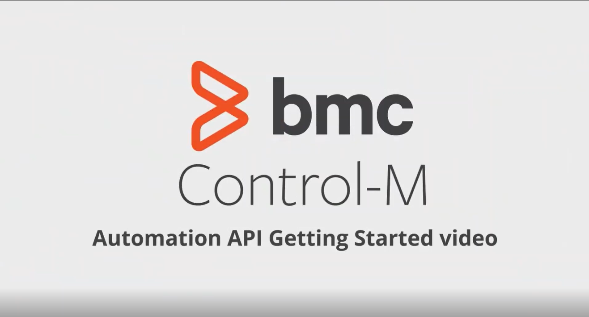

# Job-As-Code Toolebelt for Control-M README

# Job-As-Code Toolbelt #
[]() []() []() []() []() []() []() []() []() 

## Overview
This extension enables key features from BMC Software's Control-M product that will allow users to integrate their Workflow Job-As-Code, Git, and Visual Studio Code development processes. Now you can write and debug Control-M Workflow Job-As-Code scripts using the excellent IDE-like interface that Visual Studio Code provides.

> Tip: No prior experience with Control-M is required to write jobs.

## Supported file types or languages
| language    | extension                | description                 |
| ----------- | ------------------------ | --------------------------- |
| JSON        | .json                    | job-as-code script files    |
| Python      | .py                      | job-as-code python files    |


## Features
- Use pre-built code snippets while writing and debugging your Control-M Workflow Job-As-Code scripts. 
- **build**, **run** and **deploy** the Job-As-Code scripts direclty out of ***Visual Studio Code*** or ***Visual Studio Code Server*** 


> Tip: start entering ***jac*** to get a list of predefined code snippets in your json file.


## Install the Control-M Visual Studio Code extension
The Control-M extension can be found in the Visual Studio Code Extension Marketplace. More information on adding extensions to Visual Studio Code can be found [here](https://code.visualstudio.com/docs/introvideos/extend).

As in any Visual Studio Code Extension you have several options to install:

* Enter the Visual Studio Code Marketplace, search for _Control-M Code Snippets_ (or enter directly on [the extension page](https://marketplace.visualstudio.com/items?itemName=bmcsoftware.job-as-code)) and click on _Install_ button.
* Inside Visual Studio Code, enter in the Extensios panel, search for _Control-M Code Snippets_ and click on _Install_ button
* Run the following command in the Command Palette:
	```
	code --install-extension job-as-code-*.vsix
	```

## Getting Started & Installing the Control-M Automation CLI
Control-M Automation API is a set of programmatic interfaces that give developers and DevOps engineers access to the capabilities of Control-M within the modern application release process. Job flows and related configuration objects are built in JSON and managed together with other application artifacts in any source code management solution, such as GIT. This approach enables capabilities such as sophisticated scheduling, flow control, and SLA management to be built in right from inception and used during the running of batch applications as they are automatically deployed in dev, test, and production environments. Click on the image to watch the introduction video:

<div style="width: 20%; height: 20%">
  
  [](https://youtu.be/7QAuMDym9cw "Click to watch")
  
</div>

To manually install the CLI, ensure that the platform supports the installation of ***Node.js*** version 4.x or later and ***Java*** version 8 or later. Installation instructions for the CLI are provided separately for each of the following platforms:

- [Windows](https://docs.bmc.com/docs/automation-api/monthly/installation-1064010696.html#Installation-windows)
- [Linux](https://docs.bmc.com/docs/automation-api/monthly/installation-1064010696.html#Installation-Linux)
- [macOS](https://docs.bmc.com/docs/automation-api/monthly/installation-1064010696.html#Installation-Mac)


In general these are the two steps: ***download*** **ctm-cli.tgz**, then run ***npm install***. Example:


	curl --insecure --output ~/ctm-cli.tgz https://localhost:8443/automation-api/ctm-cli.tgz
	npm -g install ctm-cli.tgz


## Platform Support

The extension _should_ work anywhere VS Code itself is [supported]. 

Read the [Start using a Jobs-as-Code approach to build workflows with Control-M](https://controlm.github.io/)
to get more details on how to use the extension on these platforms.


## API Support

Control-M Automation API [Swagger](http://aapi-swagger-doc.s3-website-us-west-2.amazonaws.com/swagger.json) builds the basis of the job-as-code integration and code snippets.


## Control-M objects in JSON code

Control-M Automation API enables you to manage jobs through JSON code. See [Code Reference](https://docs.bmc.com/docs/display/workloadautomation/Control-M+Automation+API+-+Code+Reference) for more details.


> Tip: Each Control-M object begins with a **Name** and then a **Type** specifier as the first property. All object names are defined in ***PascalCase*** notation with first letters in capital case.

The Control-M Automation API allows you to automate and work interactively with Control-M. Services are groups of API commands available via either a CLI (Command Line Interface) or as REST API commands. Using the services, you can build job definitions to test whether they are valid, test-run a job to debug job definitions , combine multiple definition files into a package, deploy job definitions and packages to Control-M, provision a Control-M/Agent, manage environments, and more. Click on the link below for more information. 


| Name           | description              | 
| -----------    | ------------------------ |
| [archive](https://docs.bmc.com/docs/automation-api/monthly/archive-service-1064010768.html) | The Archive service enables you to search through job data archived in the Workload Archiving server by the Control-M Workload Archiving add-on, as well as to obtain job outputs and job logs for individual jobs. Not supported in Control-M SaaS | 
| authentication | Creates and manages authentication tokens | 
| [build](https://docs.bmc.com/docs/automation-api/monthly/build-service-1064010744.html) | The build service allows you to compile definitions of jobs, folders, or calendars and verify that they are valid for your Control-M environment. Control-M validation includes basic Control-M rules such as length of fields, allowed characters, and mandatory fields. Build will also check that the JSON is valid. If Control-M Change Manager is part of your solution, definitions will be evaluated against the relevant site standard. build can receive definition files in .json format or packages of multiple definition files in .zip or .tar.gz format. | 
| [config](https://docs.bmc.com/docs/automation-api/monthly/config-service-1064010753.html) | Using the Config service, you can access, update, and add configuration data for the major components of the Control-M environment. | 
| [deploy](https://docs.bmc.com/docs/automation-api/monthly/deploy-service-1064010746.html) | The deploy service allows you to transfer job and configuration definitions to Control-M. | 
| documentation  | Get documentation | 
| [environment](https://docs.bmc.com/docs/automation-api/monthly/environment-service-1064010769.html) | The Environment service enables you to manage environments, including defining and selecting the Control-M environment to use. | 
| [package](https://docs.bmc.com/docs/automation-api/monthly/package-service-1064010751.html) | Package a directory of definition files into a deployable archive | 
| [provision](https://docs.bmc.com/docs/automation-api/monthly/provision-service-1064010762.html) | For Control-M to run and monitor jobs on your application host, a Control-M/Server and Control-M/Agent should be installed. The Provision service allows you access to the full cycle of the following setup processes for agents and servers. | 
| [reporting](https://docs.bmc.com/docs/automation-api/monthly/reporting-service-1064010765.html) | The Reporting service enables you to generate reports that were set up through Control-M Reports. You can generate reports either synchronously or asynchronously. | 
| [run](https://docs.bmc.com/docs/automation-api/monthly/run-service-1064010748.html) | The Run service enables you to run jobs and track their status, as well as manage several other types of objects used by jobs. | 
| [session]() | The Session service allows you to log in and log out of Control-M and receive a token that can be reused in subsequent requests. | 
| usage          | Run the usage service in order to get a usage report. Supported only in Control-M SaaS | 


## Usage

TBD


## License

Please see the [BMC License](https://github.com/controlm/automation-api-community-solutions/license.html) file for details on the project.

## Release Notes

### 0.1.*

Initial Alpha Test Version

### 1.0.*
Initial release of the Control-M extension. The extension supports code snippets for Python and JSON Job-As-Code files.

https://code.visualstudio.com/docs/languages/identifiers
