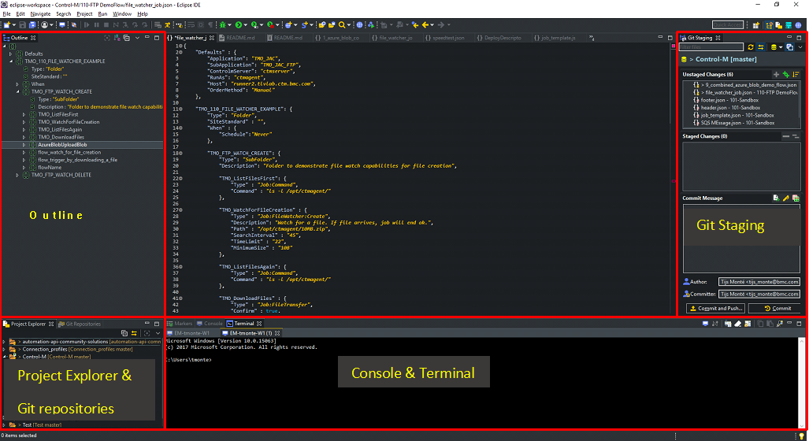
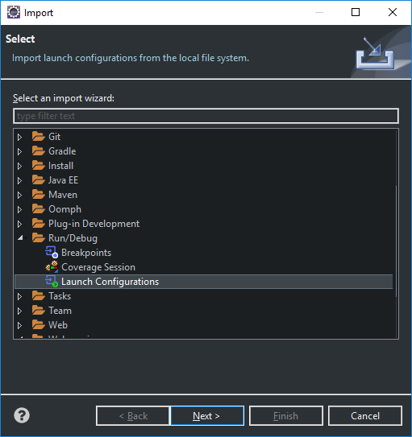
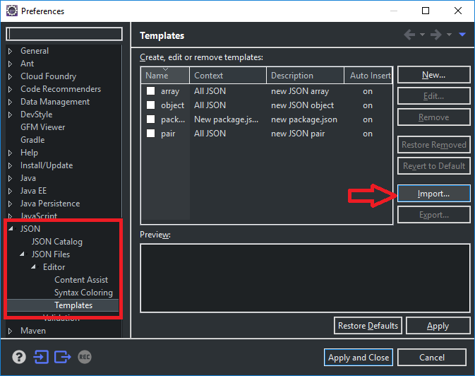
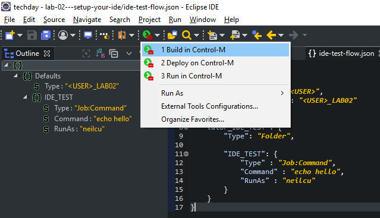

# Integrate with Eclipse.

## Step 1 - Get Eclipse

Eclipse is one of the most widely used IDEs. Eclipse is open source and offers many different plug-in to offer additional capabilities and support for coding languages. This example intends to server both the seasoned developers as well as newcomers. Due the the open architecture and the many different plug-ins, Eclipse can be overwhelming for those who are new to it. This guide intents to guide you trough this so you will be able to get started with jobs-as-code via Eclipse.

You can download the latest version of Eclipse [here](https://www.eclipse.org/)

__NOTE__: Please choose the __Eclipse JEE edition__ in order to have the right plug-ins pre-installed.

This example containts integrtrations for the following Eclipse capabilities:
- Code snippets (JSON templates)
- External Run configurations

Other useful Eclipse capabilities for working with jobs-as-code are:
- Git integration: For version control capabilities. 
- Syntax highlighting: For better readability
- Local Terminal: For using the Automation API CLI to use non standard operations

## Step 2 - Tune your Eclipse

Feel free to tailor your Eclipse to your need, but for coding jobs-as-code workflows we recommend to use the following windows:
- Git Repositories
- Git Staging
- Projects
- Console
- Outline

Below an example how this can be configured. 



> __Note:__
>
>Whatever configuration you choose, we recommend to save it as a jobs-as-code perspective (go to __Window --> Perspective --> Save Perspective As..__)

## Step 3 - Import run configuration

In order to use the Automation API directly from Eclipse, we need to setup the __External Run Configuraitons__ in Eclipse. In order to do so go to:
```
File --> Import
```

Browse to Launch Configurations (Tip: Type Launch in the search bar for quick navigation)



Select the directory __external-run-configurations__ from your local git folder for this repository.

## Step 4 - Import json templates (code snippets)

JSON templates can be used to quickly insert pieces of json to build workflows in jobs-as-code. In order to import the pre-defined templates, go to __Window --> Preferences
Navigate to 

__JSON Files --> Editor --> Templates__ and press __import__

__Note__: You need to have the Eclipse EE Developer plugin installed for this. If you don't have this option, install it from the [Eclipse Marketplace](https://marketplace.eclipse.org/content/eclipse-java-ee-developer-tools-0?mpc=true&mpc_state=) 



Select the file [templates.xml](json-templates/templates.xml) from the __json-templates__ directory of this repository. 

Feel free to add your own templates or modiy an existing one (e.g. add a prefix for jobnames of new jobs)

## Step 5 - Other tips for using Eclipse with Jobs-as-code

You can customize Eclipse to your taste by installing additional plug-ins. The plug-ins listed below are found useful by other jobs-as-code users:
- [Darkest theme](https://marketplace.eclipse.org/content/darkest-dark-theme) to make it look better
- [Eclipse Java EE Developer Tools](https://marketplace.eclipse.org/content/eclipse-java-ee-developer-tools-0?mpc=true&mpc_state=) if not installed with the initial install. 

## Step 5 - Test your setup

We are almost done. Let's test our configuration:
- Open a jobs-as-code json file.

- __Run --> External Tools__ and choose __Build in Control-M__ or chose from the menu bar as show in the picture below:

-  You should see something simular in the Eclipse Console:

```
  {
    "deploymentFile": "ide-test-flow.json",
    "successfulFoldersCount": 0,
    "successfulSmartFoldersCount": 1,
    "successfulSubFoldersCount": 0,
    "successfulJobsCount": 1,
    "successfulConnectionProfilesCount": 0,
    "successfulDriversCount": 0,
    "isDeployDescriptorValid": false
  }
]
```