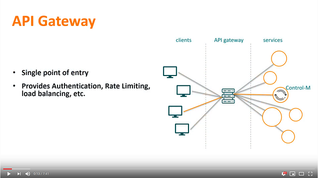

# Add Automation API as service to Apigee Edge Gateway

Quickly jump to:
*  [Setup](#setup)
*  [Configuration](#configuration)
*  [Using the Automation API client (ctm cli)](#using-the-automation-api-client-ctm-cli)
*  [Swagger UI redirect](#swagger-ui-redirect)
*  [Replacing URLs in responses](#replacing-urls-in-responses)
*  [Video](#video)


## Requirement

The company has a requirement that all REST APIs in the organisation are to 
be made available through one centralized API Gateway, which allows developers
to access those APIs without having to know on which actual host they are
running. In addition, the API Gateway allows access control and features such as 
rate limiting. The Apigee API Gateway has been selected for this.

## Prerequisites

* Control-M/Enterprise Manager 9.0.19.200 or higher*
* Control-M Automation API 9.0.18 or higher

\* An issue present in Control-M/EM 9.0.19 and 9.0.19.100 prevents 
this setup from working. Follow BMC article 000171545 to resolve this issue.

## Setup

This walkthrough does not cover setting up an Apigee account. We recommend the 
[Apigee Get Started Documentation](https://docs.apigee.com/api-platform/get-started/get-started).


## Configuration

To add the Control-M Automation API to your  Apigee Edge API gateway, follow
these steps:

1. On your Apigee console, go to: Develop > API Proxies
 
2. Click the `+Proxy` button (top-right)

3. Select the default "Reverse proxy" option and click Next
 
![Create new Proxy - step 1][createproxy1]

4. Fill in the name of the proxy, the path under which it will be available to 
   clients, and the https url to your Automation API endpoint.

![Create new Proxy - step 1][createproxy2]

5. For now we will not add additional authentication on the Gateway.

![Create new Proxy - step 1][createproxy3]

6. Make sure to only enable the secure virtual hosts, so that only https 
   communication will be allowed.

![Create new Proxy - step 1][createproxy4]

7. Select which environment you want to enable, here we're selecting only the
   "test" environment for now.

![Create new Proxy - step 1][createproxy5]


[createproxy1]: images/createproxy0.png "Create new Proxy - step 1"
[createproxy2]: images/createproxy1.png "Create new Proxy - step 2"
[createproxy3]: images/createproxy2.png "Create new Proxy - step 3"
[createproxy4]: images/createproxy3.png "Create new Proxy - step 4"
[createproxy5]: images/createproxy4.png "Create new Proxy - step 5"


## Testing a request

Requests can now be sent through the Apigee gateway as you would normally do,
using the Apigee gateway host alias and proxy path as the endpoint url.
The endpoint for the proxy created above would be:
`https://controlmaapi-eval-test.apigee.net/ctm/`

So for example a login to the AAPI should be performed by calling:
`https://controlmaapi-eval-test.apigee.net/ctm/session/login`


## Using the Automation API client (ctm cli)

Since no additional headers or other special setup is necessary to send requests 
through the proxy, the ctm cli will work through the gateway as well:

```
[ctmcli]$ ctm env add via-apigee https://controlmaapi-eval-test.apigee.net/ctm/ apiuser ********
Environment 'via-apigee' was created
via-apigee: {"endPoint":"https://controlmaapi-eval-test.apigee.net/ctm","user":"apiuser"}

[ctmcli]$ ctm session login
{
  "username": "apiuser",
  "token": "A3F5BB6EBB96D867CCFAA92DFFBE82D122128F31062A79A447EC88AD507D65F628E6F35D7E1F5B9AC51E401E9409E54B342FD8A3C76F76BE7E03746E323D03D8",
  "version": "9.19.120"
}

[ctmcli]$ ctm session logout A3F5BB6EBB96D867CCFAA92DFFBE82D122128F31062A79A447EC88AD507D65F628E6F35D7E1F5B9AC51E401E9409E54B342FD8A3C76F76BE7E03746E323D03D8
{
  "message": "Successfully logged out from session A3F5BB6EBB96D867CCFAA92DFFBE82D122128F31062A79A447EC88AD507D65F628E6F35D7E1F5B9AC51E401E9409E54B342FD8A3C76F76BE7E03746E323D03D8"
}
```


## Swagger UI redirect

After the above, all API requests are proxied correctly. However when the base
url of the API gateway is opened in a browser, a redirect to the Swagger UI 
page is returned. This redirect points the browser to the Automation API url, 
not the API Gateway url. We need this redirect to go to the API Gateway as well.

1. To accomplish this, open the "Develop" tab in the Apigee API Proxy designer.
2. Next to Policies, click the `+` button, and select to add an "Assign Message" 
policy with the name `Swagger-Redirect`. 
Update the displayed XML for this policy to the following:

```
<?xml version="1.0" encoding="UTF-8" standalone="yes"?>
<AssignMessage async="false" continueOnError="false" enabled="true" name="Swagger-Redirect">
    <DisplayName>Swagger-Redirect</DisplayName>
    <Properties/>
    <Set>
        <StatusCode>302</StatusCode>
        <Headers>
            <Header name="Location">https://controlmaapi-eval-test.apigee.net/ctm/swagger-ui.html</Header>
        </Headers>
    </Set>
    <IgnoreUnresolvedVariables>true</IgnoreUnresolvedVariables>
    <AssignTo createNew="false" transport="http" type="response"/>
</AssignMessage>
```

Make sure to set the url to be the base-path of the API gateway.

2. Next, under Proxy Endpoints, click the `+` button next to "default", and add 
a Flow named `SwaggerRedirect`. Update the XML for for this flow to the 
following:

```
        <Flow name="SwaggerRedirect">
            <Description>SwaggerRedirect</Description>
            <Request/>
            <Response>
                <Step>
                    <Name>Swagger-Redirect</Name>
                </Step>
            </Response>
            <Condition>((proxy.pathsuffix == "") or (proxy.pathsuffix == "/"))</Condition>
        </Flow>
```		

3. Save and deploy the updated proxy.

Similar to the Assign Message policy, policies to enforce quota or perform rate 
limiting can be added. For more information, refer to Apigee's documentation and
videos.


## Replacing URLs in responses

There are several Control-M Automation API responses that contain URLs,
for example the /run/order request contains a StatusURI field in its JSON 
response. We need these to reflect the Gateway URL as well.

1. On your API Proxy's "Develop" tab, click the `+` icon next to "Resources".
2. Select 'Create new file', Javascript, and name it `URLRewrite.js`
  
![Add Javascript Resource][URLRewrite1]

3. In the Code pane paste the following code:

```
// Used to rewrite URLs in the response to route through same proxy.
// URLRewrite policy.

var targeturl = 'https://ec2-00-00-000-000.us-west-2.compute.amazonaws.com:8443/automation-api';
var proxyurl = 'https://controlmaapi-eval-test.apigee.net/ctm';

var re = new RegExp(targeturl,"gi");
response.content = response.content.replace(re, proxyurl);
```

4. Next to Policies, click the `+` button, and select to add a Javascript policy.
   set the name to `URLRewrite`. Click Add.

![Add Policy][URLRewrite2]

5. Finally, add the `URLRewrite` policy to a Response Step in the PostFlow 
   section under Target Endpoints.

```
    <PostFlow name="PostFlow">
        <Request/>
        <Response>
            <Step>
                <Name>URLRewrite</Name>
            </Step>
        </Response>
    </PostFlow>
```

6. Save and deploy the updated proxy.
 
[URLRewrite1]: images/URLRewrite1.png "Add Javascript Resource"
[URLRewrite2]: images/URLRewrite2.png "Add Policy"


## Video

The following video demonstrates the above steps.

[](https://youtu.be/flY5NHc1ycI)

Click the above image to watch the video on YouTube.
