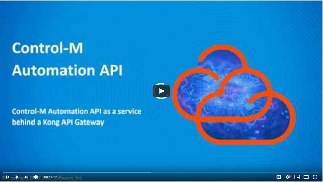

# Add Automation API as service to Kong Gateway

## Requirement

The company has a requirement that all REST APIs in the organisation are to 
be made available through one centralized API Gateway, which allows developers
to access those gateways without having to know on which actual host they are
running. In addition, the API Gateway allows access control and features such as 
rate limiting. The Kong API Gateway has been selected for this.

## Prerequisites

* Control-M Automation API 9.0.18 or higher
* [Kong](https://konghq.com/kong) 1.3 was used for testing (lower versions may
  work as well)

## Installation

This walkthrough does not cover installation of Kong itself. We recommend the 
[Kong Installation Documentation](https://konghq.com/install/).

## Configuration

### Kong with Database

If Kong has been installed with a database, the following example commands
can be used to add the Control-M Automation API service to Kong. This assumes 
the Kong admin port is 8001 and running on localhost (default).

1. Add service 

```
curl -X POST \
  --url http://localhost:8001/services/ \
  --data 'name=controlm-api' \
  --data 'url=https://ctmtest:8446/automation-api/'
```

The `name` can be any name of your choosing.
The `url` is that of the Automation API endpoint. Make sure to *end the url with
a slash* after automation-api as in the example above.

2. Add route

```
curl -X POST \
  --url http://localhost:8001/services/controlm-api/routes \
  --data 'hosts[]=controlm.api' \
  --data 'protocols[]=https'
```

The `hosts` parameter identifies the name that clients will use in their Hosts 
header to indicate they want to connect to this Control-M Automation API service.
The hosts need not be actual existing host names, they can be any logical name. 

We highly recommend setting the `protocols` parameter to *https only* (the Kong 
default is to allow both http and https), so that credentials and tokens can not 
be sent in clear text.

3. Test a request

After adding a route, the service would now be available.
The Kong gateway in this example is running on the host "kong-gateway" and using
default port 8443.

Use the following to try a /session/login request:

```
curl -X POST --url https://kong-gateway:8443/session/login \
  --header 'Host: controlm.api' \
  --header "Content-Type: application/json" \
  --data '{"username":"emuser","password":"empass"}'
```

The `'Host: controlm.api'` header lets Kong know that this request is to be 
forwarded to the Control-M Automation API which had this host name configured in
its route (see step 2).

4. Add plugins

Kong has many plugins for authentication, rate limiting, etc. Please refer to 
the Kong documentation for more information.
This example shows how to add rate-limiting to our controlm-api service.

```
curl -X POST http://localhost:8001/services/controlm-api/plugins \
    --data "name=rate-limiting"  \
    --data "config.second=5" \
    --data "config.hour=10000"
```

Now the Kong API Gateway will only allow a maximum of 5 requests per second, or 
10,000 per hour to be made to the controlm-api service.


### Kong Without a Database

If you are using Kong without a database, the configuration described above can
be accomplished by adding the following section under the `services:` section of
the `kong.yml` file:

```
- name: controlm-api
  url: https://ctmtest:8446/automation-api/
  routes:
  - name: controlm-api
    hosts: ["controlm.api"]
    protocols: ["https"]
    paths:
    - /
  plugins:
  - name: rate-limiting
    config:
      policy: local
      second: 5
      hour: 10000
```


## Video

The following video demonstrates the above steps.

[](https://youtu.be/wghZT5tZxco)

Click the above image to watch the video on YouTube.
