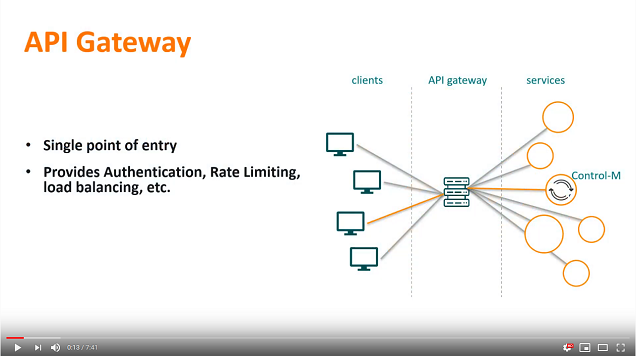

# Apigee complete quick setup

This example combines the configurations from the two previous examples:
1. [Add AAPI service to Apigee Gateway](../add-aapi-service-to-apigee-gateway)
2. [Apigee Outbound Authentication](../apigee-outbound-auth)

Modifications were made to be able to combine the two.
The resulting package can be imported using the apigeetool utility.

## Prerequisites

1. Apigee account 

This walkthrough does not cover setting up an Apigee account. We recommend the 
[Apigee Get Started Documentation](https://docs.apigee.com/api-platform/get-started/get-started).

2. Apigeetool

The apigeetool utility is used to import the example API Proxy definition into
your Apigee environment.
For more inforamtion on how to install this, see 
[apigeetool installation](https://www.npmjs.com/package/apigeetool#installation).


## Configuration

1. Copy the `apiproxy` directory from this example to a location on the machine
   where you have the apigeetool installed.

2. Edit the following two files which contain the login credentials to your 
Control-M Automation API backend and endpoint url:
```
apiproxy/policies/redirect-swagger.xml
apiproxy/resources/jsc/api-config.js
apiproxy/targets/default.xml
```

3. From the parent directory where you copied the `apiproxy` directory, run the
   following command:
```
apigeetool deployproxy -u "me@example.com" -o "myorg" -n controlm -e test
```

Your username is the e-mail address with which you login to Apigee. The 
organisation will be listed there as well. The environment (-e) option specifies
in which environment to deploy the proxy. 
For more information about apigeetool options go 
[here](https://www.npmjs.com/package/apigeetool#deployproxy).

This command deploys the `controlm` API Proxy to your Apigee 
environment. If a proxy with the same name already exists, a new revision will 
be added to that proxy.

3. Create the cache

The example proxy uses a cache named `ctmtoken` to store the Control-M
Automation API session token. Use the apigeetool to create it:
```
apigeetool createcache "me@example.com" -o "myorg" -e test -z ctmtoken
```

4. The example adds API Key authentication to the API Proxy. This is done 
because the authentication to the Control-M backend will be handled entirely by
the Apigee gateway, so without additional authentication the Control-M 
Automation API would be accessible by anyone.

See the [Secure an API by requiring API keys]https://docs.apigee.com/api-platform/tutorials/secure-calls-your-api-through-api-key-validation#abouttheapiproduct
tutorial for quick steps on how to create a developer user with corrresponding
API Key.

The API Keys must be added to requests as an http header named `apikey`.


## Done

We can now start sending requests through the API Gateway.

For example, a `/config/servers` request can be sent using the curl utility, 
making sure to include the `apikey` in the headers:
```
curl -s --url https://controlmaapi-eval-test.apigee.net/controlm/config/servers \
  --header "apikey: ASfAK1k6Qa5UHMAzdTdgMA3PvGm0z8x2" 
```


## Note about Swagger-UI page

The example gateway has been created to still allow the Swagger-UI page to be 
displayed, however due to the authentication changes (added apikey and backend
authentication handled by gateway), the Try It Out feature on this page will no 
longer work.


## Video

The following video demonstrates the above steps.

[](https://youtu.be/flY5NHc1ycI)

Click the above image to watch the video on YouTube.
