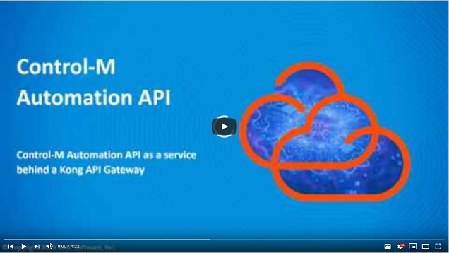

# Using the Automation API cli through an API gateway

This project describes how to enable the Control-M Automation API command line
interface (ctm cli) to access the Automation API REST service through an API 
Gateway.

## Prerequisites

* Control-M Automation API version 9.0.19.120 or higher
* API Gateway configured to route to the Control-M API. In this example, we will
  use the Kong API Gateway. How to set this up can be found in a separate 
  example [add-aapi-service-to-kong-gateway](../add-aapi-service-to-kong-gateway).

## Steps

The following steps assume these hosts are being used:

* `ctmtest`:  host with Control-M version 9.0.19 installed, and Automation API
  listening on port 8446.
* `kong`: host with the Kong API Gateway installed, using port 8443 for https 
  requests, and port 8001 as admin port on localhost interface only. These are
  Kong's default settings.

### 1. Request header 

We can verify the following curl request works to login to the Automation API
through the Kong API Gateway:

```
curl -i -k --url https://kong:8433/session/login \
  --header 'Host: controlm.api' \
  --header "Content-Type: application/json" \
  -X POST --data '{"username":"emuser","password":"empass"}'\
```

The `/session/login` request is sent to the Kong API Gateway running on kong:8443.
The `'Host: controlm.api'` http header tells Kong that this request should be 
routed to the service that has this host specified in its route (see Example 
linked in Prerequisites section on how to do this). Note that `controlm.api` is
a logical name which does not need to match an actual existing hostname.


### 2. Set up ctm cli environment for Kong API GAteway

To add an environment to the ctm cli, use the `ctm env add` command as normal:

```
ctm env add viakong https://kong.bmc.com:8443 emuser empass
ctm env set viakong
```

### 3. Add request header to environment

The Automation API command line interface (ctm cli) does not send the additional
request header needed by Kong, so requests would fail:

```
$ ctm session login
{
  "message": "no Route matched with those values"
}
```

The following command sets the `additionalLoginHeader` parameter which tells 
the ctm cli to send this header along with every request to this environment:

```
ctm env update viakong additionalLoginHeader 'Host: controlm.api'
```

Now, Control-M API requests made by the cli work:

```
$ ctm session login
{
  "username": "emuser",
  "token": "F885199C3065D5482AEECB925B252ABFC8BF0BB341B872373A0A05D99458E93A203D06C7290E6D71118554C7B29C3772A861520EFD50A01739C076F17F7067B3",
  "version": "9.19.120"
}
```

## Video

The following video demonstrates the above steps.

[](https://youtu.be/wghZT5tZxco?t=185)

Click the above image to watch the video on YouTube.

