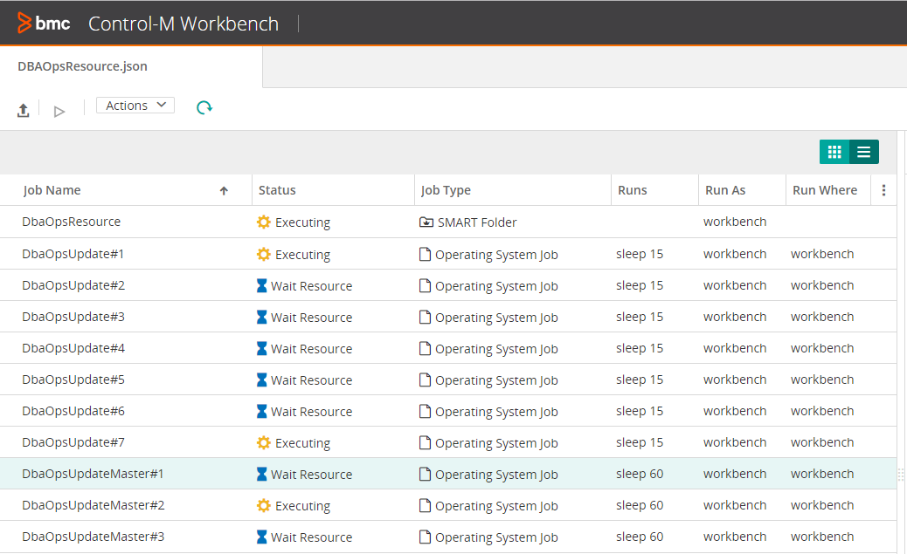

# json

This directory contains 1 example json file with jobs definitions.
* [DBAOpsResource.json](./DBAOpsResource.json)

This example demonstrates the use of the semaphore and mutex resources on 10 jobs to control jobs running concurrently and exclusively.  All 10 jobs require a 
common semaphore (*DbaOpsDbInstance1*) to execute.  7 of the *DbaOpsUpdate* jobs require 1 unit of semaphore *DbaOpsDbInstance1* to run, while 3 *DbaOpsUpdateMaster* jobs
require 3 units of semaphore *DbaOpsDbInstance1* since they require more time and resources.  The 3 *DbaOpsUpdateMaster* jobs are also not allowed to run at the same time
and require the *DbaOpsMasterTable* resource to run since they can not update the Master tables at the same time.


### DbaOpsUpdate jobs
```
    "DbaOpsUpdate#N" : {
      "Type" : "Job:Command",
      "SubApplication" : "Resource",
      "EndFolder" : false,
      "Host" : "workbench",
      "CreatedBy" : "workbench",
      "RunAs" : "workbench",
      "Application" : "DbaOpsWeeklyUpdate",
      "Command" : "sleep 15",
      "When" : {
        "WeekDays" : [ "NONE" ],
        "MonthDays" : [ "ALL" ],
        "SpecificDates" : [ ],
        "DaysRelation" : "OR"
      },
      "DbaOpsDbInstance1" : {
        "Type" : "Resource:Semaphore",
        "Quantity" : "1"
      }
    },

```

For a non-Control-M Workbench environment substitute *workbench* with the actual *Host*, *RunAs*, and *CreatedBy* parameters.

### Require 1 unit of "DbaOpsDbInstance1"
```
      "DbaOpsDbInstance1" : {
        "Type" : "Resource:Semaphore",
        "Quantity" : "1"
      }
```      

### DbaOpsUpdateMaster jobs
```
    "DbaOpsUpdateMaster#N" : {
      "Type" : "Job:Command",
      "SubApplication" : "Resource",
      "Priority" : "Very High",
      "EndFolder" : false,
      "Host" : "workbench",
      "CreatedBy" : "workbench",
      "RunAs" : "workbench",
      "Application" : "DbaOpsWeeklyUpdate",
      "Command" : "sleep 60",
      "When" : {
        "WeekDays" : [ "NONE" ],
        "MonthDays" : [ "ALL" ],
        "SpecificDates" : [ ],
        "DaysRelation" : "OR"
      },
      "DbaOpsMasterTableLock" : {
        "Type" : "Resource:Mutex",
        "MutexType" : "Exclusive"
      },
      "DbaOpsDbInstance1" : {
        "Type" : "Resource:Semaphore",
        "Quantity" : "3"
      }
    },
```

### Require 3 units of semaphore *DbaOpsDbInstance1* and exclusive mutex *DbaOpsMasterTableLock*

```
      "DbaOpsMasterTableLock" : {
        "Type" : "Resource:Mutex",
        "MutexType" : "Exclusive"
      },
      "DbaOpsDbInstance1" : {
        "Type" : "Resource:Semaphore",
        "Quantity" : "3"
      }
```

### Higher job priority

The 3 *DbaOpsUpdateMaster* jobs were given higher priority so they will have a better chance of executing first.

```
"Priority" : "Very High",
```

### Build

Using the Control-M Automation API *Build Service*, the jobs can be made to run.

```
ctm build DBAOpsResource.json
```
### Execution

Using the Control-M Automation API *Run Service*, the jobs can be made to run.

```
ctm run DBAOpsResource.json
```

The jobs require 1-3 units of the Semaphore *DbaOpsDbInstance1*.  Allowing 5 units will allow several jobs to run concurrently.  The following Automation API command can be used to set this.

```
ctm run resource::add workbench DbaOpsDbInstance1 5
```

For more information on the *Run Service* please refer to the following documentation.

https://docs.bmc.com/docs/automation-api/919/services-817914516.html#Services-resource_managementResourceManagement

The 3 *DbaOpsUpdateMaster* jobs require the Mutex *DbaOpsMasterTableLock* resource .  This resource should not be added in exclusive mode and acts as a locking mechanism.  The exclusive mutex resource is reserved
automatically by the jobs before they execute.


### Example execution

In this sample run, 5 units of *DbaOpsDbInstance1* semaphore allows 1 critical job and 2 minor ones to run concurrently.


